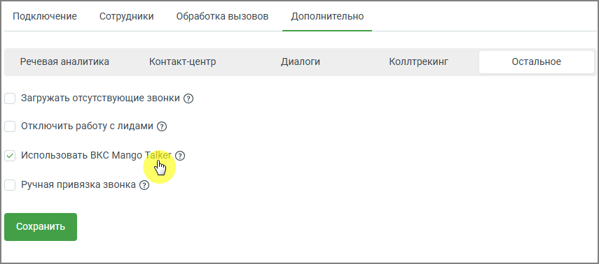
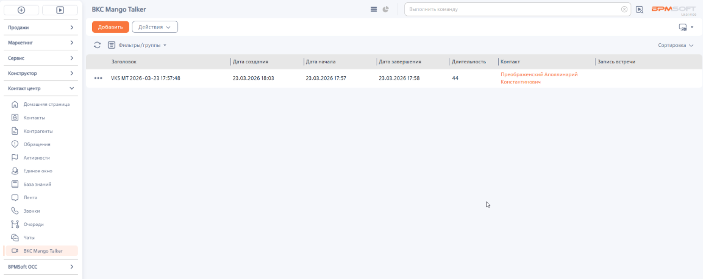

# Как включить использование ВКС

> Трассировка: PDF §2.4 · сквозные стр. 45-46 · источники: ч.1 `kb/sources/integration-bpmsoft/Mango_office_integration_BPMSoft.pdf` с.45-46.

Чтобы включить возможность работы с видеоконференцсвязью, в основных настройках интеграции необходимо: • открыть вкладку «Дополнительно»; • установить флаг «Использовать ВКС MANGO TALKER»; • нажать кнопку «Сохранить». Руководство по интеграции АТС MANGO OFFICE и BPMSoft | Версия от 22.06.2026

После включения настройки в интерфейсе BPMSoft становится доступна работа с видеоконференциями. Для просмотра истории видеовстреч перейдите в рабочее место “Контакт- центр” и выберите раздел “ВКС Mango Talker”. В разделе отображается список проведенных видеовстреч.

