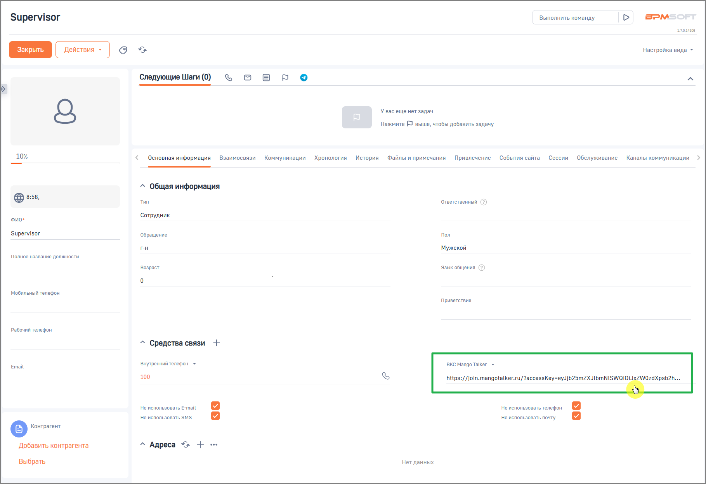

# Как работать с видеоконференцией в карточке контакта

> Трассировка: PDF §2.4 · сквозные стр. 46-47 · источники: ч.1 `kb/sources/integration-bpmsoft/Mango_office_integration_BPMSoft.pdf` с.46-47.

В разделе “Контакты” в карточке контакта доступна ссылка для подключения к видеоконференции MANGO TALKER. При первом обращении система запрашивает у сервиса MANGO TALKER уникальную ссылку на видеоконференцию и сохраняет её за данным контактом. Сформированная ссылка: • отображается в карточке контакта; • используется для подключения к видеоконференции; Руководство по интеграции АТС MANGO OFFICE и BPMSoft | Версия от 22.06.2026 • является постоянной и не изменяется при последующих обращениях.

При переходе по ссылке открывается вкладка браузера с предложением войти в видеоконференцию MANGO TALKER.
