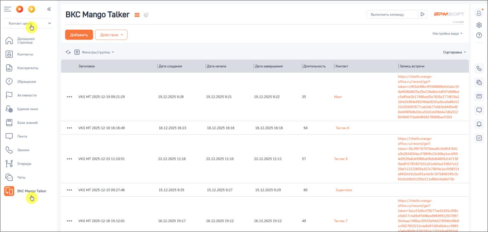
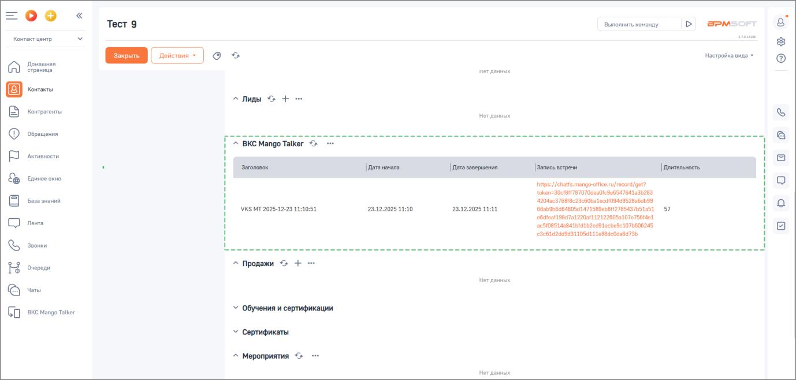

# Результаты видео-встречи

> Трассировка: PDF §2.4 · сквозные стр. 47-48 · источники: ч.1 `kb/sources/integration-bpmsoft/Mango_office_integration_BPMSoft.pdf` с.47-48.

После завершения видео-встречи информация о ней сохраняется в BPMSoft в разделе “ВКС Mango Talker”. Для каждой видеовстречи отображаются: • дата создания; • дата начала и завершения; • продолжительность встречи; • контакт, связанный со встречей; • запись встречи. Сохранённые данные позволяют анализировать историю взаимодействий с клиентом и использовать записи видео-встреч в дальнейшей работе. В разделе ВКС Mango Talker отображается вся история ВКС встреч. Руководство по интеграции АТС MANGO OFFICE и BPMSoft | Версия от 22.06.2026

На скриншоте ниже показана история видеовстреч для отдельного контакта в блоке “ВКС Mango Talker”.

