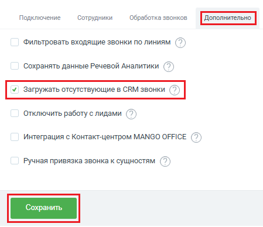

# Как включить

> Трассировка: PDF §2.4 · сквозные стр. 49 · источники: ч.1 `kb/sources/integration-bpmsoft/Mango_office_integration_BPMSoft.pdf` с.49.

Чтобы включить функцию загрузки отсутствующих в CRM звонков, в окне “Основные настройки интеграции” следует: 1) открыть вкладку “Дополнительно”; 2) установить флаг “Загрузка отсутствующих в CRM звонков”; 3) нажать на кнопку “Сохранить” внизу окна “Основные настройки интеграции”:

