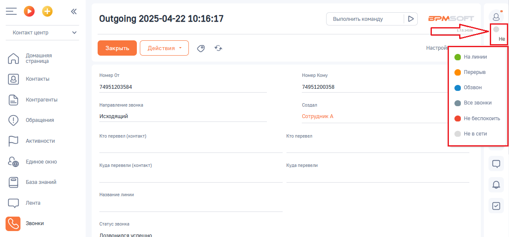

# Статусы Контакт-центра в интерфейсе BPMSoft

> Трассировка: PDF §2.4 · сквозные стр. 51 · источники: ч.1 `kb/sources/integration-bpmsoft/Mango_office_integration_BPMSoft.pdf` с.51.

Статус пользователя отображается в интерфейсе BPMSoft сразу после включения настроек, указных в требованиях и обновления страницы.

Чтобы изменить статус пользователя, необходимо: 1) нажмите на статус пользователя. Будет открыто дополнительное меню; 2) выберите статус пользователя
