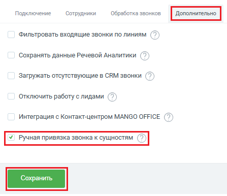

# Как включить

> Трассировка: PDF §2.4 · сквозные стр. 52-53 · источники: ч.1 `kb/sources/integration-bpmsoft/Mango_office_integration_BPMSoft.pdf` с.52-53.

Для этого, в вашей BPMSoft, в основных настройках интеграции необходимо: 1) открыть закладку “Дополнительно”; 2) активировать переключатель “Ручная привязка звонка к сущностям”; 3) нажать кнопку “Сохранить”: Руководство по интеграции АТС MANGO OFFICE и BPMSoft | Версия от 22.06.2026

