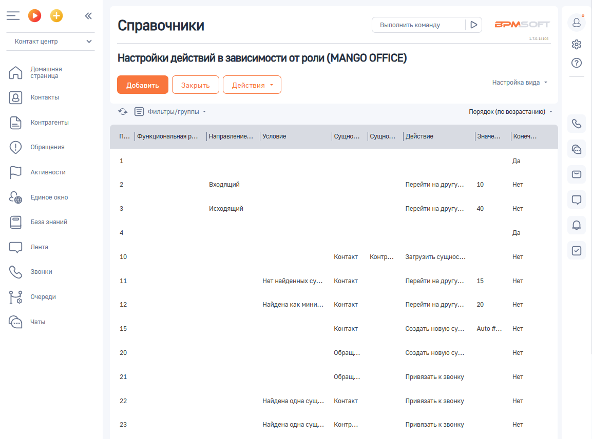
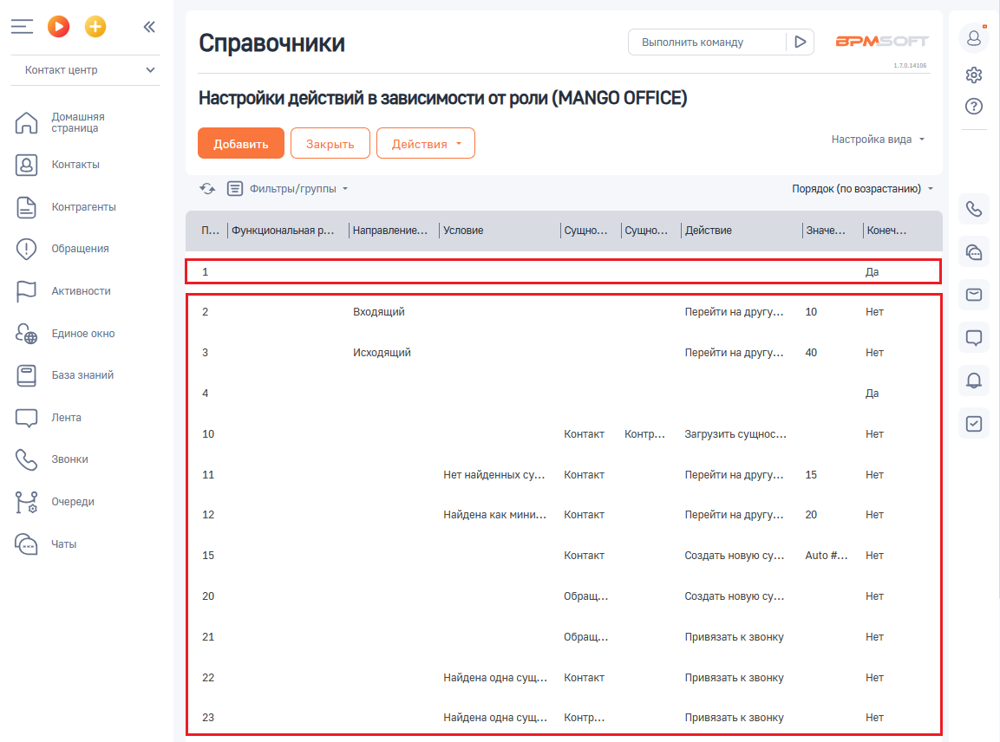

# Описание интерфейса

> Трассировка: PDF §2.5 · сквозные стр. 55-58 · источники: ч.1 `kb/sources/integration-bpmsoft/Mango_office_integration_BPMSoft.pdf` с.55-58.

На странице “Настройка действий в зависимости от роли” показана таблица (см. рисунок ниже), содержащая правила выполнения действий зависимости от роли: Руководство по интеграции АТС MANGO OFFICE и BPMSoft | Версия от 22.06.2026

В первой строке таблицы всегда указано правило, при помощи которого вы можете активировать или деактивировать настройку. Во второй и последующих строках указаны правила обработки звонков (одна строка = одно правило), определяющие, какой звонок должен быть обработан, когда активируется правило, какая сущность при этом создается и какое правило должно быть применено следующим, см. рисунок ниже. Важно. По умолчанию в строках таблицы указаны тестовые правила обработки звонков, если у вас они еще не были настроены ранее. В тестовых правилах указаны действия, которые будут реально выполняться в вашей BPMSoft (создаваться и связываться сущности), если правило истинно для звонка. Поэтому, с их помощью можно обучатся работе с данной настройкой и экспериментировать с параметрами правил. Нажмите на то или иное тестовое правило, чтобы изменить его параметры. Вы можете в любой момент редактировать или удалить тестовое правило. Руководство по интеграции АТС MANGO OFFICE и BPMSoft | Версия от 22.06.2026

В столбцах таблицы содержатся параметры правил. Название параметра указано в шапке каждого столбца:

| Параметр | Пояснение |
| --- | --- |
| Порядок | Определяет последовательность применения правил к звонку. По умолчанию, правила применяются по возрастанию значений в данном столбце, если иное не определено правилом. Порядок определяете вы при добавлении, либо редактировании правила. |
| Функциональная роль | В этой графе указывается роль (группа) сотрудников, которые обрабатывают звонок, к которому будет применяться правило. Примечание. Состав доступных функциональных ролей, соответствует составу функциональных ролей, указанных в справочниках “Организационные роли” и “Функциональные роли” вашей BPMSoft. Чтобы изменить состав функциональных ролей, обратитесь к вашему администратору BPMSoft. |
| Направление звонка | В этой графе указывается направление звонка, к которому будет применяться правило. |
| Условие | В этой графе указывается условие, при выполнении которого будет выполнено действие, указанное в графе “Действие”. Вы можете выбрать условие из доступного набора условий. Изменить набор условий нельзя. |
| Сущность | В этой графе указывается сущность, с которой надо выполнить то или иное действие. Например, в этой графе можно указать значение “Контакт”, а в графе “Действие” указать “Открыть сущность”. |

Руководство по интеграции АТС MANGO OFFICE и BPMSoft | Версия от 22.06.2026

| Параметр | Пояснение |
| --- | --- |
| Сущность 2 | В этой графе указывается дополнительная сущность, связанная с сущностью, указанной в графе “Сущность”. Например, если в этой графе указать значение “Контрагент”, а в графе “Сущность” указать значение “Контакт”, при этом в поле “Действие” указать значение “Открыть сущность”, то будут открыты данные контрагентов, связанных со звонком. |
| Действие | Действие, которое будет выполнено, если правило истинно для звонка. В этом поле можно выбрать действие из ограниченного набора. |
| Значение | В этой графе вы можете указать либо порядковый номер правила, к которому надо перейти после выполнения данного правила, либо логическое выражение (есть ограничения). Например, если в графе “Действие” указано “Перейти на другую строку”, то в данной графе следует указать номер правила, на которое будет выполнен переход. |
| Конечное действие при срабатывании | Признак принудительного завершения действий по данном звонку. Может иметь следующие значения: - Да: означает, что после выполнения действия, следует закончить применение правил данной таблицы по отношению к данному звонку; - Нет: означает, что после выполнения действия нужно перейти к следующему по порядку правилу. При этом, если в поле “Значение” указан номер правила, к которому надо перейти, то приложение интеграции перейдет к этому правилу. Если же номер НЕ указан, то приложение интеграции перейдет к правилу, указанному строкой ниже. |
