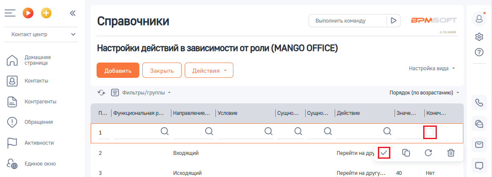

# Как активировать или деактивировать настройку

> Трассировка: PDF §2.5 · сквозные стр. 61-62 · источники: ч.1 `kb/sources/integration-bpmsoft/Mango_office_integration_BPMSoft.pdf` с.61-62.

Для этого, в вашей BPMSoft откройте настройку. Будет открыта страница ” Настройки действий в зависимости от роли (MANGO OFFICE)“. Чтобы АКТИВИРОВАТЬ настройку действий в зависимости от роли, нужно

нажать на первую строку таблицы, а затем СНЯТЬ ГАЛОЧКУ в поле

“Конечное действие при срабатывании” и нажать на кнопку :

Руководство по интеграции АТС MANGO OFFICE и BPMSoft | Версия от 22.06.2026 Для того, чтобы ДЕАКТИВИРОВАТЬ настройку действий в зависимости от роли, нужно нажать на первую строку таблицы, а затем ПОСТАВИТЬ ГАЛОЧКУ

в поле “Конечное действие при срабатывании” и нажать на кнопку :

