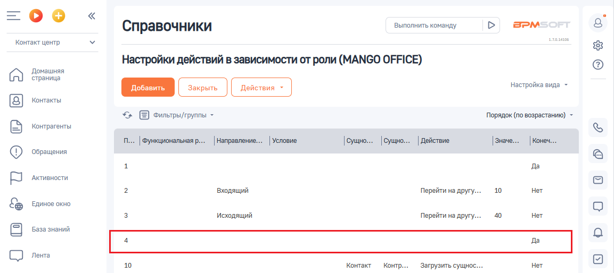
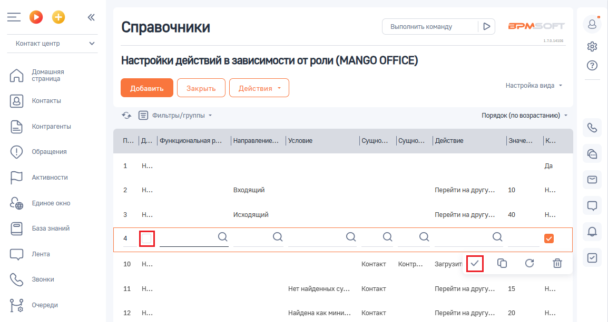
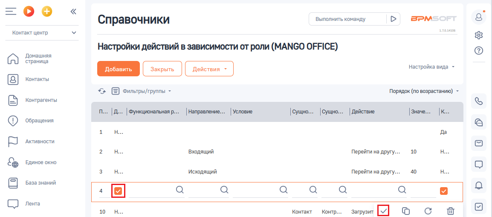

# Как включить или приостановить действие правила

> Трассировка: PDF §2.5 · сквозные стр. 62-64 · источники: ч.1 `kb/sources/integration-bpmsoft/Mango_office_integration_BPMSoft.pdf` с.62-64.

Для включения и отключения правила, используется специальная колонка “Деактивация” в таблице правил. По умолчанию, колонка “Деактивация” скрыта, чтобы ее добавить в таблицу, выполните эти действия. Если она у вас уже есть, то в настройке “Настройка действий в зависимости от роли” следует: 1) найдите строку данными нужного вам правила и нажмите на нее:

Руководство по интеграции АТС MANGO OFFICE и BPMSoft | Версия от 22.06.2026 2) чтобы ВЫКЛЮЧИТЬ правило, надо УСТАНОВИТЬ ГАЛОЧКУ в графе “Деактивация” (так, как показано на рисунке ниже) и нажать на кнопку

:

Если вам надо ВКЛЮЧИТЬ правило, надо СНЯТЬ ГАЛОЧКУ в графе

“Деактивация” (так, как показано на рисунке ниже) и нажать на кнопку :

<!-- изображение на стр. 63: байты не извлечены (PyMuPDF недоступен) -->

Руководство по интеграции АТС MANGO OFFICE и BPMSoft | Версия от 22.06.2026
