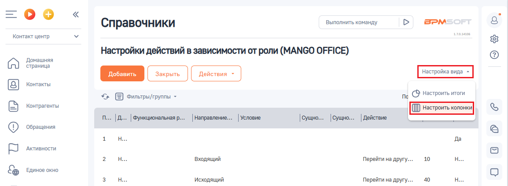
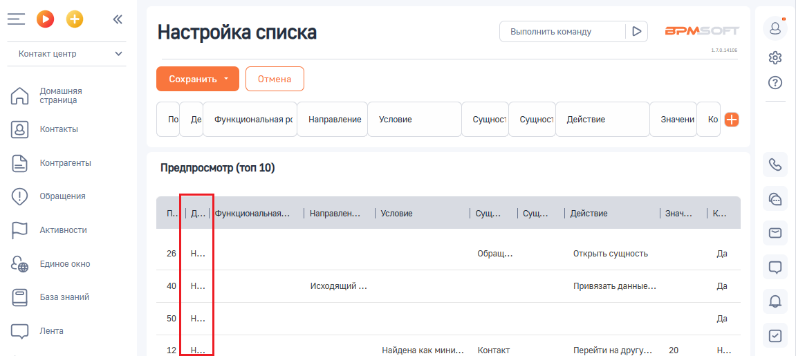
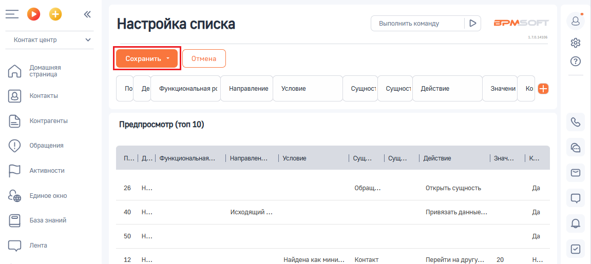

# Как настроить колонки в таблице

> Трассировка: PDF §2.5 · сквозные стр. 64-65 · источники: ч.1 `kb/sources/integration-bpmsoft/Mango_office_integration_BPMSoft.pdf` с.64-65.

Для этого, в настройке “Настройка действий в зависимости от роли” следует: 1) нажать на пункт “ВИД”. Будут открыты дополнительные поля; 2) нажать на пункт “Настроить колонки”:

3) нажать на кнопку :

4) ввести значение “Деактивирована” в выпадающем списке “Колонка”; 5) нажать на кнопку “ВЫБРАТЬ”:

Руководство по интеграции АТС MANGO OFFICE и BPMSoft | Версия от 22.06.2026 6) будет добавлена колонка “Деактивирована” в таблицу правил:

7) при необходимости вы можете переместить колонку, наведя на нее курсор мыши, затем нажать и не отпускать левую кнопку мыши. Перетащите курсором колонку в то или иное место таблицы (не обязательно). Кроме того, вы можете расширить отображение колонки; 8) нажмите на кнопку “Сохранить”:

