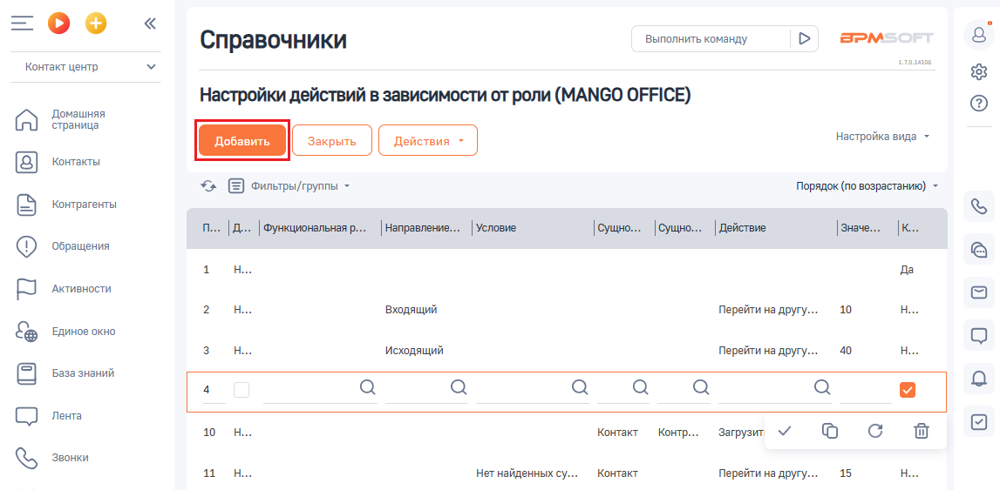
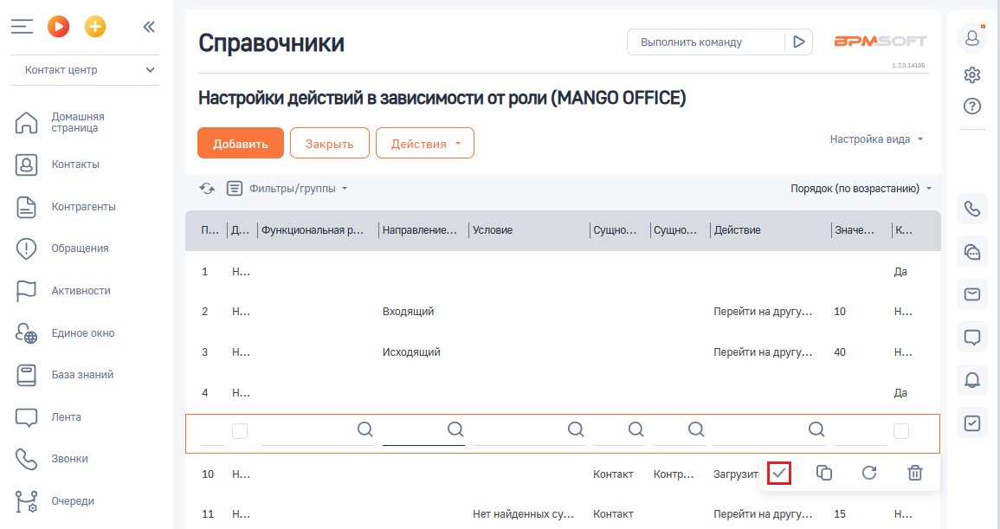

# Добавление

> Трассировка: PDF §2.5 · сквозные стр. 65-66 · источники: ч.1 `kb/sources/integration-bpmsoft/Mango_office_integration_BPMSoft.pdf` с.65-66.

Важно. В настройку действий в зависимости от роли можно добавить не более 40 правил обработки звонков (всего). Для этого, в настройке “Настройка действий в зависимости от роли” следует: 1) нажать на строку с данными того правила, после которого нужно добавить новое правило. Будут открыты дополнительные поля; 2) нажать на кнопку “Добавить”: Руководство по интеграции АТС MANGO OFFICE и BPMSoft | Версия от 22.06.2026

3) будет добавлена новая строка для ввода параметров правила. Введите параметры правила, руководствуясь их описанием (см. Как устроена таблица правил обработки звонков);

Примечание. Нажав на кнопку в том или ином поле, вы увидите список возможных значений данного поля.

4) нажмите кнопку , чтобы сохранить введенное правило:

