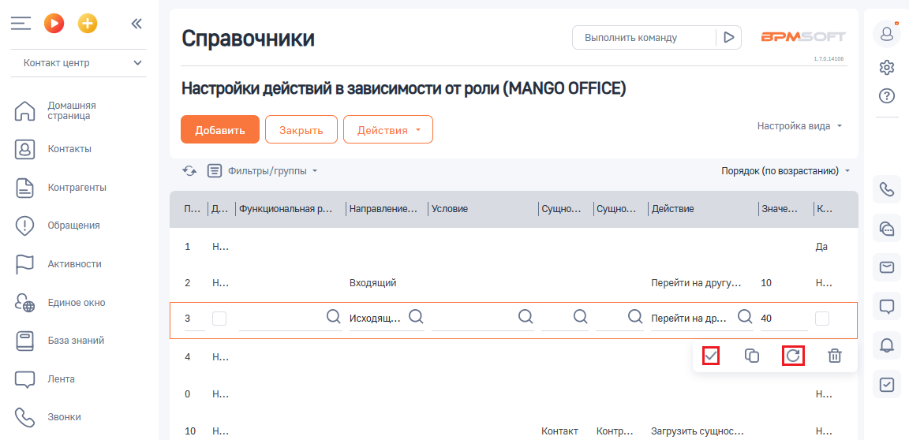
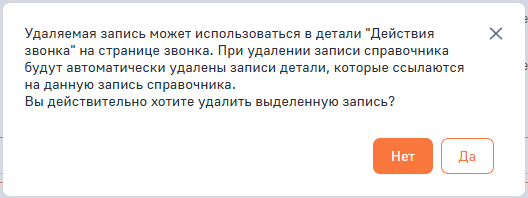

# Редактирование или удаление правила

> Трассировка: PDF §2.5 · сквозные стр. 66-68 · источники: ч.1 `kb/sources/integration-bpmsoft/Mango_office_integration_BPMSoft.pdf` с.66-68.

Важно. 1) Если вы изменили тот или иной параметр правила и сохранили изменения, то уже не сможете их вернуть, то есть нельзя отменить изменение значения параметра; 2) Удаляемая запись может быть в записи “Действия звонка” на странице звонка. При удалении записи справочника автоматически удаляются детали записи, которые ссылаются на описание записи справочника. Не пренебрегайте дополнительной проверкой. Руководство по интеграции АТС MANGO OFFICE и BPMSoft | Версия от 22.06.2026 Для этого, в настройке “Настройка действий в зависимости от роли” следует: 1) нажмите на строку с данными нужного правила; 2) чтобы редактировать правило, измените значение в том или ином параметре; Важно. Пока вы не сохранили правило, внесенные изменения можно

отменить, нажав на кнопку . 3) после того как вы внесли все необходимые правки, сохраните правило,

нажав . Важно. После сохранения правила, внесенные изменения нельзя отменить (только путем повторного редактирования).

Чтобы удалить правило, нажмите на кнопку . Будет открыто окно с предупреждением о том, что вместе с правилом будет удалена запись о его применении в истории действий всех звонков:

Руководство по интеграции АТС MANGO OFFICE и BPMSoft | Версия от 22.06.2026
