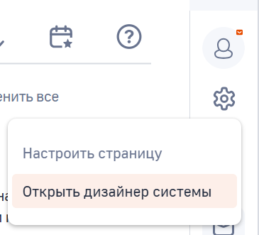
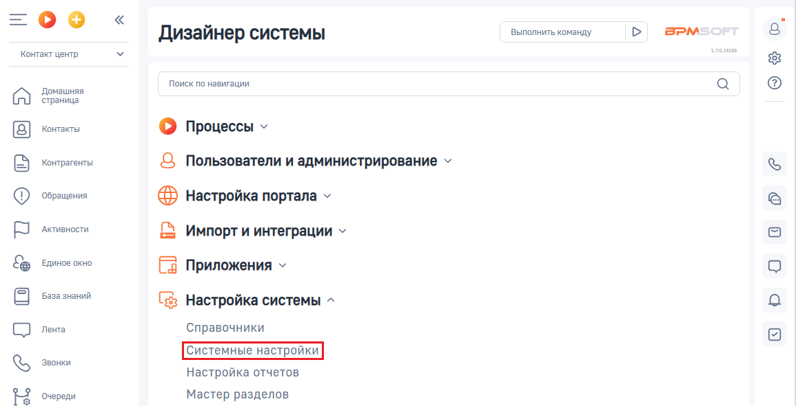
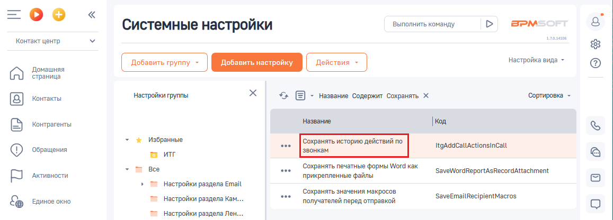
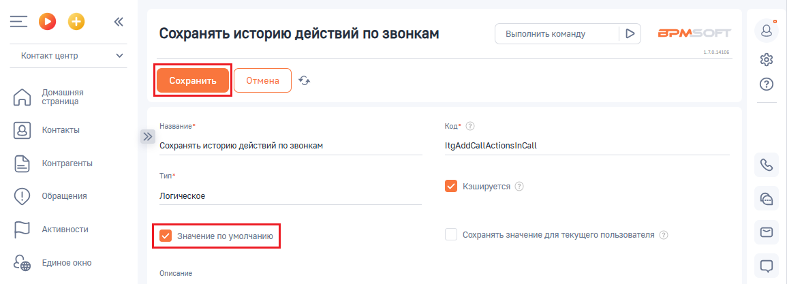

# Как включить или выключить настройку

> Трассировка: PDF §2.6 · сквозные стр. 68-69 · источники: ч.1 `kb/sources/integration-bpmsoft/Mango_office_integration_BPMSoft.pdf` с.68-69.

Для этого, в вашем BPMSoft выполните следующие действия:

1) нажмите на кнопку и выберите пункт “Открыть дизайнер системы”:

2) нажмите на ссылку “Системные настройки” в блоке “Настройка системы”:

Руководство по интеграции АТС MANGO OFFICE и BPMSoft | Версия от 22.06.2026 3) дважды нажмите на строку “Сохранять историю действий по звонкам”. Будут открыты дополнительные поля:

4. чтобы включить историю сохранений действий по звонкам, нужно активировать переключать “Значение по умолчанию”. А чтобы выключить настройку - деактивируйте переключатель “Значение по умолчанию”; 5. нажмите кнопку “Сохранить”, чтобы сохранить настройки.

