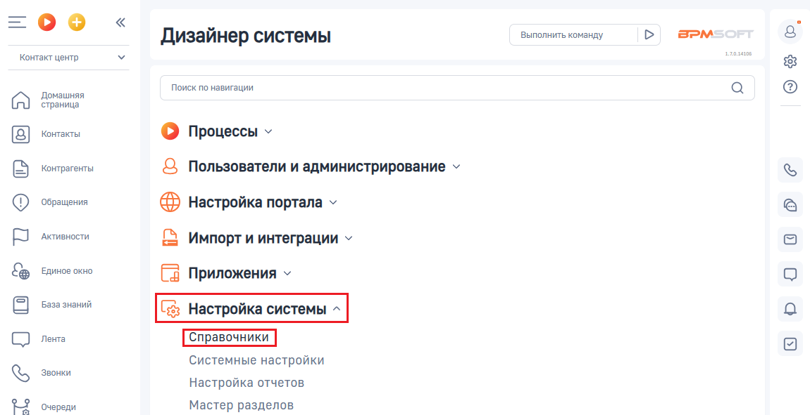
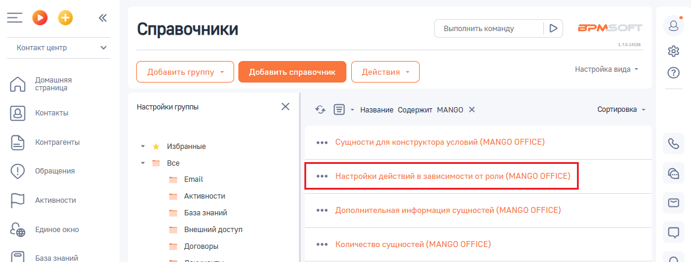
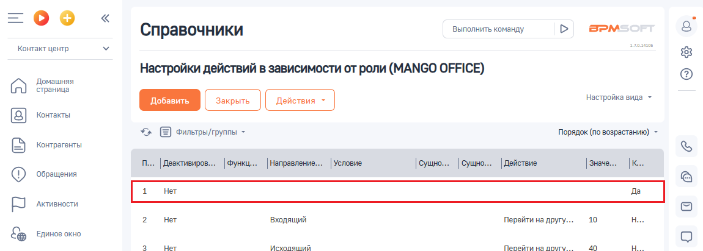

# Как проверить, включена ли настройка ”Настройки действий в зависимости от роли”

> Трассировка: PDF §2.6 · сквозные стр. 70-71 · источники: ч.1 `kb/sources/integration-bpmsoft/Mango_office_integration_BPMSoft.pdf` с.70-71.

от роли” Для этого, в вашей BPMSoft следует:

1) нажмите на кнопку и выберите пункт “Открыть дизайнер системы”:

2) нажмите на ссылку “Справочники” в блоке “Настройка системы”:

3) нажмите на строку ” Настройки действий в зависимости от роли (MANGO OFFICE)“. Будут открыты дополнительные поля:

Руководство по интеграции АТС MANGO OFFICE и BPMSoft | Версия от 22.06.2026 4. посмотрите, указано ли значение “Нет” в первой строке таблицы (столбец “Конечное действие при срабатывании”). Настройка “Настройки действий в зависимости от роли (MANGO OFFICE)” включена, если в первой строке таблицы, в столбце “Конечное действие при срабатывании” указано значение “Нет”. Примечание. Если настройка отключена, то правила обработки звонков будут применяться не полностью.

