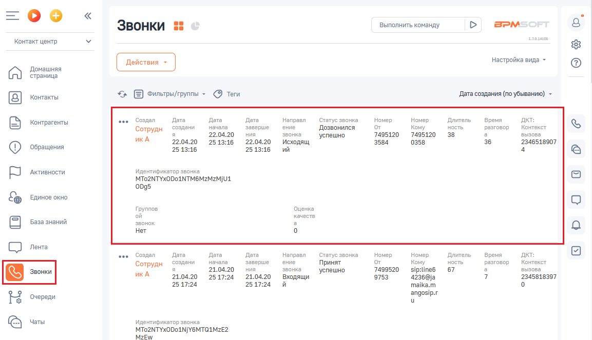
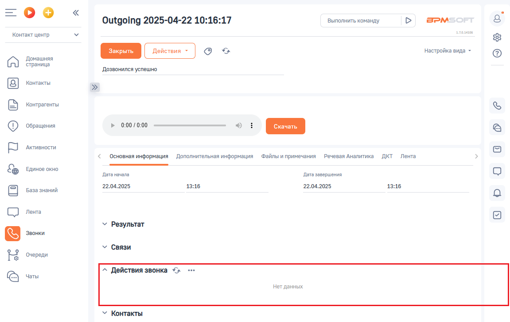

# Как открыть отчет

> Трассировка: PDF §2.7 · сквозные стр. 72-73 · источники: ч.1 `kb/sources/integration-bpmsoft/Mango_office_integration_BPMSoft.pdf` с.72-73.

Чтобы открыть отчет “Действия звонка”, выполните следующие действия в BPMSoft: 1) перейдите в раздел “Звонки”; 2) дважды нажмите на строку с данными звонка. Будут открыты общие сведения о звонке:

3. откройте вкладку “Основная информация”; 4. в блоке “Действия звонка” будут показаны данные отчета:

Руководство по интеграции АТС MANGO OFFICE и BPMSoft | Версия от 22.06.2026
