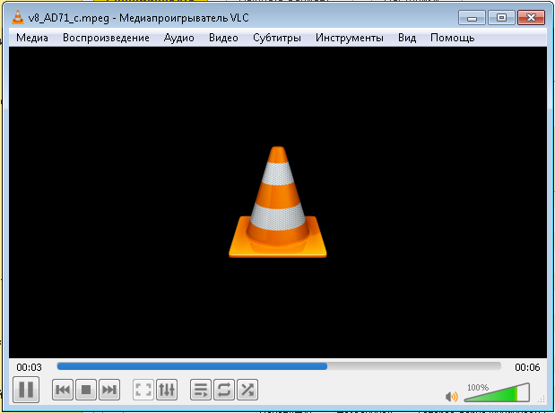
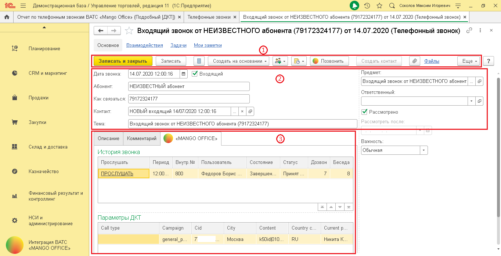
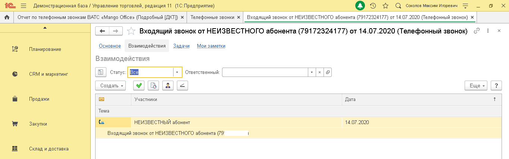
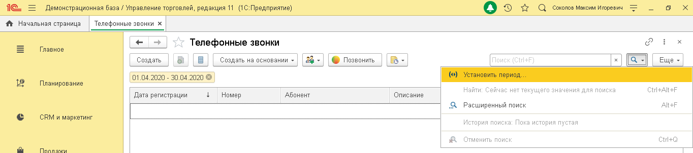

# 6. Отчеты

> Трассировка: PDF §6 · сквозные стр. 32-40 · источники: ч.1 `kb/sources/integration_1c/Integratsiya_virtualnoy_ats_Pryamaya_integraciya_s_1C.pdf` с.32-40.

## 6.1 Отчет по телефонным звонкам ВАТС

Это отчет в 1С, который отражает количество звонков, совершенных через вашу Виртуальную АТС «Mango office». Вы выбираете период и вариант отчета: краткий, основной, подробный (ДКТ). Как открыть отчет Для того, чтобы открыть отчет, выполните следующие действия: 1) перейдите в раздел «Интеграция ВАТС «Mango office»; 2) нажмите на ссылку «Отчет по телефонным звонкам»; 3) активируйте переключатель «Период отчета», затем выберите даты отчета; 4) нажмите кнопку «Выбрать вариант…»:

Рисунок 46 5) выберите вариант отчета; 6) нажмите кнопку «Выбрать»:

32 5Прямая интеграция с системой «1С: Управление торговлей» Редакция 11 (11.3 - 11.4, 11.5) | Версия от 22.12 .2025 Рисунок 47 7) нажмите кнопку «Сформировать»:

Рисунок 48 Будет выведен на экран отчет по телефонным звонкам ВАТС выбранного варианта:

Рисунок 49 Описание параметров отчета Отчет по телефонным звонкам состоит из следующих параметров:

| Параметр отчета | Пояснение | Варианты отчета |  |  |
| --- | --- | --- | --- | --- |
|  |  | Краткий | Основной | Подробный |
| № звонка, Дата звонка | Номер звонящего (если звонок входящий) или номер, на который звонил сотрудник (исходящий звонок), а также дата начала звонка. | + | + | + |
| Запись звонка | Ссылка на запись разговора. Опционально | - | + | - |
| Направление звонка | Направление вызова. Возможные значения: внутренний, исходящий, входящий | + | + | + |
| Статус звонка | Возможные значения: | + | + | + |

33 5Прямая интеграция с системой «1С: Управление торговлей» Редакция 11 (11.3 - 11.4, 11.5) | Версия от 22.12 .2025

| Параметр отчета | Пояснение | Варианты отчета |  |  |
| --- | --- | --- | --- | --- |
|  |  | Краткий | Основной | Подробный |
|  | - Пропущенный: входящий звонок был пропущен; - Принят успешно: входящий звонок, длительность которого строго больше N сек; - Принят не успешно: входящий звонок, длительность которого меньше или равно N сек; - Дозвонился успешно: исходящий звонок, длительность которого строго больше M сек; - Дозвонился не успешно: исходящий звонок, длительность которого меньше или равно M сек; - Переведен: звонок переведен |  |  |  |
| Автор звонка | Сотрудник, принявший звонок при входящем. Сотрудник, совершивший звонок при исходящем. Примечание. Под сотрудником нужно понимать пользователя 1С | + | + | + |
| Участник звонка | Кто принял вызов. Опционально | - | + | - |
| Абонент | Имя Клиента, если звонок привязан к Клиенту или имя контакта, если звонок привязан к контакту, нет ни одного Клиента, связанного с контактом | + | + | + |
| Инициатор | Инициатор звонка | + | + | + |
| Номер линии | DID-номер, на который звонил Клиент или SIP-адрес линии, на который звонил Клиент (в том числе для звонка с сайта) при входящем. Номер, через который звонил сотрудник при исходящем звонке | + | + | + |
| Начало звонка | Время начала звонка. | + | + | + |
| Начало разговора | Время начала разговора. | + | + | + |
| Окончание звонка | Время окончания звонка | + | + | + |
| Время звонка | Суммарная длительность звонка, от начала звонка до его завершения. | + | + | + |
| Время разговора | Суммарное время разговоров, либо 0, если разговора не было | + | + | + |

34 5Прямая интеграция с системой «1С: Управление торговлей» Редакция 11 (11.3 - 11.4, 11.5) | Версия от 22.12 .2025

| Параметр отчета | Пояснение | Варианты отчета |  |  |
| --- | --- | --- | --- | --- |
|  |  | Краткий | Основной | Подробный |
| Данные ДКТ | Данные коллтрекинга о посещении вашего сайта | - | - | + |

Воспроизведение записи разговора Чтобы прослушать запись разговора, в основном или подробном отчете по звонкам ВАТС дважды кликните по ссылке «Прослушать запись». Примечание. Если ссылка на запись разговора отсутствует, то значит разговор не состоялся либо не велась запись разговора по той или иной причине.

Рисунок 50 Начнется воспроизведение выбранной вами записи. Примечание. Воспроизведение записи разговора выполняется на медиапеере, ранее установленном на вашем ПК.

Рисунок 51 35 5Прямая интеграция с системой «1С: Управление торговлей» Редакция 11 (11.3 - 11.4, 11.5) | Версия от 22.12 .2025

## 6.2 Карточка звонка

Общие сведения Для каждого звонка в 1С автоматически создается отдельная карточка, в которой сохраняются подробные сведения о звонке, например, номер телефона, ФИО ответственного сотрудника и т.д. Вы можете в карточке звонка прослушать запись разговора, посмотреть данные коллтрекинга, прикрепить файл к карточке и многое другое. Информация в карточке звонка обновляется автоматически и вы сможете узнать, последние актуальные сведения. Как открыть отчет Чтобы открыть карточку звонка, дважды кликните по номеру звонка в отчете по звонкам ВАТС:

Рисунок 52 или в отчете «Телефонные звонки»:

Рисунок 53 В карточке звонка информация собрана на нескольких вкладках: 36 5Прямая интеграция с системой «1С: Управление торговлей» Редакция 11 (11.3 - 11.4, 11.5) | Версия от 22.12 .2025 - Основное; - Взаимодействие; - Задачи; - Мои заметки. На вкладке «Основное» отображаются основные сведения о звонке: 1) панель с элементами управления; 2) параметры звонка; 3) дополнительные вкладки: - Описание: внесите дополнительные сведения о звонке, при необходимости; - Комментарий: добавьте комментарий, при необходимости; - MANGO OFFICE: содержит 2 таблицы а) История звонка: запись разговора и информация звонке; б) Параметры ДКТ: данные коллтрекинга о посещении вашего сайта. Доступны, если в ВАТС подключен Коллтрекинг:

Рисунок 54 Взаимодействие – это контакты с Клиентом по различным каналам: телефон, смс, и т.д. На данной вкладке показана история контактов с Клиентом, зафиксированная в 1С: 37 5Прямая интеграция с системой «1С: Управление торговлей» Редакция 11 (11.3 - 11.4, 11.5) | Версия от 22.12 .2025

Рисунок 55

## 6.3 Отчет «Телефонные звонки»

Отчет «Телефонные звонки» позволяет получить информацию о звонках пользователей через ВАТС MANGO OFFICE. В нем доступны следующие показатели: - дата регистрации звонка: - номер; - информация об абоненте или новом Клиенте; - описание, указанное в карточке Клиента; - тема. Чтобы открыть отчет в 1С, выполните: 1) перейдите в раздел «Интеграция ВАТС «Mango office»; 2) нажмите на ссылку «Телефонные звонки»; 3) нажмите кнопку, затем выберите пункт «Установить период»:

Рисунок 56 4) введите период отчета и нажмите кнопку «Выбрать»: 38 5Прямая интеграция с системой «1С: Управление торговлей» Редакция 11 (11.3 - 11.4, 11.5) | Версия от 22.12 .2025

Рисунок 57 На экране будет показан отчет за выбранный период:

Рисунок 58 Чтобы перезвонить по номеру, указанному в отчете, кликните по номеру, затем нажмите кнопку

. Чтобы открыть карточку звонка для просмотра более подробных сведений – дважды кликните по номеру. 39 5Прямая интеграция с системой «1С: Управление торговлей» Редакция 11 (11.3 - 11.4, 11.5) | Версия от 22.12 .2025
