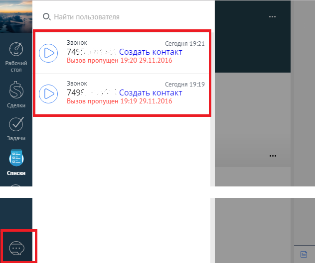
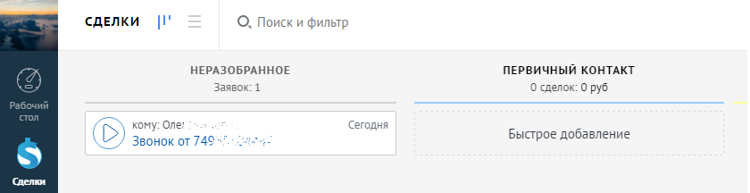

# 5. Пропущенные звонки

> Трассировка: PDF §5 · сквозные стр. 91-92 · источники: ч.1 `kb/sources/integration_amocrm/Mango_office_integration_amoCRM.pdf` с.91-92.

Если сотрудник отсутствовал на рабочем месте и были пропущенные звонки, то вне зависимости, был открыт amoCRM у него или не был открыт, в amoCRM попадет информация о пропущенных звонках. Чтобы увидеть все пропущенные звонки, необходимо открыть область уведомлений amoCRM:

Пропущенные звонки от новых Клиентов (не сохраненных в amoCRM) также отображаются в неразобранном.

Примечания: 1. Это зависит от настроек виджета – звонок также может сохраниться в качестве контакта (если включен флаг “Создавать контакт при звонках с новых номеров”), а также сделки (если пир этом еще включен флаг “Создавать сделку”). 2. Если пропущенный звонок сохранился в неразобранном, то если вы сконвертируете его в сделку, то дата и время звонка будут равны дате и времени конвертации из неразобранного. 3. Звонки, сохраненные в неразобранном не попадут в инструменты аналитики, до тех пор пока не будут сконвертированы в сделки. 91 Интеграция Виртуальной АТС MANGO OFFICE и amoCRM | Версия от 25.08.2025
