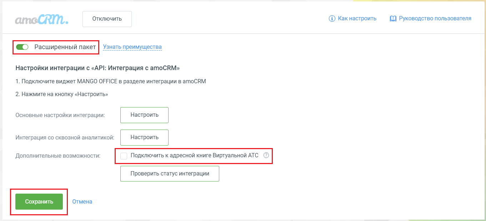
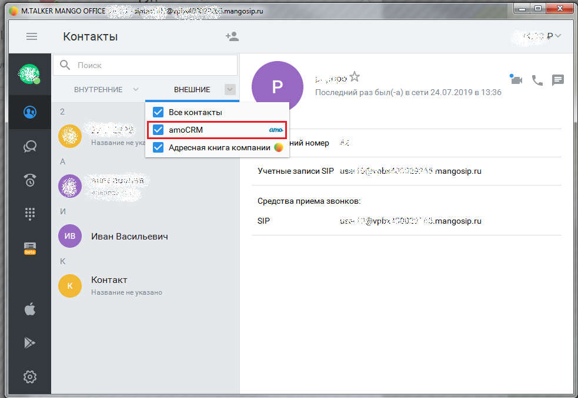
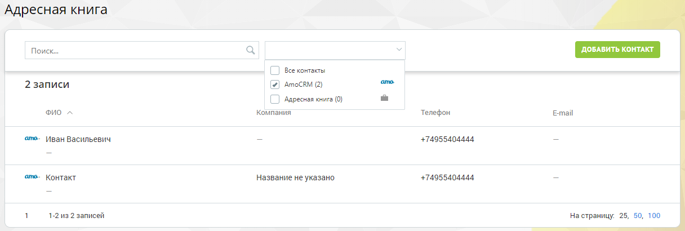
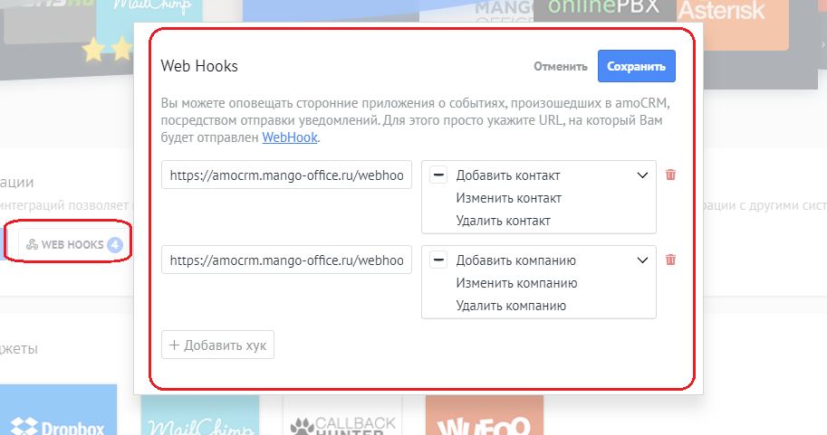

# 13. Интеграция с адресной книгой Виртуальной АТС

> Трассировка: PDF §13 · сквозные стр. 122-124 · источники: ч.1 `kb/sources/integration_amocrm/Mango_office_integration_amoCRM.pdf` с.122-124.

Если в Виртуальной АТС подключена услуга “Расширенные возможности интеграции”, то в Личном кабинете можно подключить amoCRM как внешний источник контактов в адресную книгу MANGO OFFICE. Вам нужно установить флаг “Подключить к адресной книге Виртуальной АТС” и нажать “Сохранить”. Начнется отображение контактов и компаний из amoCRM в адресной книге Виртуальной АТС:

Контакты и компании из amoCRM будут видны: - в Личном кабинете Виртуальной АТС в разделе “Адресная книга”; - в Mango Talker; - в Контакт Центр MANGO OFFICE. В MANGO TALKER:

В Личном кабинете Виртуальной АТС: 122 Интеграция Виртуальной АТС MANGO OFFICE и amoCRM | Версия от 25.08.2025

При обновлении контактов/компаний в amoCRM, информация о них будет автоматически обновлена в адресной книге Виртуальной АТС. Это обеспечивается с помощью автоматически устанавливаемых WebHook в amoCRM:

Адреса для web-hook: - контакт - https://amocrm.mango-office.ru/webhook/contact/ххх - компания - https://amocrm.mango-office.ru/webhook/company/ххх Если удалить web-hook, то информация о контактах и компаниях не будет автоматически обновляться в адресной книге Виртуальной АТС. Внимание! Можно просматривать карточку контакта/компании, но нельзя ее редактировать. Редактировать ее можно только из amoCRM 123 Интеграция Виртуальной АТС MANGO OFFICE и amoCRM | Версия от 25.08.2025
