# 14. Интеграция с Контакт Центром MANGO OFFICE

> Трассировка: PDF §14 · сквозные стр. 124-139 · источники: ч.1 `kb/sources/integration_amocrm/Mango_office_integration_amoCRM.pdf` с.124-139.

## 14.1 Учет кампаний исходящего обзвона в amoCRM

Если Вы подключили Контакт Центр MANGO OFFICE (далее по тексту – КЦ) к Виртуальной АТС, то в рамках интеграции с amoCRM будет доступна дополнительная возможность: учет кампаний исходящего обзвона в amoCRM. То есть, звонки, выполненные в рамках кампаний исходящего обзвона КЦ, обрабатываются (с показом карточки) и фиксируются в amoCRM только при включенной опции “Интеграция с Контакт-центром”.

Кроме того, если запущена кампания исходящего обзвона из КЦ, то при входящем звонке будет показана информация о контакте из настроек кампании:

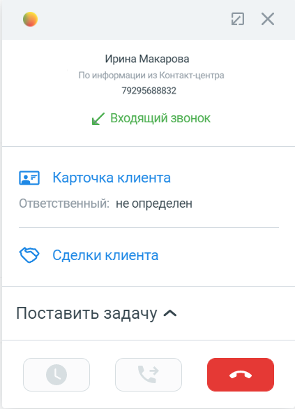

Если контакт создается в amoCRM автоматически (согласно настройкам виджета) или создается из карточки звонка, то в контакте автоматически сохранятся данные:

| Поле в amoCRM | Описание |
| --- | --- |

124 Интеграция Виртуальной АТС MANGO OFFICE и amoCRM | Версия от 25.08.2025

| ЦОВ: Привлечен кампанией исходящего обзвона | Имя кампании |
| --- | --- |
| ЦОВ: Идентификатор кампании исходящего обзвона | Уникальный идентификатор кампании |
| ЦОВ: Идентификатор Клиента | Уникальный идентификатор кампании из кампании |

## 14.2 Интеграция с digital-воронкой

(beta) Добавление задания в кампанию исходящего обзвона при изменении в digital-воронке Обзор Благодаря виджету интеграции можно настроить автоматическое добавление номера Клиента в кампанию исходящего обзвона (ИО) Контакт-центра MANGO OFFICE (КЦ). Это дает вам возможность собирать номера всех новых Клиентов в одну кампанию ИО, и ваши операторы смогут быстро обзвонить всех новых Клиентов, при этом использовать скрипты для диалога с Клиентом и прочие удобные функции Контакт-центра MANGO OFFICE. После того как вы настроили интеграцию кампании ИО с digital-воронкой и первый номер Клиента был добавлен виджетом интеграции эту кампанию, вы можете, открыв карточку кампании в КЦ, увидеть технический таск:

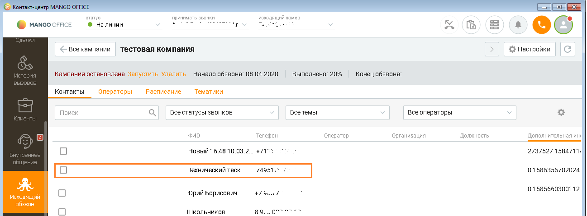

Технический таск - это задача кампании ИО, содержащая номер вашей Виртуальной АТС. По сути, это служебная задача для Виртуальной АТС выполнить автозвонок (звонок самое себе), чтобы кампания ИО, в которую входит технический таск, не была завершена (не перешла в статус “Завершена”). Примечание. Статус “Завершена” означает, что кампания ИО полностью остановлена и нельзя добавлять в нее номера Клиентов, а также нельзя ее повторно запустить. Подробнее о статусах кампаний - в Руководстве пользователя КЦ. Автозвонок создается виджетом интеграции при первом добавлении номера в кампанию ИО из digital-воронки. При втором и последующих добавлениях номеров, такой таск не создается (потому что он там уже есть). Когда Клиент выполняет действия, определенные в качестве триггера в digital-воронке, в виджете интеграции создается запрос к КЦ на добавление номера Клиента в кампанию ИО. Затем этот запрос обрабатывается в КЦ: 125 Интеграция Виртуальной АТС MANGO OFFICE и amoCRM | Версия от 25.08.2025 - если кампания ИО не завершена, то номер Клиента будет добавлен в эту кампанию; - если кампания ИО находится в статусе “Завершена”, то будет выдано сообщение об ошибке. Можно удалить технический таск из кампании ИО. Вот как будет работать интеграция кампании ИО с digital-воронкой, при удалении технического таска. Пример: 1) в КЦ вы создали кампанию ИО “А1” и в amoCRM настроили виджет интеграции на добавление номеров Клиентов в кампанию А1; 2) если будет удален технический таск из А1, виджет интеграции будет добавлять номера Клиентов в А1. Однако, если А1 завершится, будет выдано сообщение об ошибке, поскольку добавлять в завершившуюся кампания нельзя. Ограничения 1) Можно включить добавление звонков в кампании ИО, только если у вас есть внутренний номер Виртуальной АТС, связанный с вашим аккаунтом в amoCRM, при этом используется расширенная версия интеграции. В этом разделе описано, как связать аккаунт amoCRM с внутренним номером Виртуальной АТС. О том, как привязать номер мобильного телефона к внутреннему номеру Виртуальной АТС описано в этом руководстве. 2) Чтобы виджет интеграции смог добавить звонок в кампанию ИО, эта кампания НЕ должна быть завершена (то есть, НЕ должна находиться в статусе “Завершена”). Как настроить Для этого сначала нужно включить возможность добавления автозвонков в digital-воронку в Личном кабинете Виртуальной АТС. А затем, настроить digital-воронку на добавление автозвонков. Включение возможности добавления автозвонка в digital-воронку Для этого, в окне “Основные настройки интеграции” необходимо: 1) выбрать домен amoCRM; 2) перейти на закладку “Дополнительно”; 3) установить флаг “Интеграция с Контакт-центром”. Появится дополнительный флаг; 4) установить флаг “Добавить возможность добавления заданий автозвонков в digital-воронке”. Появится дополнительный флаг; 5) установить флаг “Открывать в отдельной вкладке карточку сделки при автозвонке”; Примечание. Возможность открывать в отдельной вкладке карточку сделки при автозвонке доступна только в браузере Chrome (от версии 80 и выше). Если флаг включен, то при автозвонке по кампании обзвона в отдельной вкладке браузера откроется карточка сделки. 6) нажать кнопку “Сохранить” в низу окна “Основные настройки интеграции”: 126 Интеграция Виртуальной АТС MANGO OFFICE и amoCRM | Версия от 25.08.2025

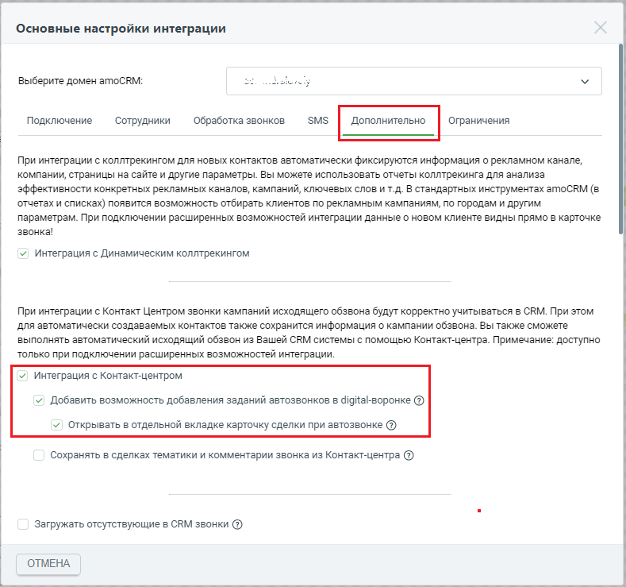

Настройка интеграции кампании исходящего обзвона с digital-воронкой Чтобы настроить виджет, в разделе “Сделки” нужно: 1) нажать на кнопку “Настроить воронку”:

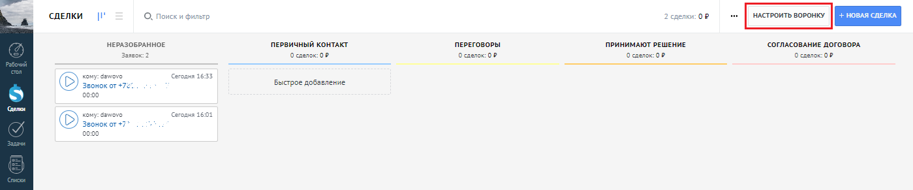

2) кликнуть под статусом, для которого нужного настроить добавление номера в кампанию ИО. Откроется окно со списком действий и виджетов.

127 Интеграция Виртуальной АТС MANGO OFFICE и amoCRM | Версия от 25.08.2025 3) найти среди них виджет MangoOffice и нажать “Добавить”:

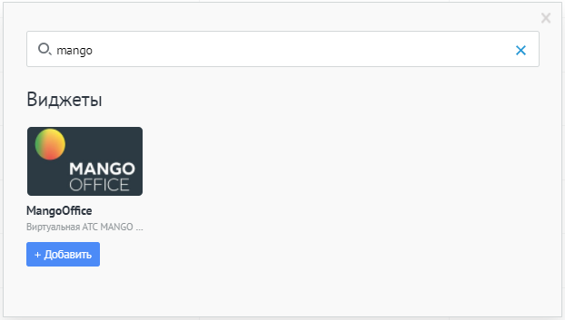

Откроется окно настройки, в котором указать: 1) при каких условиях добавлять номер Клиента в кампанию ИО; 2) установить флаг “Добавить автозвонок в кампанию обзвона”; 3) указать кампанию ИО, в которую будут добавляться номера телефонов Клиентов; 4) выбрать действие в случае, если оператор не смог дозвониться до Клиента; 5) включить флаг “Применить триггер к текущим сделкам в статусе”, чтобы опция применилась ко всем сделкам, которые сейчас находятся на данном этапе воронки; 6) нажать кнопку “Готово”: 128 Интеграция Виртуальной АТС MANGO OFFICE и amoCRM | Версия от 25.08.2025

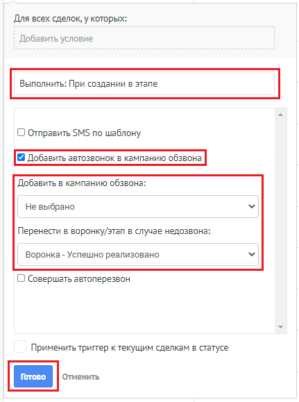

7) нажать кнопку “Сохранить”:

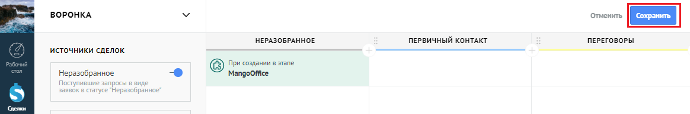

Интеграция SMS с digital-воронкой Обзор С помощью виджета интеграции MANGO OFFICE и amoCRM можно настроить отправку автоматических SMS в воронках продаж на разных этапах, что помогает автоматизировать уведомления Клиентам в процессе работы с ними. Можно настроить отправку sms не только своим Клиентам, но и своим сотрудникам и себе. Тогда вы или ваши сотрудники будут в курсе изменений в сделке. Например, если сумма сделки превысит определенную сумму или, если сделка будет закрыта. Стоимость SMS - согласно вашему тарифному плану. Эксплуатационные ограничения Накладываются следующие ограничения доступности: 129 Интеграция Виртуальной АТС MANGO OFFICE и amoCRM | Версия от 25.08.2025 1) настройка триггеров отправки SMS доступна вам, только если у вас есть внутренний номер Виртуальной АТС, связанный с вашим аккаунтом в amoCRM, при этом вы пользуетесь расширенной версией интеграции; 2) не отправляются SMS тем сотрудникам, у которых: - к аккаунту amoCRM не привязан внутренний номер Виртуальной АТС; - ко внутреннему номеру Виртуальной АТС не привязан номер мобильного телефона. Примечание. В разделе “Сопоставление сотрудников” описано, как связать аккаунт amoCRM с внутренним номером Виртуальной АТС. О том, как привязать номер мобильного телефона к внутреннему номеру Виртуальной АТС описано в этом руководстве. Как перейти к настройкам digital-воронки Чтобы открыть настройки digital-воронки, необходимо: 1) войти в ваш amoCRM; 2) перейти в раздел “Сделки”, в котором нажать на кнопку “Настроить”:

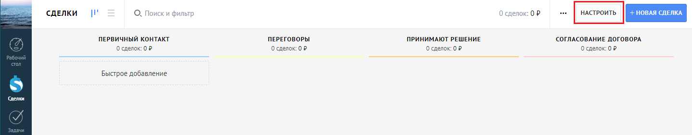

3) кликнуть под статусом, для которого нужного настроить опцию digital-воронки. Откроется окно со списком действий и виджетов:

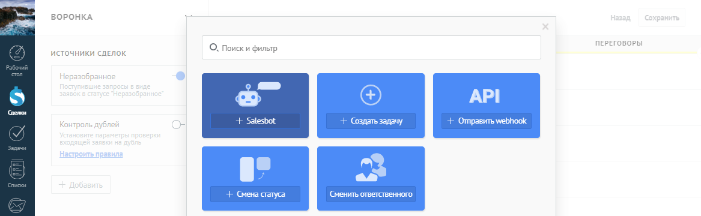

4) найти среди них виджет MangoOffice и нажать “Добавить”. Откроется окно с настройкой опций digital-воронки: 130 Интеграция Виртуальной АТС MANGO OFFICE и amoCRM | Версия от 25.08.2025

Как настроить отправку SMS Для этого, в окне настройки опций digital-воронки необходимо: 1) включить флаг “Отправлять SMS по шаблону”; 2) в открывшихся полях настройки SMS-уведомления указать: - при каких условиях отправлять SMS (к примеру, тэг равен vip, или бюджет сделки более 50 000 руб.); - при каком действии со сделкой отправлять SMS (к примеру, отмене сделки, смене ответственного, при оплате счета и т.д.); - кому отправить (покупателю и/или ответственному и/или лично вам, для отслеживания важных сделок); - от кого отправлять SMS; Примечание. В списке “Выбрать получателя (сотрудник)” перечислены только те сотрудники amoCRM, которым настроены внутренние номера Виртуальной АТС (см. Эксплуатационные ограничения). 3) ввести шаблон текста SMS. При настройке текста SMS можно указывать автоматические заполняемые поля (макросы) с информацией из сделки, основного контакта, ответственного и т.д. Для этого воспользуйтесь списками под полем для ввода текста SMS. В них перечислены те поля, в том числе пользовательские, которые можно использовать в шаблоне SMS. При выборе значения – оно автоматически вставляется в конец текста шаблона SMS. Ниже приведен пример настройки автоматического уведомления Клиента по SMS при смене ответственного по его сделке: Добрый день, {{maincontact.name}}! Ваш персональный менеджер {{user.name}}, тел. +74955404444, доб.{{user.phone}} При таком настроенном шаблоне, к примеру, после смены ответственного в сделке с бюджетом более 50 000 руб. - Клиенту придет SMS с текстом “Добрый день, Олег! Ваш персональный менеджер Лопаткин Василий, тел. +74955404444, доб.100”. 4) включить флаг “Применить триггер к текущим сделкам в статусе” (внизу окна настройки опций digital-воронки), чтобы опция автоперезвона применилась ко всем сделкам, которые сейчас находятся на данном этапе воронки; 5) кликнуть на кнопку “Готово”. На этом настройка завершена! 131 Интеграция Виртуальной АТС MANGO OFFICE и amoCRM | Версия от 25.08.2025

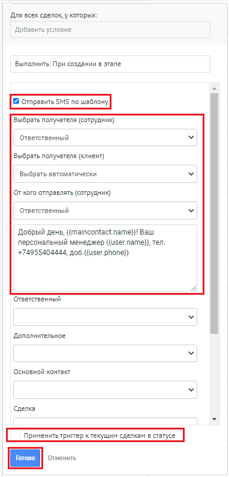

Если SMS- сообщение отправлено Клиенту, то информация об SMS сохранится в карточке Клиента. Благодаря гибкости и богатым возможностям в цифровых воронках amoCRM можно создать несколько различных условий отправки на разных этапах разных воронок, в том числе несколько условий на одном этапе воронки. Автоперезвон при изменении в digital-воронке Обзор Автоперезвон – это опция виджета интеграции, которая позволяет, при изменениях в воронке продаж, немедленно связать вашего оператора с Клиентом. Например, если на определенном этапе сумма сделки превысит заданную или Клиент пришлет сообщение в чат, то виджет интеграции тут же позвонит вашему сотруднику, а затем и Клиенту, и установит между ними соединение. 132 Интеграция Виртуальной АТС MANGO OFFICE и amoCRM | Версия от 25.08.2025 В результате использования этой опции ваши сотрудники чаще разговаривают с Клиентами, а Клиенты получат оперативную поддержку по интересующим их вопросам. Функция автоперезвона также позволяет настроить автоматическое создание задач по неудавшимся звонкам и выбрать воронку/этап, в которую будут попадать сделки неудавшихся звонков. В разделе “Автоперезвон при изменении в digital-воронке” вы узнаете, как настроить опцию автоперезвон и управлять ею. Эксплуатационные ограничения Накладываются следующие ограничения доступности: 1) опция доступна вам, только если у вас есть внутренний номер Виртуальной АТС, связанный с вашим аккаунтом в amoCRM, при этом вы пользуетесь расширенной версией интеграции; 2) невозможно настроить распределение звонков на тех сотрудников, у которых к аккаунту amoCRM не привязан внутренний номер Виртуальной АТС. Примечание. В разделе “Сопоставление сотрудников” можно узнать, как связать аккаунт amoCRM с внутренним номером Виртуальной АТС. Как настроить автоперезвон По умолчанию опция автоперезвона отключена. Чтобы включить ее, необходимо: 1) открыть окно настройки digital-воронки: 2) включить флаг “Совершать автоперезвон”; 3) в поле “Добавить условие” указать, при каких условиях совершать автоперезвон (например, если сумма сделки превышает 50 000 или Клиент прислал сообщение в чат); 4) в списке “На кого будет распределяться звонок” указать на кого будет распределяться звонок: - сотрудник; - группа сотрудников Виртуальной АТС; - ответственный по сделке. Примечание. В списке “Выбрать получателя (сотрудник)” перечислены сотрудники amoCRM, которым настроены внутренние номера Виртуальной АТС (см. Эксплуатационные ограничения). 5. если нужно, чтобы виджет интеграции ставил задачу оператору, если оператор не смог выполнить автоперезон или Клиент не ответил, то включить флаг “Ставить задачи по неудавшимся звонкам”; Примечания: • под неудавшимся звонком понимается звонок, на который Клиент не ответил, а также, если оператор вообще не перезвонил Клиенту; • под удавшимся звонком понимается звонок, который принял Клиент. 133 Интеграция Виртуальной АТС MANGO OFFICE и amoCRM | Версия от 25.08.2025 6) если нужно, чтобы виджет переводил на тот или иной этап воронки продаж те сделки, по которым зафиксирован неудавшийся звонок, то в списке “Воронка/этап для неудавшихся звонков” выберите этап, на который будет переведена такая сделка; 7) если нужно, чтобы виджет переводил на тот или иной этап воронки продаж те сделки, по которым зафиксирован удавшийся звонок, то в списке “Воронка/этап для удавшихся звонков” выберите этап, на который будет переведена такая сделка; 8) выбрать номер Виртуальной АТС, с которого будет выполняться автоперезвон; 9) включить флаг “Применить триггер к текущим сделкам в статусе”, чтобы опция автоперезвона применилась ко всем сделкам, которые сейчас находятся на данном этапе воронки; 10) кликнуть на кнопку “Готово”. На этом настройка завершена!

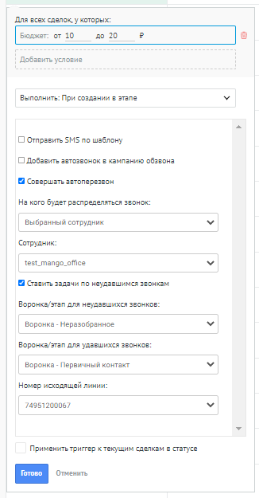

Управление автоматическим перезвоном Настроив опцию автоперезвон, можно ограничить скорость совершения перезвонов, то есть контролировать количество вызовов в минуту, совершаемых автоматически Виртуальной АТС. Кроме этого, можно настраивать количество звонков в очереди на автоперезвон. А также, можно сбросить все звонки в очереди задач на автоперезвон. Чтобы перейти к управлению опцией, в окне “Основные настройки интеграции” необходимо: 1) прокрутить закладку “Обработка звонков” вниз до конца, чтобы стал виден блок “Автоперезвоны в Digital воронке”; 134 Интеграция Виртуальной АТС MANGO OFFICE и amoCRM | Версия от 25.08.2025

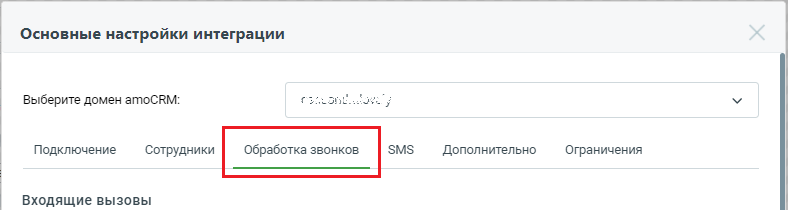

2) в блоке “Автоперезвоны в Digital воронке” размещены настройки: – Скорость автоперезвона (звонков в минуту): сколько автоперезвонов для ваших Клиентов должно совершаться в минуту. Все звонки свыше указанного лимита будут находиться в очереди на обработку. Если указать значение 0, то автоперезвон будет приостановлен; Важно! В поле “Скорость автоперезвонов (звонков в минуту)” можно указывать только целые положительные числа. – Звонков в очереди на автоперезвон: количество звонков в очереди, ожидающие обработки (ожидающих автоперезвона). Чтобы очистить очередь звонков, нужно нажать ссылку “Очистить”. Важно: • ссылка “Очистить” отображается только, если количество звонков в очереди больше 0 (нуля); • если нажать ссылку “Очистить”, то сделки, удаленные из очереди, не передвигаются по этапам воронки продаж, а также задачи по пропущенным не ставятся.

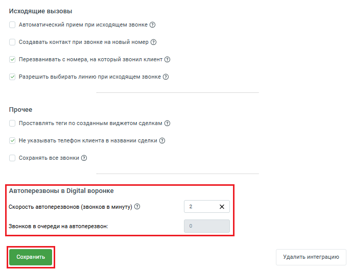

135 Интеграция Виртуальной АТС MANGO OFFICE и amoCRM | Версия от 25.08.2025

## 14.3 Сохранять в сделках тематики и комментарии звонка из

Контакт-центра Принцип работы При проведении кампании ИО, оператор КЦ может в данные каждого совершенного им исходящего звонка, вносить тематики разговора и комментарии. Вы можете в настройках интеграции включить передачу этих тематик и комментариев ваш amoCRM. По умолчанию настройка “Сохранять в сделках тематики и комментарии звонка из Контакт- центра” выключена. Если настройка будет включена, то в течение 1 часа с момента начала звонка в рамках исходящего обзвона, сервис интеграций будет автоматически сохранять в amoCRM тематики и комментарии, сделанные оператором в рамках кампании ИО. При этом надо учесть следующее: - если в настройках интеграции включены опции “Создавать контакт при звонке на новый номер” и “Создавать сделку при звонке на новый номер”, то: 1. если номер телефона не сохранен в контакты вашего amoCRM, то виджет интеграции автоматически создаст в amoCRM контакт и сделку. При этом, в настройке вам нужно заранее указать этап воронки, на которой будет создана сделка; 2. если номер телефона сохранен в контактах amoCRM и нет открытых сделок, то будет виджет интеграции автоматически создаст в amoCRM новую сделку. При этом, в настройке вам нужно заранее указать этап воронки, на которой будет создана сделка; 3. если номер телефона сохранен в контактах amoCRM и есть открытая сделка, то будет виджет интеграции автоматически создаст в amoCRM новую сделку на отдельном этапе воронки. При этом, в настройке вам нужно заранее указать этап воронки, на которой будет создана сделка. - если в настройках интеграции выключены опции “Создавать контакт при звонке на новый номер” и “Создавать сделку при звонке на новый номер” и, при этом включена данная настройка “Сохранять в сделках тематики и комментарии звонка из Контакт-центра”, то действия а)-в) будут выполняться только для исходящих звонков в рамках кампании исходящего обзвона. Как включить В окне “Основные настройки интеграции” на закладке “Дополнительно” необходимо: 136 Интеграция Виртуальной АТС MANGO OFFICE и amoCRM | Версия от 25.08.2025

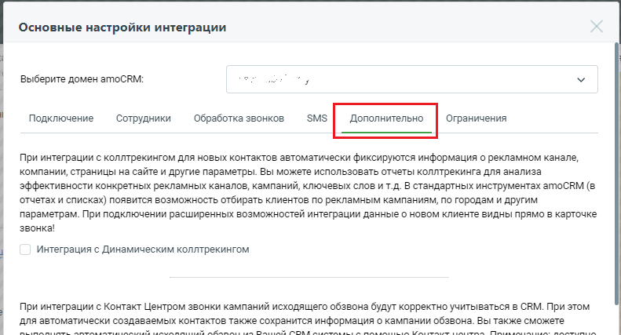

1) активируйте переключатели “Интеграция с Контакт-центром” и “Сохранять в сделках тематики и комментарии звонка из Контакт-центра”; 2) в поле “Если есть сделка” выберите этап воронки продаж, на котором будет создана еще одна сделка, если к контакту уже привязана открытая сделка; 3) в поле “Если нет сделки” выберите этап воронки продаж, на котором будет создана новая сделка; Примечание. Перед тем как создавать новую сделку, виджет интеграции проверяет наличие в amoCRM открытой сделки, привязанной к этому номеру: - если такая сделка есть, то виджет интеграции в amoCRM: 1. создаст новую сделку на этапе воронке, указанной в поле “Если есть сделка”; 2. в созданную сделку в комментарии сохранит тематики и комментарии оператора КЦ; - если к контакту не привязана открытая сделка, то виджет интеграции в amoCRM создаст новую сделку на этапе воронке, указанной в поле “Если нет сделки” и в эту сделку сохранит тематики и комментарии оператора КЦ. 4) нажмите кнопку “Сохранить” в самом низу закладки “Дополнительно”:

137 Интеграция Виртуальной АТС MANGO OFFICE и amoCRM | Версия от 25.08.2025 138 Интеграция Виртуальной АТС MANGO OFFICE и amoCRM | Версия от 25.08.2025
