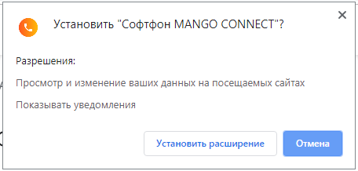
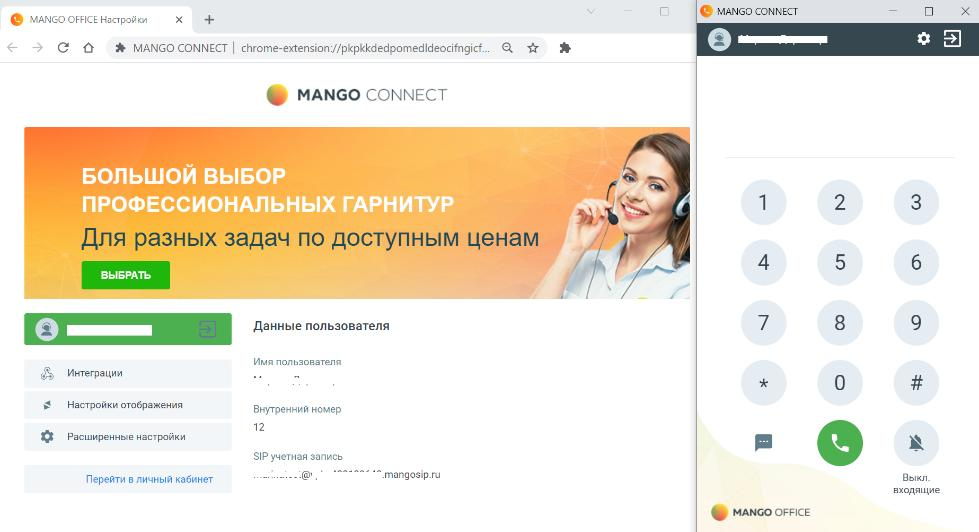
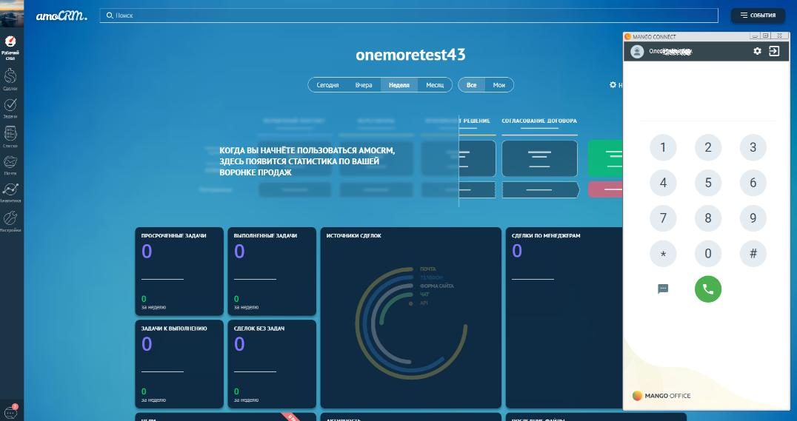

# 15. Софтфон MANGO CONNECT

> Трассировка: PDF §15 · сквозные стр. 139-144 · источники: ч.1 `kb/sources/integration_amocrm/Mango_office_integration_amoCRM.pdf` с.139-144.

## 15.1 Обзор

Софтфон “MANGO CONNECT” — расширение для Google Chrome, которое при интеграции виртуальной АТС с amoCRM-системой позволит звонить, принимать вызовы и отправлять SMS из окна браузера. Работает с amoCRM и только при наличии услуги “Расширенные возможности интеграции”. Для корректной работы MANGO CONNECT нужно обеспечить доступ к порту 7443 по протоколу WSS, путем открытия этого порта в файрволе (firewall), используемом в вашей сети, и снятии всех ограничений на использование данного порта. Не нужно ограничивать доступ к порту 7443 в вашей сети, если нужно звонить и принимать вызовы при помощи MANGO CONNECT. Нужно открыть порт 7443, тогда MANGO CONNECT сможет корректно выполнять свои функции. Внимание! Браузерный софтфон MANGO CONNECT предназначен только для работы в браузере Chrome! Для установки софтфона перейти в Chrome по ссылке - Софтфон MANGO CONNECT Чтобы звонить из браузера требуется только установленное расширение MANGO CONNECT и гарнитура. Все функции MANGO CONNECT: • прием входящих звонков; • работа в режиме “Не беспокоить” / DND, в котором все входящие вызовы автоматически сбрасываются; • набор номера на клавиатуре или с помощью номеронабирателя в приложении; • исходящие звонки по клику из amoCRM-системы; • возможность набора DTMF-команд при дозвоне на голосовое меню; • перевод вызова на другого сотрудника или внешний номер; • запись разговора во время звонка; • отключение звука во время разговора; • постановка вызова на удержание; • отображение имени или телефона Клиента; • отправка SMS из приложения; • всплывающее уведомление и звуковое оповещение при входящем звонке; • приложение работает со всеми гарнитурами. 139 Интеграция Виртуальной АТС MANGO OFFICE и amoCRM | Версия от 25.08.2025

## 15.2 Установка и первый запуск работы

Установку расширения необходимо выполнить каждому сотруднику. 1) нажать “Установить”:

140 Интеграция Виртуальной АТС MANGO OFFICE и amoCRM | Версия от 25.08.2025 2) подтвердить разрешение на установку:

3) ввести данные SIP ID сотрудника и пароля; 4) нажать на кнопку “Войти”:

5) после успешной авторизации пользователя будут показаны настройки расширения и окно софт фона: 141 Интеграция Виртуальной АТС MANGO OFFICE и amoCRM | Версия от 25.08.2025

6) после авторизации уже можно звонить и принимать звонки:

7) в настройках расширения указать ваш домен в amoCRM и нажать кнопку “Сохранить”:

8) Софтфон MANGO CONNECT настроен на работу с amoCRM. 142 Интеграция Виртуальной АТС MANGO OFFICE и amoCRM | Версия от 25.08.2025

## 15.3 Дополнительно

Как включить и выключить режим “Не беспокоить” / DND MANGO CONNECT поддерживает режим “Не беспокоить”. Если вы включили данный режим, то все ваши всходящие звонки автоматически сбрасываются. Примечание. В данном режиме входящий звонок завершается с кодом 1123, который означает “Получен сигнал”Не беспокоить”. Чтобы перевести ваш MANGO CONNECT в режим “Не беспокоить”, нужно нажать на кнопку. Чтобы отключить “Режим не беспокоить”, в вашем MANGO CONNECT нужно нажать кнопку

.

а) б) 143 Интеграция Виртуальной АТС MANGO OFFICE и amoCRM | Версия от 25.08.2025
