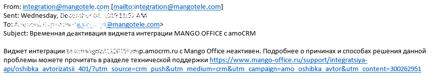

# 17. Всплывающие сообщения об ошибках в интерфейсе

> Трассировка: PDF §17 · сквозные стр. 145-153 · источники: ч.1 `kb/sources/integration_amocrm/Mango_office_integration_amoCRM.pdf` с.145-153.

amoCRM

## 17.1 Обзор

Можно самостоятельно устранить некоторые ошибки, связанные с интеграцией amoCRM и виртуальной АТС MANGO OFFICE, или отправить заявку на исправление этих ошибок в службу поддержки Клиентов MANGO OFFICE. При возникновении ошибки, в левом нижнем углу экрана amoCRM появляется специальное уведомление. Эти уведомления отмечаются заголовком Нажать для справки. Внимание! Это уведомление отображается на экране в течение 5 секунд.

Затем, специальное уведомление об ошибке можно найти в области уведомлений amoCRM:

Текст каждого уведомления содержит краткое описание и код ошибки. При нажатии на уведомление, в зависимости от ошибки, будет открыта новая вкладка браузера, в которой показано подробное описание варианта решения проблемы ИЛИ будет открыта страница “Поддержка” сайта www.mango-office.ru 145 Интеграция Виртуальной АТС MANGO OFFICE и amoCRM | Версия от 25.08.2025

## 17.2 Перечень кодов ошибок

В таблице ниже перечислены возможные сообщения об ошибках и возможные способы их решения. Примечание. Параметры <Код ошибки> в тексте сообщения используются как “переменные”. Во время выдачи сообщения об ошибке вместо такого параметра будет подставлено реальное значение.

| Код ошибки | Сообщение | Причина возникновения | Вариант решения |
| --- | --- | --- | --- |
| Ошибки звонка |  |  |  |
| 2100 | Доступ к ВАТС ограничен (2100) | Произошла внутренняя ошибка подключения. | Обычно такие сбои устраняются быстро. Если проблема по-прежнему не решена, свяжитесь с нами. |
| 2110 | Доступ к ВАТС ограничен (2110) | Проблемы с подключением, они связаны с недостатком средств на вашем счету. | Проверьте баланс вашего счета виртуальной АТС. Подробнее о том, как проверить баланс и пополнить счет можно найти в разделе "Пополнение баланса" |
| 2120 | Доступ к ВАТС ограничен (2120) |  |  |
| 2130 | Доступ к ВАТС ограничен (2130) |  |  |
| 2140 | Доступ к ВАТС ограничен (2140) | Произошла внутренняя ошибка подключения. | Обычно такие сбои устраняются быстро. Если проблема по-прежнему не решена, свяжитесь с нами. |
| 2300 | Направление заблокировано (2300) | Попытка звонка в недопустимый по настройкам ЛК регион | В настройках виртуальной АТС проверьте установку флажка на направлении Россия, а для международных вызовов - флажки на необходимых для Вас направлениях. Как это сделать, можно найти в разделе "Не совершается исходящий международный/междугородный звонок из amoCRM". |
| 2400 | Ошибка приложения (2400) | Произошла внутренняя виджета. | Обычно такие сбои устраняются быстро. Если проблема по-прежнему не решена, следует написать или позвонить в нашу техподдержку. |
| 3100 | Ошибка приложения (3100) |  |  |
| 3300 | Ошибка приложения (3300) |  |  |
| 4100 | Ошибка приложения (4100) |  |  |
| Ошибка прослушивания файла с записью разговора в amoCRM |  |  |  |
| 101 | Ошибка воспроизведения. Нет файла | Данная ошибка возникает, если вы пытаетесь воспроизвести или скачать запись разговора, которая отсутствует в облачном хранилище виртуальной АТС. | Проверьте наполненность облачного хранилища и готовность файла с записью разговора. О том, как это сделать читайте в разделе "Не получается воспроизвести файл в amoCRM" |

146 Интеграция Виртуальной АТС MANGO OFFICE и amoCRM | Версия от 25.08.2025

| Код ошибки | Сообщение | Причина возникновения | Вариант решения |
| --- | --- | --- | --- |
| 102 | Неверный ключ в настройках интеграции с ВАТС (102) | Проверьте настройки сети, путем отправки PING на наши IP. | Обновить страницу. Если проблема по- прежнему не решена, следует написать или позвонить в нашу техподдержку. |
| 103 | Ошибка приложения (103) | Произошла внутренняя ошибка прослушивания файла с записью разговора в amoCRM. | Обычно такие сбои устраняются быстро. Если проблема по-прежнему не решена, следует написать или позвонить в нашу техподдержку. |
| 3330 | Пользователь не настроен | Сотрудник не настроен в настройках интеграции виртуальной АТС и amoCRM (у сотрудника прописан добавочный, которого нет в виртуальной АТС) | Проверить настройки сотрудника в интеграции можно в личном кабинете MANGO OFFICE. О том, как это сделать читайте в разделе "Зачем внутренние номера в виджете и где их взять?" |
| Прочее коды ошибок |  |  |  |
| 401 | Ошибка авторизации (401) | Неактивен/удален из amoCRM аккаунт администратора, указанный в настройках виджета | О том, как это сделать читайте в разделе "Что делать в случае ошибки авторизации (401)" |
| 403 | Ошибка доступа (403) | Возникает в случае блокировки IP адреса Клиента в настройках amoCRM | Необходимо проверить белый список IP адресов и работоспособность API amoCRM. О том, как это сделать читайте в разделе "Что делать в случае ошибки доступа". |
| 005 | Ошибка приложения (005) | Ошибка выполнения callback запроса | Обычно такие сбои устраняются быстро. Если проблема по-прежнему не решена, следует написать или позвонить в нашу техподдержку. |
| 007 | Ошибка приложения (007) | Произошла внутренняя ошибка |  |
| 202 | Пользователь не настроен (202) | У сотрудника в карточке сотрудника отсутствует добавочный в настройках виртуальной АТС | Проверить настройки сотрудника в интеграции можно в личном кабинете MANGO OFFICE. О том, как это сделать читайте в разделе "В настройках интеграции указан не существующий номер". |
| 014 | Ошибка приложения (014) | Произошла внутренняя ошибка | Обычно такие сбои устраняются быстро. Если проблема по-прежнему не решена, следует написать или позвонить в нашу техподдержку. |

147 Интеграция Виртуальной АТС MANGO OFFICE и amoCRM | Версия от 25.08.2025

## 17.3 Уведомления по электронной почте о блокировке виджета

Уведомления о блокировке вашего виджета интеграции отправляются по электронной почте на адрес, указанный в настройках интеграции виртуальной АТС с amoCRM в поле “Email администратора amoCRM”. Примечание. Нельзя менять настройки отправки уведомлений о блокировке.

## 17.4 Пример уведомления о блокировке виджета

Если ваш виджет интеграции был заблокирован по той или иной причине, то сервис интеграции отправит вам специальное электронное письмо об этом, например, такое:

В письме указан домен заблокированного виджета и ссылка на страницу “Поддержка” сайта www.mango-office.ru, нажав на которую, будет открыта страница с описанием причины блокировки и способах решения данной проблемы.

## 17.5 Что делать, если не приходит уведомление о блокировке?

Если не получается найти письмо с уведомлением о блокировке, то необходимо: 1) поискать письмо с уведомлением о блокировке в папке “Спам” вашей электронной почты. Возможно, что письмо находится в этой папке; 2) проверить фильтры вашей электронной почты. Вы могли настроить фильтры, которые автоматически отправляют в папку “Спам” или удаляют письма от integation@mangotele.com Чтобы уведомления о блокировке не попадали в спам, настройте фильтр так, чтобы уведомления всегда попадали в папку “Входящие” и помечались как важные. 148 Интеграция Виртуальной АТС MANGO OFFICE и amoCRM | Версия от 25.08.2025 Список изменений в документе 25.08.2024 1) Добавлено описание функциональности сохранения и передачи Резюме разговора в разделе «Речевая аналитика» 27.11.2024 1) Добавлено описание отслеживания все звонков, в том числе не сопоставленных сотрудников. 2) Добавлено описание функции постзвонковой оценки качества. 14.10.2024 1) Объединены в единый раздел все настройки интеграции, связанные Контак-центром. 2) Добавлено описание настройки “Сохранять в сделках тематики и комментарии звонка из Контакт-центра”. 30.09.2024 Корректировка описания порядка подключения виджета интеграции. 11.09.2024 Обновлен порядок подключения виджета интеграции. 28.08.2024 Изменение дизайна документа. 03.07.2024 1) функция определения номера по справочнику “Желтые страницы” больше недоступна; 2) добавлено описание логики работы функции “Перезванивать с номера, на который звонил Клиент”. 29.11.2023 Корректировка общего описания опции “Интеграция с Контакт Центром MANGO OFFICE”. 11.01.2023 Коррекция метаданных файла. 09.12.2022 149 Интеграция Виртуальной АТС MANGO OFFICE и amoCRM | Версия от 25.08.2025 Дополнено описание настройки “Создавать контакт при звонках с новых номеров”. В новом контакте могут быть данные о компании, если включена настройка “Определять информацию по Желтым страницам”. 06.12.2022 В описание настройки “Определять информацию по Желтым страницам” добавлена информация об автоматическом создании компании, при создании контакта. 14.11.2022 Обновлены иллюстрации из-за обновления интерфейса amoCRM. 13.09.2021 Общее редактирование текста. 22.08.2022 1) обновлено описание подключения интеграции в amoCRM; 2) обновлено описание настройки сопоставления сотрудников Виртуальной АТС и amoCRM; 3) обновлены иллюстрации в связи с изменениями в части подключения интеграции. 28.04.2022 Добавление краткого описания поля “ДКТ: ya_client_id” в описание настройки “Интеграция с Коллтрекингом MANGO OFFICE”. 25.04.2022 1) добавлено описание новых полей, передаваемых в amoCRM, если в виджете включена настройка “Интеграция с Коллтрекингом MANGO OFFICE”; 2) скорректировано описание умных правил распределения звонков. 14.03.2022 1) дополнено описание настройки сопоставления сотрудников amoCRM и Виртуальной АТС при установке базовых настроек виджета; 2) дополнено описание функции Автоперезвон при изменении в digital-воронке. Добавлено описание как настроить воронку/этап для сделок, по которым перезвонили Клиенту, и Клиент принял вызов (удавшийся звонок). 09.03.2022 Добавлено описание формата номера телефона, который нужно использовать при настройке умных правил распределения входящих звонков. 28.02.2022 Увеличено до 100 количество умных правил, которые можно создать в виджете интеграции. 25.02.2022 Добавлено описание прочих настроек интеграции: проставлять теги по созданным виджетом сделкам, не указывать телефон клиента в названии сделки. 24.02.2022 1) добавлено описание настройки “Заменять номер линии на комментарий в интерфейсе CRM”; 2) в описание работы с предупреждениями добавлено описание еще одного предупреждения, выдаваемого при сохранении настроек интеграции в домене amoCRM, в котором уже настроена и “активна” интеграция. 150 Интеграция Виртуальной АТС MANGO OFFICE и amoCRM | Версия от 25.08.2025 22.02.2022 Добавлено описание пользовательских настроек карточки звонка. 28.01.2022 Дополнено описание обработки пропущенных в IVR звонков. Добавлено описание настройки “Для повторных пропущенных в IVR: назначать на ответственного за клиента”. 29.12.2021 Общее редактирование текста. 27.12.2021 Добавлено описание начала работы с интеграцией: подготовка, порядок действий, как проверить передачу данных о звонке и т.д. 08.12.2021 1) добавлено описание правило постановки задачи по пропущенным вызовам, а также описано как включить постановку задача на ответственного за контакт; 2) добавлено описание постановки задачи из карточки звонка вручную; 3) добавлено описание “Как изменить порядок применения правил”; 4) обновлено описание карточки звонка и функции “Список обзвона”, а также добавлены в текст ссылки на рисунки. 11.10.2021 Дополнено описание порядка перевода звонка на другого сотрудника, а также добавлено описание как отменить перевод звонка на другого сотрудника. 08.10.2021 Добавлено описание функции “Не беспокоить” в описание софтфона MANGO CONNECT. 03.09.2021 1) добавлено описание создания сделок в разных воронках в зависимости от группы, на которую поступил звонок; 2) дополнено описание настройки ограничения номеров. Теперь в основных настройках интеграции справа от номера отображается комментарий к этому номеру, загруженный из настроек вашей ВАТС; 3) добавлено описание настройки “Перезванивать с номера, на который звонил Клиент”; 4) отредактирован титульный лист. 02.09.2021 1) обновлено описание настройки “Создавать контакт при звонке на новый номер”. Теперь, если данная настройка включена, то появляется дополнительная возможность создавать сделку при звонке на новый номер; 2) добавлено описание настройки автоматического приема при исходящем звонке; 3) дополнено описание карточки звонка описанием работы с новыми функциями. 24.06.2021 Добавлено описание функции “Загружать отсутствующие в amoCRM звонки”. 17.06.2021 151 Интеграция Виртуальной АТС MANGO OFFICE и amoCRM | Версия от 25.08.2025 В описании интеграции Виртуальной АТС одновременно с несколькими доменами amoCRM обновлено описание работы с предупреждениями. 16.06.2021 Добавлено описание интеграции Виртуальной АТС с несколькими доменами amoCRM. 06.04.2021 1) добавлено описание опции определения Клиента по справочнику “Желтые страницы” в карточке звонка; 2) общее редактирование текста. 06.04.2021 1) дополнено описание настройки отображения карточки звонка (beta); 2) дополнено описание настройки умных правила распределения входящих звонков требованиями к схеме распределения вызовов, не выполнение которых приводит к некорректной работе и сообщению об ошибке в настройках интеграции. 05.04.2021 1) обновление описания карточки звонка в разделе “Входящий звонок”; 2) общее редактирование иллюстраций. 20.01.2021 1) дополнено описание повторного сохранения настроек; 2) добавлено описание сохранения текстов Речевой Аналитики. 15.01.2021 Редактирование иллюстраций. 11.11.2020 Дополнено описание видов звонков и способов фиксации их в amoCRM. 06.10.2020 Дополнено описание управления автоматическим перезвоном. 06.08.2020 Дополнено описание настройки показа карточки звонка в интерфейсе amoCRM. 29.07.2020 Добавлено описание настройки показа карточки звонка в интерфейсе amoCRM. 02.07.2020 Дополнено описание опции Автоперезвон при изменении в digital-воронке. 30.06.2020 Обновлено описание порядка установки виджета в amoCRM и порядка установки базовых настроек. 08.06.2020 1) добавлено описание опции Автоперезвон при изменении в digital-воронке; 2) обновлено описание интеграции SMS с digital-воронкой. 28.04.2020 152 Интеграция Виртуальной АТС MANGO OFFICE и amoCRM | Версия от 25.08.2025 Добавлено требование к информационной сети Клиента для корректной работы MANGO CONNECT. 26.04.2020 Добавлено описание возможности добавления задания в кампанию исходящего обзвона при изменении в digital-воронке (beta). 06.04.2020 1) добавлено описание междоменного отслеживания звонка; 2) добавлены эксплуатационные ограничения отправки SMS в воронке. 03.04.2020 1) добавлено описание настройки всплывающих уведомлений в браузере; 2) добавлено описание влияния флага “Фиксировать в”неразобранное” на обработку повторных звонков от новых Клиентов. 04.02.2020 1) добавлено описание возможности помечать дублированные контакты аналитики; 2) добавлено описание сброса нежелательных звонков при помощи умных алгоритмов. 28.01.2020 Добавлено описание возможности сохранения данных речевой аналитики. 153
