# 6. Настройка аутентификации и авторизации на примере Keycloak

> Трассировка: PDF §6 · сквозные стр. 13-22 · источники: ч.1 `kb/sources/lk-vats-sso/MANGO_OFFICE_LK_VATS_Auth_SSO.pdf` с.13-22.

примере Keycloak Чтобы начать настройку аутентификации и авторизации с помощью Keycloak, перейдите на вкладку «Login» в настройках вашего существующего Realm.

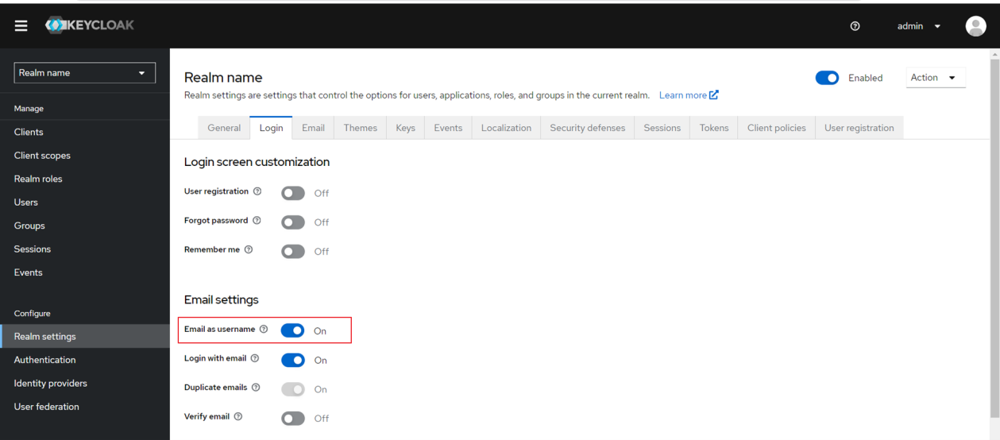

Далее установите переключатель «Email as username» («Email в качестве имени пользователя») в положение «включено». Это важно, чтобы после успешной авторизации вам предоставлялось значение адреса электронной почты в атрибуте «nameId». По умолчанию, адрес электронной почты используется как идентификатор.

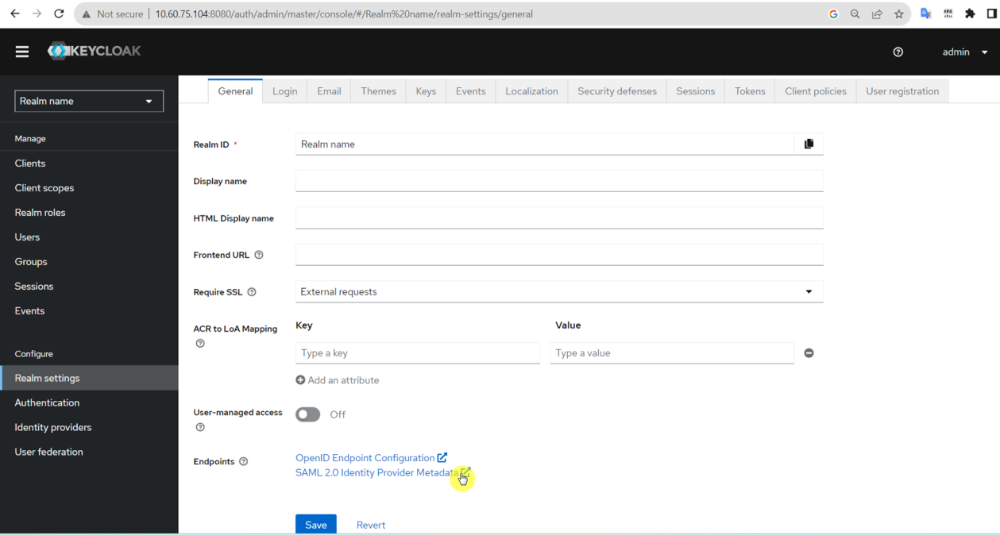

Кликнув на ссылку, экспортируйте настройки в формате XML для последующего импорта в Личный Кабинет MANGO OFFICE.

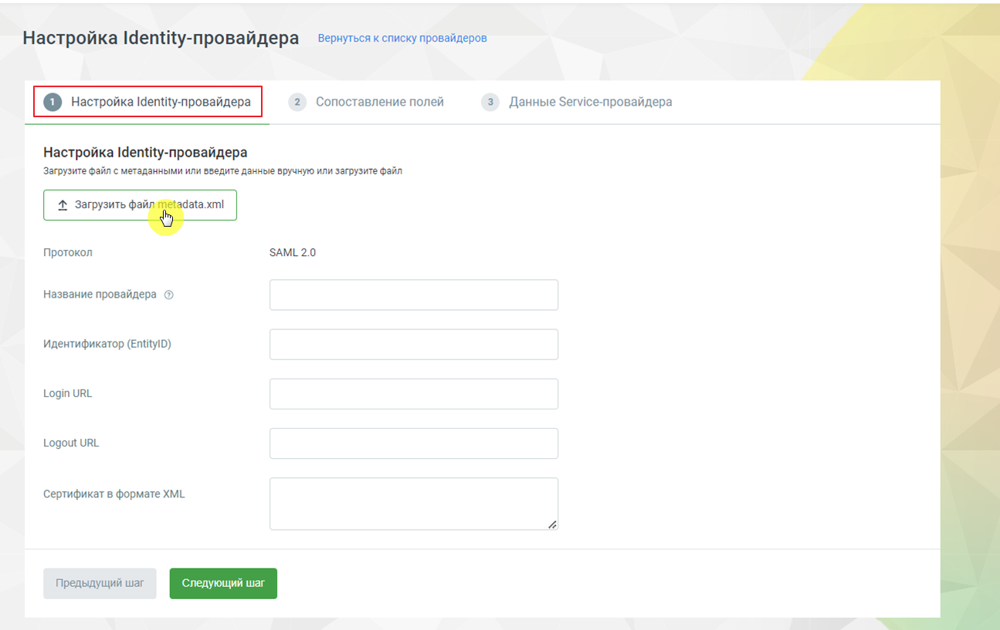

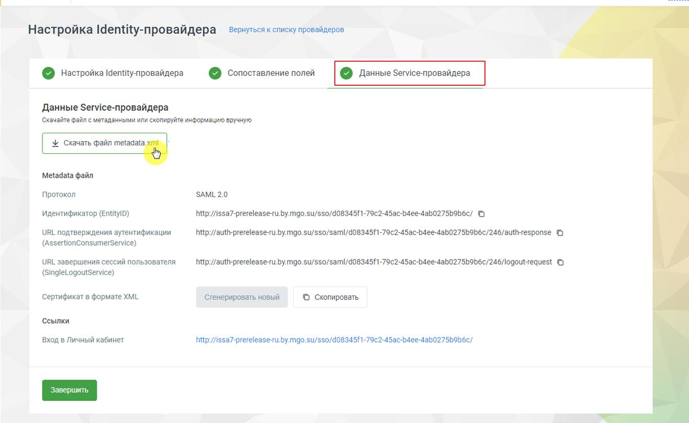

После сохранения настроек IdP (Identity Provider) в ЛК MANGO OFFICE, импортируйте полученный XML файл. Для этого нажмите на кнопку «Загрузить файл metadata.xml» на вкладке Настройка Identity-провайдера.

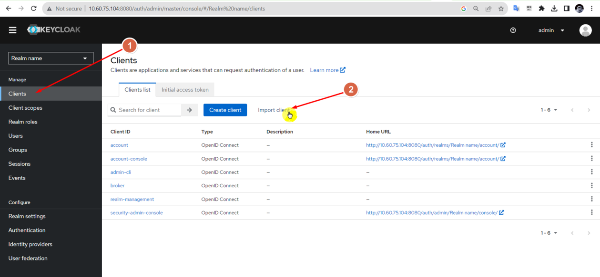

Плоле «Название провайдера» заполните самостоятельно, остальные поля подтянутся из файла metadata.xml. В ЛК ВАТС произведите сопоставление полей в соответствии с Шагом 2.

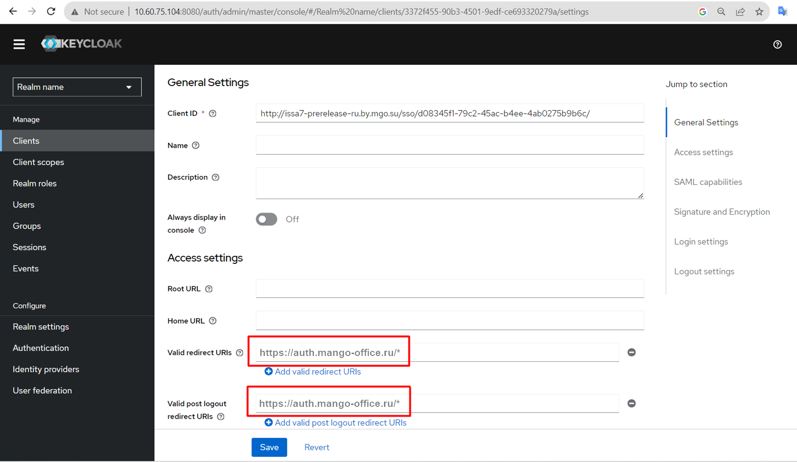

После успешного сохранения IdP в ЛК MANGO OFFICE скачайте файл с метаданными для последующего импорта в Keycloak. Для этого нажмите на кнопку «Скачать файл metadata.xml» на вкладке Данные Service-провайдера.

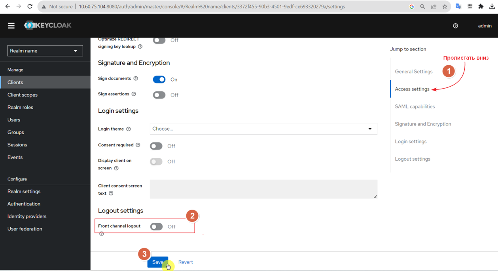

Вернитесь в Keycloak и перейдите на вкладку Clients. Затем импортируйте скачанный в шаге 5 файл с метаданными, нажав на кнопку «Import client».

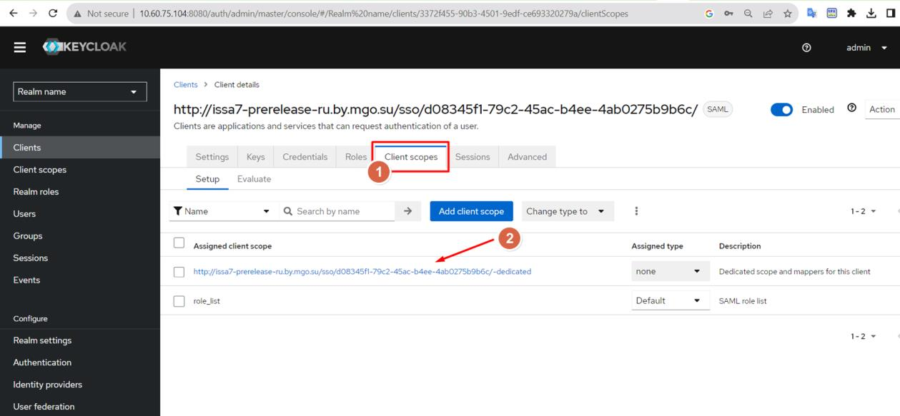

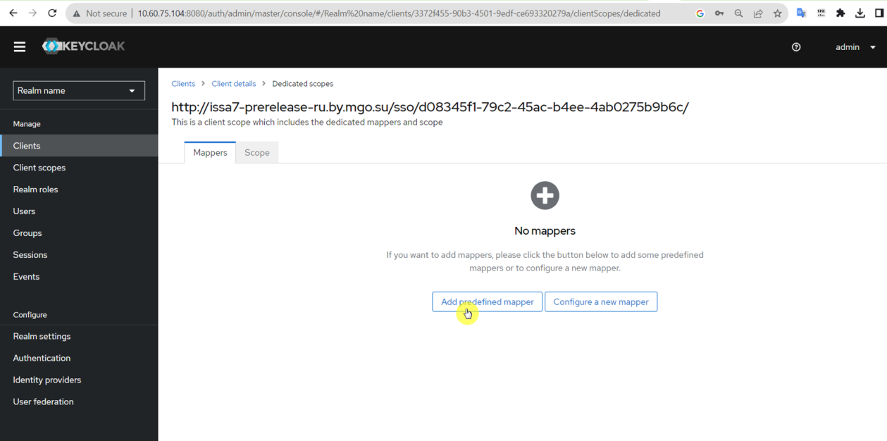

После импорта настроек, заполните параметры «Valid Redirect URIs» и «Valid Post Logout Redirect URIs» значением https://auth.mango-office.ru/*.

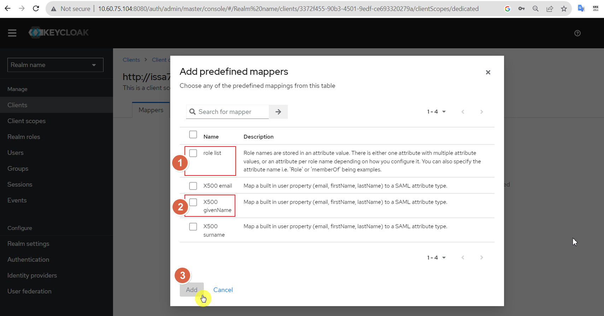

Пролистайте окно вкладки «Clients» вниз до подраздела Access setting. Переведите переключатель «Front Channel Logout» в положение «выключено», чтобы Keycloak не инициировал автоматический выход пользователя из приложений. Сохраните внесенные изменения.

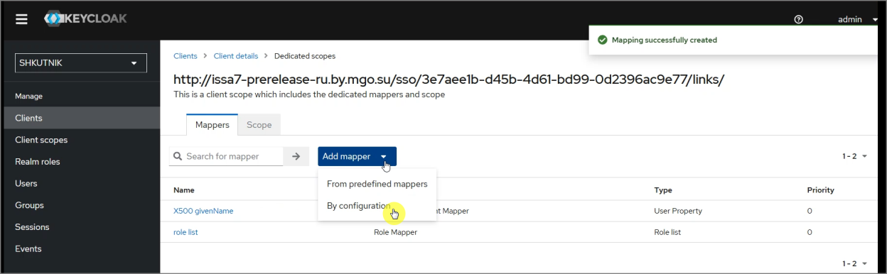

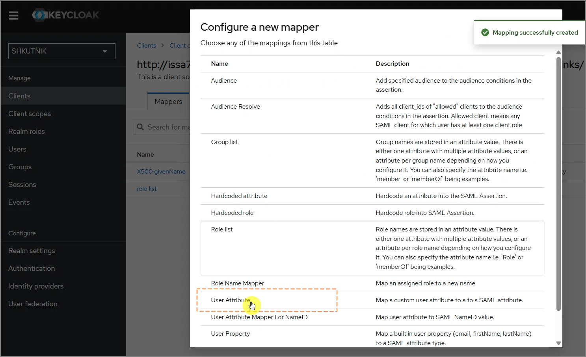

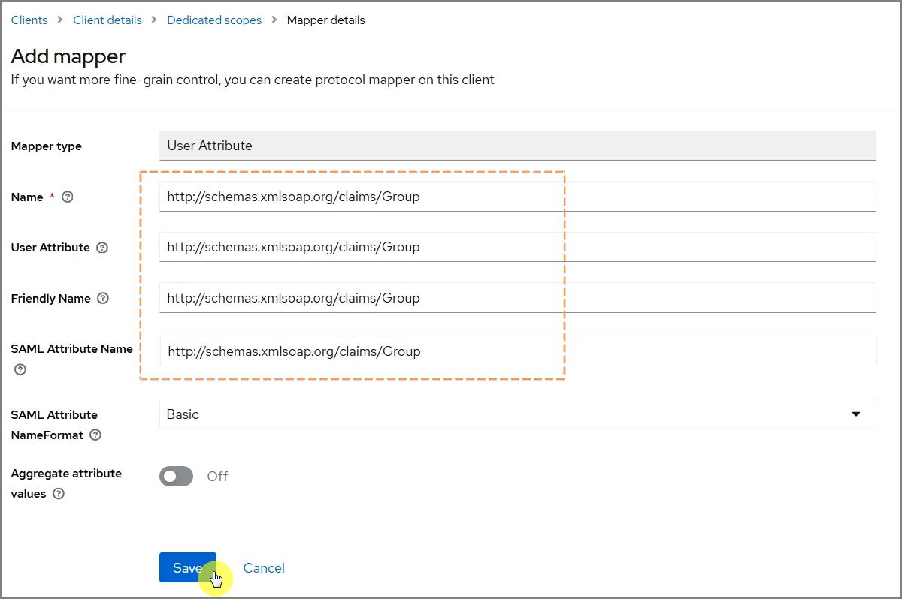

Перейдите на вкладку Client Scopes и добавьте новый маппер для сопоставления полей, настроенных в Шаге 2 настройки IdP в ЛК MANGO OFFICE.

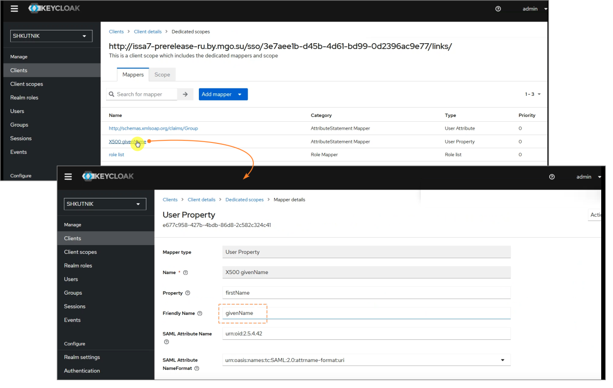

Нажмите кнопку «Add predefined mapper», чтобы добавить новый маппер.

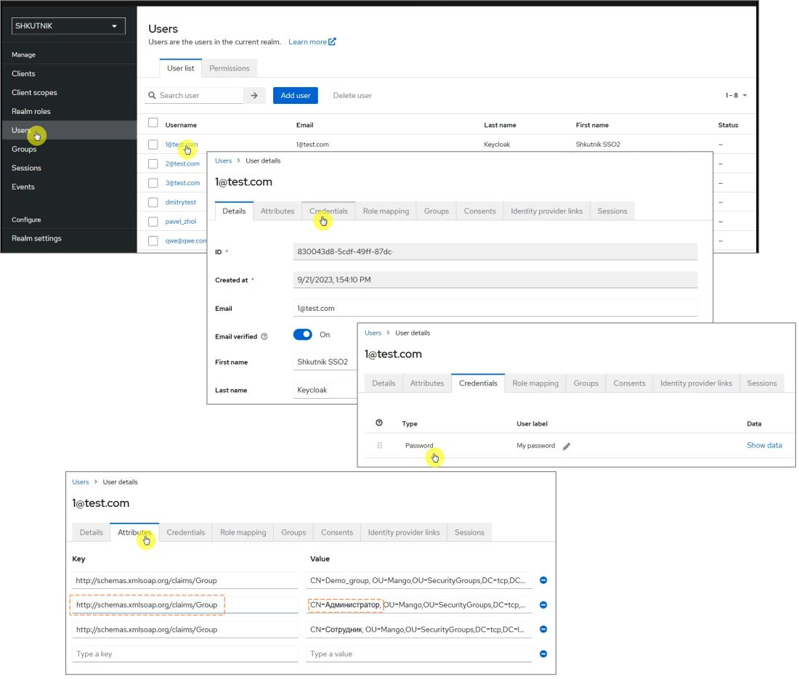

<!-- изображение на стр. 18: байты не извлечены (PyMuPDF недоступен) -->

<!-- изображение на стр. 19: байты не извлечены (PyMuPDF недоступен) -->

<!-- изображение на стр. 19: байты не извлечены (PyMuPDF недоступен) -->

<!-- изображение на стр. 19: байты не извлечены (PyMuPDF недоступен) -->

Добавьте мапперу атрибуты (Роль и Имя).

<!-- изображение на стр. 19: байты не извлечены (PyMuPDF недоступен) -->

<!-- изображение на стр. 19: байты не извлечены (PyMuPDF недоступен) -->

В разделе Clients на вкладке Dedicated scopes → Mappers нажмите кнопку Add mapper и в раскрывающемся списке выберите By configuration, чтобы создать новый маппер с ручной настройкой параметров.

<!-- изображение на стр. 19: байты не извлечены (PyMuPDF недоступен) -->

<!-- изображение на стр. 20: байты не извлечены (PyMuPDF недоступен) -->

<!-- изображение на стр. 20: байты не извлечены (PyMuPDF недоступен) -->

<!-- изображение на стр. 20: байты не извлечены (PyMuPDF недоступен) -->

В открывшемся окне Configure a new mapper выберите тип маппера User Attribute. Этот тип используется для передачи пользовательского атрибута Keycloak в SAML- атрибут.

<!-- изображение на стр. 20: байты не извлечены (PyMuPDF недоступен) -->

Заполните параметры маппера для передачи групп пользователя в SAML-ответе: • в поле Name укажите имя SAML-атрибута, которое используется в целевой системе; • в поле User Attribute укажите имя пользовательского атрибута, в котором в Keycloak будут храниться значения групп; • в поле Friendly Name укажите удобочитаемое имя атрибута, которое будет использоваться в SAML-утверждении; • в поле SAML Attribute Name укажите имя атрибута, ожидаемое сервис- провайдером; • в поле SAML Attribute NameFormat оставьте значение Basic или укажите формат, требуемый принимающей системой. После заполнения параметров нажмите Save, чтобы сохранить маппер. Имя атрибута должно совпадать с тем значением, которое используется при сопоставлении полей на стороне сервис-провайдера.

<!-- изображение на стр. 21: байты не извлечены (PyMuPDF недоступен) -->

<!-- изображение на стр. 21: байты не извлечены (PyMuPDF недоступен) -->

<!-- изображение на стр. 21: байты не извлечены (PyMuPDF недоступен) -->

<!-- изображение на стр. 21: байты не извлечены (PyMuPDF недоступен) -->

Откройте вкладку Mappers и убедитесь, что созданный маппер (в примере - http://schemas.xmlsoap.org/claims/Group) появился в списке.

<!-- изображение на стр. 21: байты не извлечены (PyMuPDF недоступен) -->

<!-- изображение на стр. 22: байты не извлечены (PyMuPDF недоступен) -->

<!-- изображение на стр. 22: байты не извлечены (PyMuPDF недоступен) -->

<!-- изображение на стр. 22: байты не извлечены (PyMuPDF недоступен) -->

Проверьте, что его тип указан как User Attribute, а категория – AttributeStatement Mapper. Откройте маппер X500 givenName. Убедитесь, что заданы следующие параметры: • Mapper type – User Property; • Property – firstName; • Friendly Name – givenName; • SAML Attribute Name – urn:oid:2.5.4.42; • SAML Attribute NameFormat – urn:oasis:names:tc:SAML:2.0:attrname-format:uri. Эта настройка обеспечивает передачу имени пользователя в SAML-ответе. Перейдите в раздел Users, откройте карточку пользователя и выберите вкладку Attributes.

<!-- изображение на стр. 22: байты не извлечены (PyMuPDF недоступен) -->

Добавьте атрибут с ключом http://schemas.xmlsoap.org/claims/Group. В поле значения укажите группы пользователя, например: • CN=Администратор, OU=Mango, OU=SecurityGroups Сохраните изменения. Добавленные атрибуты будут передаваться через настроенный маппер в SAML-ответе при аутентификации пользователя.
