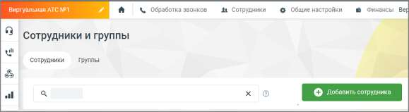
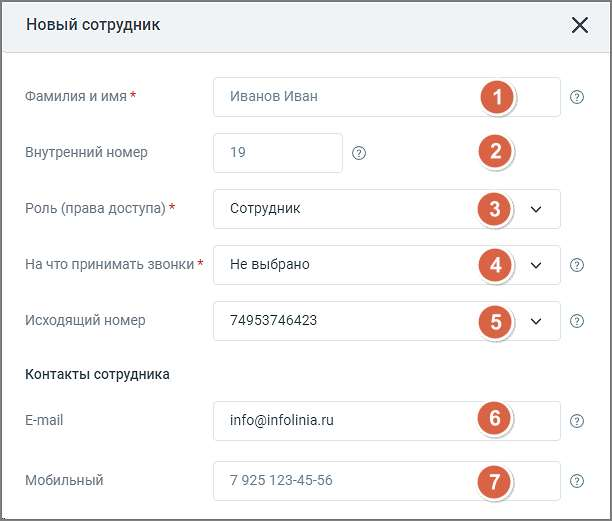
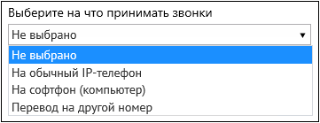
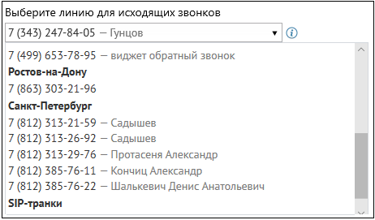
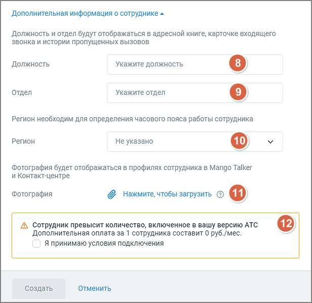
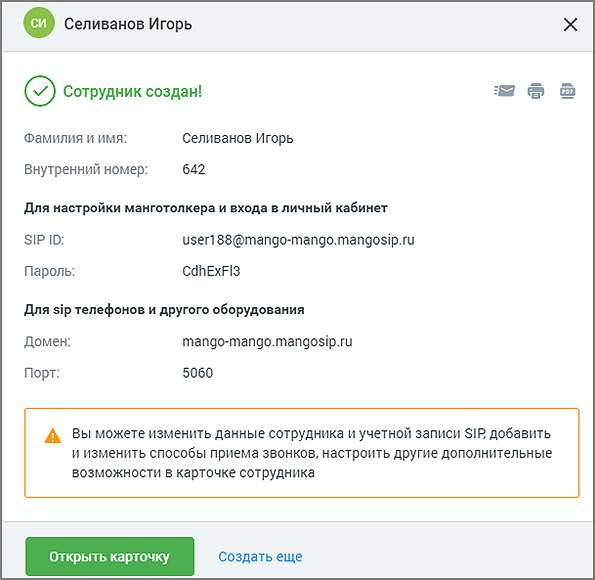
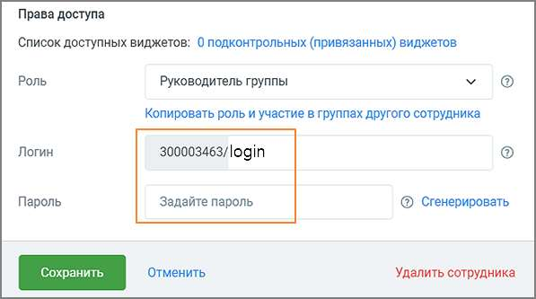
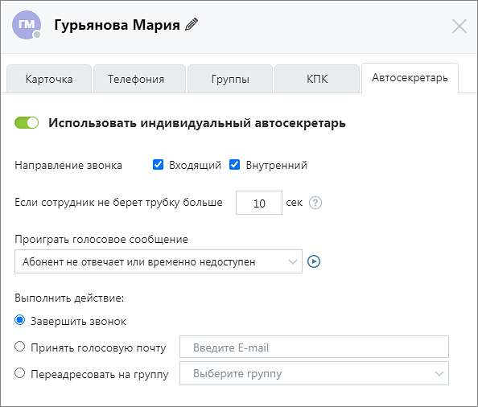

# Регистрация нового пользователя

> Трассировка: PDF §1.1 · сквозные стр. 9-17 · источники: ч.1 `kb/sources/mango-cc-manual/CC_manual_1.26.28.1.pdf` с.9-17.

Для регистрации нового пользователя создайте для него учетную запись сотрудника в Личном кабинете Виртуальной АТС, с которой используется Контакт-центр MANGO OFFICE. Для этого войдите в Личный кабинет, выберите Виртуальную АТС, с которой вы используете Контакт-центр MANGO OFFICE, откройте список сотрудников и добавьте нового сотрудника.

Вы также можете зарегистрировать нового пользователя с помощью Контакт-центра MANGO OFFICE. Для этого перейдите в настройки программы на закладку "ВАТС", откройте список сотрудников и нажмите ссылку "Добавить сотрудника". После этого на экране отображается форма для ввода данных.

1. Укажите Ф.И.О. сотрудника. Если специалист с такими данными уже существует, отображаются соответствующее сообщение и ссылка на его карточку, в которой при необходимости можно внести изменения. 2. При создании профиля сотруднику автоматически присваивается порядковый внутренний номер. При необходимости его можно изменить. Внутренний номер должен быть уникальным и состоять не более, чем из пяти цифр. Рекомендованная минимальная длина внутреннего номера составляет две цифры во избежание возникновения конфликтов с номерами пунктов голосового меню. 3. Укажите роль сотрудника (права доступа к функционалу Личного кабинета). 4. Укажите способ приема звонков.

При выборе вариантов «На обычный IP-телефон» и «На софтфон (компьютер)» требуется наличие учетной записи SIP. Она создается в автоматическом режиме или задается позднее при редактировании карточки сотрудника.

При выборе варианта «Перевод на другой номер» необходимо указать телефонный номер в формате 7 925 123-45-67. 5. Выбор линии для исходящих звонков выполняется, только если к Виртуальной АТС подключено более одного телефонного номера, включая номера 8-800 и SIP-линии.

При выборе значения «Не указан номер – Нет исходящей связи» для сотрудника не указывается исходящий номер, что приводит к отсутствию возможности использовать внешнюю исходящую связь. Если при создании сотрудника на ВАТС нет ни одного телефонного номера DID , номера 8- 800 или номера-заглушки, но есть одна SIP-линия, то Шаг 5 не отображается, а данная SIP- линия автоматически указывается в качестве линии для исходящих звонков. При количестве линий две и более Шаг 5 отображается. 6. При создании сотрудника указанный электронный адрес записывается в карточку сотрудника. На этот адрес сотруднику отправляется письмо с информацией по завершению регистрации и установлению пароля сотрудника в Личном кабинете. Если электронный адрес не указан, при создании карточки Администратор может создать или сгененировать пароль самостоятельно и передать его сотруднику. Поле проверяется на уникальность. Если введенный электронный адрес принадлежит другому сотруднику ВАТС, появится соответствующее системное уведомление. Поле является обязательным для заполнения, если оно используется в настройках двухфакторной авторизации.

| Если в карточке сотрудника не указан e-mail, сотрудник не имеет возможности |  |  |
| --- | --- | --- |
|  | самостоятельно изменить свой пароль доступа к ЛК ВАТС. Таким образом это создает |  |
|  | возможную проблему компрометации паролей, так как Администратор уже заранее знает |  |
| пароль создаваемого пользователя. |  |  |

7. Если поле «Мобильный» оставить пустым, номер может подтягиваться из вкладки «Телефония» (если он соответствует параметрам мобильного телефона). Поле проверяется на уникальность. Если введенный номер мобильного телефона принадлежит другому сотруднику ВАТС, появится соответствующее системное уведомление. Поле является обязательным для заполнения, если оно используется в настройках двухфакторной авторизации.

8. Укажите должность нового сотрудника. 9. Укажите отдел, в котором работает сотрудник. 10. Выберите из выпадающего списка регион, в котором территориально находится сотрудник. 11. Загрузите фото сотрудника. Допустимые форматы png, jpeg, bmp. 12. Отметьте чекбокс согласия на дополнительную оплату за превышение количество сотрудников, добавленный в ЛК ВАТС. После заполнения полей формы нажмите Создать. Будет выполнена автоматическая проверка на корректность введенных данных. Если поле было заполнено с ошибкой, на экране отобразится соответствующее сообщение. При отсутствии ошибок отобразится форма вида:

Для удаления сотрудника откройте карточку сотрудника и нажмите кнопку Удалить сотрудника. При удалении выполняется проверка, задействован ли сотрудник: • в кампаниях Исходящего обзвона статусах «Завершена», «Запланирована», «Остановлена» – в этом случае сотрудник исключается из списка операторов и удаляется; • в запланированном вызове – в этом случае вызов будет отменен, сотрудник удаляется; • если сотрудник указан хотя бы в одной кампании Исходящего обзвона в статусе, отличном от «Завершена», «Запланирована», «Остановлена», удаление не производится, а на экране отображается информационное сообщение. Для редактирования профиля откройте его, нажав соответствующую кнопку. Карточка включает несколько вкладок: Карточка Вкладка "Карточка" используется для настройки: • профиля сотрудника (E-mail, Отдел, Должность); • учетных записей SIP; • доступа в личный кабинет.

В Личном кабинете предусмотрены базовые и пользовательские роли. Базовые роли – стандартные роли, имеющие предустановленный набор настроек; пользовательские роли – это роли, созданные и настроенные клиентом. Базовые роли включают: • Нет доступа — доступ в Личный кабинет полностью запрещен. По умолчанию присваивается каждому новому сотруднику; • Сотрудник — частичное ограничение доступа к некоторым разделам, настройкам и инструментам Личного кабинета и Лицевого счета; • Бухгалтер — полный доступ к разделу «Лицевой счет» и ограниченный (такой же, как для предыдущей категории) к остальным; • Администратор — полный доступ ко всем разделам. Рекомендуем присваивать эту категорию только руководящему персоналу.

| Сотрудник, являющийся администратором в Виртуальной АТС, автоматически получает |
| --- |
| роль «Администратор» в Контакт-центре. |

Укажите логин после цифрового префикса, являющегося номером текущего продукта. Пример: 300003463/maxim. Укажите пароль или нажмите Сгенерировать для автоматического создания. Пароль должен состоять не менее чем из восьми символов, содержать цифры, строчные и прописные буквы a–z (использовать русские буквы не допускается). При присвоении сотруднику роли «Нет доступа» заданные логин, пароль и статус возможности входа по SIP сохраняются в Личном кабинете. Также логин и пароль не удаляются при снятии галочки «Создать отдельные логин/пароль для Личного кабинета и Контакт-центра». Телефония Вкладка "Телефония" используется для настройки: • данных абонента АТС (внутренний номер, способ приема звонков); • средств приема звонков (телефон или учетная запись SIP); • исходящего номера и разрешенных направлений звонков. Внутренний номер сотрудника можно использовать для переадресации вызовов на остальные средства связи. Для этого в списке «Принимать звонки» выберите нужный пункт. Рекомендованная минимальная длина внутреннего номера составляет две цифры во избежание возникновения конфликтов с номерами пунктов голосового меню. В блоке "Средства приема звонков" указываются все контакты для дозвона, порядок их использования и расписание.

Для добавления еще одного средства связи нажмите соответствующую кнопку и выберите нужный способ. По умолчанию для каждого номера устанавливается статус «Активен». Это означает, что данное средство связи используется для приема вызовов. Если требуется изменить время ожидания ответа для номера, введите нужное значение в поле Ждать ответ. По умолчанию при создании нового сотрудника с указанным средством приема звонков, а также при добавлении нового средства приема звонков в данном поле указывается значение, установленное в настройке "Время ожидания ответа по умолчанию, сек.:". Подробнее о настройке см. в подразделе «Настройки ожидания ответа».

| Если указать значение «0», то цифра заменяется на знак бесконечности, что расценивается |
| --- |
| как "бесконечно ожидать ответ". |

Предусмотрено расписание работы номера. Для его редактирования нажмите соответствующую ссылку в столбце «Расписание». Задайте период, дату, день недели или время. Используя дополнительные параметры списка «Добавить», вы можете установить максимально подробное и точное расписание для каждого из номеров. Если к текущей Виртуальной АТС подключено несколько номеров, в списке «Исходящий номер» блока "Совершение звонков" можно указать тот, который должен определяться у вызываемого абонента. Если у компании есть филиалы в разных регионах, есть возможность выбрать номер в нужном. Кроме номеров MANGO OFFICE в списке также отображаются номера 8-800 и SIP-адреса с активным режимом работы.

| Рекомендуем устанавливать для исходящих звонков номер в регионе присутствия, чтобы |
| --- |
| платить по тарифам местной связи и экономить средства. |

Контакт-центр Чтобы статус пользователя в Контакт-центре MANGO OFFICE оказывал влияние на готовность этого сотрудника к приему и обслуживанию звонков, включите соответствующую настройку. При включенной настройке Принимать вызовы на номер(а), выбранные в Контакт- центре, выбор номеров обслуживания в Контакт-центре MANGO OFFICE будет недоступен. При необходимости присвоить право доступа «Администратор» в Контакт-центре MANGO OFFICE, воспользуйтесь одноименной опцией. При изменении категории пользователя с «Администратор» на «Сотрудник» он автоматически теряет роль «Администратор» в Контакт-центре MANGO OFFICE (настройка на вкладке «Контакт-центр» будет выключена). И наоборот. Группы При необходимости добавьте пользователю права оператора и/или супервизора для групп в Контакт-центре MANGO OFFICE. Операторы могут обрабатывать звонки, распределенные на группу, в которой они состоят, а супервизоры помимо этого — контролировать деятельность операторов. Для добавления нажмите соответствующую ссылку и отметьте нужные группы. При удалении группы выполняется проверка, задействована ли группа: • в кампаниях Исходящего обзвона статусах «Завершена», «Запланирована», «Остановлена» – в этом случае группа исключается из списка групп операторов и удаляется; • если группа указана хотя бы в одной кампании Исходящего обзвона в статусе, отличном от «Завершена», «Запланирована», «Остановлена», удаление не производится, а на экране отображается информационное сообщение. КПК Перед выбором способа авторизации рекомендуем ознакомиться с инструкцией.

Если включить авторизацию «По номеру», то при звонке с любого из средств связи, указанных в соответствующем блоке на вкладке «Телефония», Виртуальная АТС авторизует пользователя без ввода PIN-кода, даже если он задан. Автосекретарь

| Вкладку видят пользователи, обладающие правом "Настраивать индивидуальные правила |  |  |
| --- | --- | --- |
|  | обработки звонков (Автосекретарь)", а также если на продукте подключена услуга "Личный |  |
| автосекретарь". |  |  |

Личный автосекретарь позволяет настроить индивидуальные условия обработки вызовов для сотрудников. Автосекретарь устанавливает правила переадресации в случае, если статус сотрудника в Контакт-центре указан как "Не в сети" или "Перерыв".

После включения чекбокса "Использовать индивидуальный Автосекретарь" пользователю доступны следующие настройки: 1. Направление звонка (входящий или внутренний) – настройка условия направления звонка для обработки; 2. Если сотрудник не берет трубку больше __ сек - время в секундах, в течение которого ожидается ответ сотрудника. Максимальное время ожидания – 100 секунд. Если параметр равен 0, время ожидания принимается согласно правил для сотрудников, установленных в разделе ВАТС Обработка звонков/Настройки ожидания ответа (см. п.4.4.3 Руководства пользователя ВАТС) 3. Проиграть голосовое сообщение - выберите из выпадающего списка голосовое сообщение, которое будет проигрываться, если в течение установленного в п.2 времени

ответа от сотрудника не поступило. Выбранное голосовое сообщение можно прослушать

при помощи встроенного плеера, кликнув по пиктограмме .

Этот параметр не является обязательным для настройки. 4. Выполнить действие – после воспроизведения голосового сообщения Автосекретарь выполнит одно из указанных в настройках действий: • завершить звонок • принять голосовую почту – абонент сможет записать и отправить голосовое сообщение на e-mail сотрудника, после чего звонок завершается. По умолчанию, в поле указан e-mail сотрудника, для которого настраивается правило обработки. • переадресовать на группу – звонок будет переадресован на указанную группу. далее звонок обрабатывается по правилам, настроенным для обработки звонков группой.

| Если в рамках алгоритма распределения для данной группы вызов должен быть |  |  |
| --- | --- | --- |
|  | переадресован на данного сотрудника, то Автосекретарь не обрабатывает звонок повторно. |  |
|  | Таким образом, для каждого звонка индивидуальные правила обработки срабатывают не |  |
| более одного раза для сотрудника. |  |  |

<!-- изображение на стр. 17: байты не извлечены (PyMuPDF недоступен) -->

Сохраните настройки кнопкой Сохранить. Клик по ссылке Отменить отменяет изменения и возвращает настройки обработки звонков к последнему сохраненному значению. Клик по ссылке Удалить приводит к удалению карточки сотрудника. Так же удаляются все настроенные для сотрудника правила обработки звонков.
