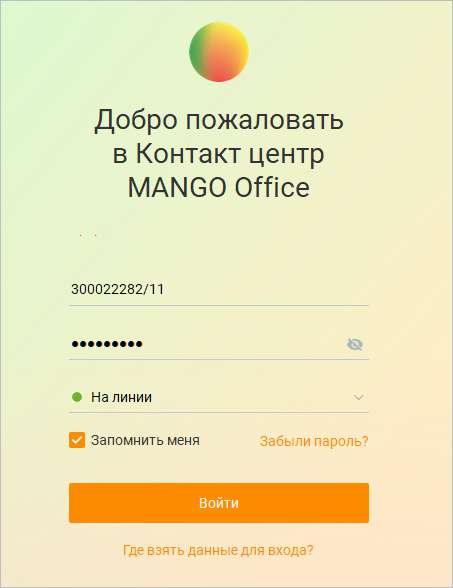
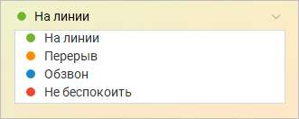
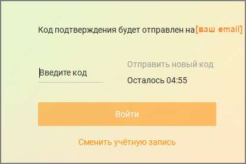

# 1.2. Вход в систему

При первом запуске Контакт-центра MANGO OFFICE на экране отображается окно входа в систему для ввода информации, необходимой для осуществления проверки полномочий пользователя и синхронизацией с сервером.

При входе пользователя в систему проверяются логин и пароль, введенные пользователем. Для входа допускается использовать следующие комбинации: Логин сотрудника + пароль сотрудника: Логин и пароль сотрудника, генерируемые при включенной настройке Создать отдельные логин/пароль для Личного кабинета и Контакт-центра в карточке сотрудника. Номер телефона сотрудника + пароль сотрудника: Номер телефона сотрудника (только мобильный, начинающийся с символов +79, 79 или 89), указанный в блоке "Средства приема звонков" и пароль, указанный в одноименном поле карточки сотрудника на вкладке "Карточка". E-mail сотрудника + пароль сотрудника: E-mail, указанный в поле "E-mail" блока "Профиль сотрудника" карточки сотрудника и пароль, указанный в одноименном поле. В случае, когда настройка Запомнить включена, а логин и пароль введены верно, то при последующих запусках программы окно входа в систему не отображается.

При необходимости выберите нужный статус пользователя в списке "Статус". При выборе значения "Не изменять" вход в систему выполняется с тем же статусом, с которым до этого был выполнен выход.

После этого нажмите кнопку Войти. Отобразится окно ввода кода подтверждения. Проверьте адрес электронной почты, введите шестизначный код подтверждения и снова нажмите кнопку Войти.

Добро пожаловать в Контакт-центр MANGO OFFICE!

| Если код был некорректно введен более пяти раз, ввод кода на 5 минут становится |  |  |
| --- | --- | --- |
| недоступен. По истечение этого времени ввод кода снова будет доступен. |  |  |
|  | При первом входе в приложение отображается окно с настройками софтфона. |  |

Если на компьютере пользователя Контакт-центра установлена программа Punto Switcher, для корректной работы необходимо внести Контакт-центр в список программ-исключений Punto Switcher. Как это сделать – узнайте здесь. Возможные проблемы, возникающие при входе в систему При возникновении в процессе входа в систему проблем с доступом к серверу Контакт-центра MANGO OFFICE, связанных с сетевой инфраструктурой (например, при отсутствии маршрута до сервера) в окне входа в систему отображается соответствующее сообщение об ошибке. Если вы неверно указали логин или пароль учетной записи в процессе входа в систему на экране отображается окно с сообщением об ошибке. Если срок жизни пароля превысил настройки, установленные в ЛК ВАТС в разделе Безопасность и ограничения → Настройка → Настройка сложности пароля для сотрудника, в процессе входа в систему на экране отображается окно с сообщением об ошибке и предложение о смене пароля.

При ошибках регистрации встроенного софтфона, не связанных с недоступностью SIP- сервера или неверно указанным логином и паролем, на экране также отображается сообщение об ошибке.

| Если количество одновременных пользователей Контакт-центра MANGO OFFICE для |  |  |
| --- | --- | --- |
|  | вашей Виртуальной АТС больше предусмотренного версией продукта, то после нажатия |  |
|  | Войти на экран выводится соответствующее предупреждающее сообщение. При этом вход в |  |
| систему не производится. |  |  |

Для увеличения количества одновременных пользователей перейдите к инструменту «Контакт-центр» в Личном кабинете и измените настройки. Более подробная информация приведена в подразделе «Контакт-центр» справочной системы Личного кабинета для Виртуальной АТС (п.4.5.4 Справочника ВАТС). При отрицательном балансе на счету в Личном кабинете пользователя выводится следующее уведомление:

<!-- изображение на стр. 21: байты не извлечены (PyMuPDF недоступен) -->
