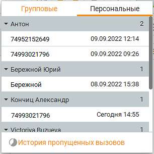
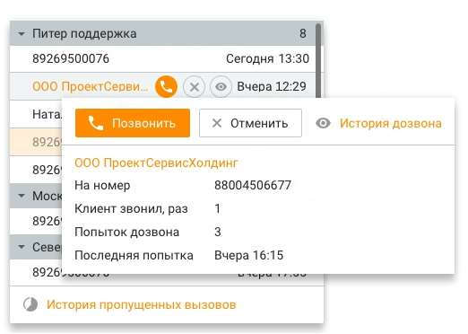

# 2.2. Пропущенные вызовы

> Трассировка: PDF §2.2 · сквозные стр. 24-26 · источники: ч.1 `kb/sources/mango-cc-manual/CC_manual_1.26.28.1.pdf` с.24-26.

В приложении предусмотрен быстрый доступ к списку пропущенных персональных и групповых вызовов. Также на панели отображается количество пропущенных вызовов за последние семь дней.

Список пропущенных вызовов отображается по клику на иконке , на которой также показывается суммарное количество пропущенных групповых и персональных вызовов, доступных пользователю.

| Отчет по пропущенным в Мониторе пропущенных вызовов генерируется с момента |
| --- |
| подключения услуги "Пропущенные вызовы". |

Данный инструмент позволяет (с учетом роли сотрудника в Контакт-центре): • перезванивать по пропущенным вызовам • просматривать списки пропущенных вызовов • исключать пропущенные вызовы из списка к перезвону

Клик по ссылке "История пропущенных вызовов" открывает раздел История вызовов/Пропущеные вызовы. Персональные вызовы Оператор КЦ в мониторе пропущенных вызовов может видеть список своих пропущенных по внешним вызовам, по которым еще не было перезвона, чтобы оперативно по ним перезвонить. Супервизор группы операторов КЦ в мониторе пропущенных вызовов может видеть список своих пропущенных и список пропущенных операторов, входящих в его группы (без разделения по группам), по которым не было перезвона, чтобы оперативно перезвонить по своим пропущенным вызовам и напомнить своим операторам о необходимости перезвона по их пропущенным. Сортировка для супервизора: вверху свои пропущенные вызовы, ниже – подчиненных, в алфавитном порядке. Групповые вызовы Пропущенный групповой вызов отображается в списке только в случае, если текущий пользователь состоит на момент просмотра списка в группе, которая пропустила вызов от абонента. Вызовы, пропущенные в голосовом меню, отображаются всем сотрудникам и размещаются вверху списка. Счетчик пропущенных вызовов также учитывает значение настройки Работа с пропущенными для текущего пользователя. Для каждой группы сотрудников отображается отдельный разделитель с наименованием группы и количеством пропущенных групповых вызовов. В случае, когда было пропущено несколько групповых вызовов абонента несколькими группами, то пропущенный вызов увидят только группы, пропустившие последний вызов от абонента. Пример

| В 12:00 пропущен вызов от абонента №1 группами А и В. |
| --- |
| • Вызов видят операторы и супервизоры, состоящие в группах А и В на момент просмотра |
| списка пропущенных вызовов. |
| • Администраторы видят пропущенный вызов в разделах и группы А, и группы В. |
| В 12:10 пропущен вызов от абонента №1 группой А. |
| • Группа В не видит ни первый пропущенный, ни второй. |
| • Группа А (операторы и супервизоры) видит только последний пропущенный вызов. |
| • Администраторы видят только последний пропущенный вызов только в разделе группы |
| А. |

При инициации исходящего вызова любым способом в адрес абонента с пропущенным вызовом либо принятого входящего вызова от абонента пропущенный вызов исключается из всех списков пропущенных вызовов на продукте (в том числе по тем группам, в которых текущий оператор не состоит). При нажатии ссылки "История пропущенных вызовов" выполняется переход к инструменту Пропущенные вызовы в рамках истории вызовов. Список пропущенных вызовов содержит следующие данные: 1. Наименование группы и кнопка скрытия/раскрытия пропущенных вызовов по группе; 2. Кто звонил (инициатор вызова); 3. Время поступления вызова; При наведении на строку пропущенного вызова дополнительно отображаются кнопки (с учетом роли сотрудника в Контакт-центре):

• Позвонить • Отменить • История дозвона

По клику на кнопке История дозвона также открывается окно истории перезвонов.
