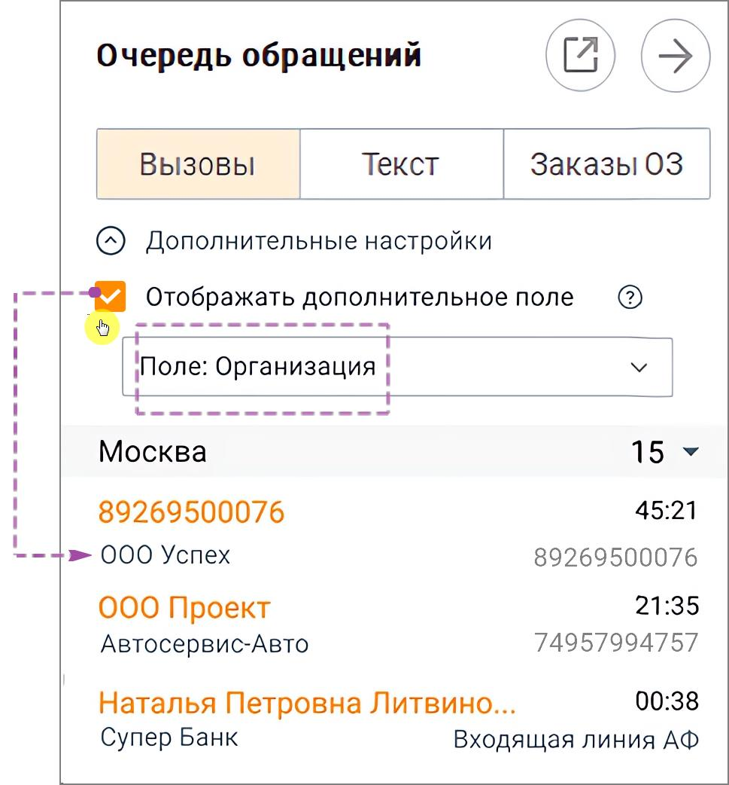
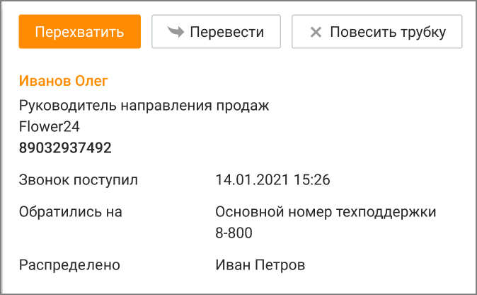

# 2.3.1. Вызовы

> Трассировка: PDF §2.3.1 · сквозные стр. 27-29 · источники: ч.1 `kb/sources/mango-cc-manual/CC_manual_1.26.23-part-1.pdf` с.27-29.

Вкладка отображает список вызовов клиентов, ожидающих распределения на сотрудников в очереди на группу, а также вызовы клиентов, которые находятся на этапе голосового меню. Вызовы, распределенные на группу сотрудников, отображаются в соответствующих группах на вкладке. Вызов отображается в очереди на группу во всех состояниях: • Находится в очереди; • Начинается дозвон до оператора; • Идет попытка получения информации о состоянии сотрудника. Вызовы на этапе голосового меню по внешним номерам, на которые позвонил клиент, отображаются в соответствующих группах номеров, на которые позвонил клиент. Во всех состояниях вызова пользователю доступна возможность перехвата вызова. Если вызов уже распределяется пользователю, то дополнительно доступна информация о сотруднике, на которого распределяется данный вызов. В случае поступления вызова с признаком CLIR (признак сокрытия номера), вместо номера подставляется значение "Номер скрыт". Вызовы, создаваемые в рамках исходящего обзвона без участия оператора, не отображаются в очереди. Исключение составляют переводы на оператора или группу из данного модуля.

| Если в Личном кабинете (раздел "Номера, подключенные к АТС") поле "Комментарий" |
| --- |
| для номера заполнено, то вместо номера отображается текст комментария. |

Настройка отображения данных из Карточки контакта в Очереди обращений У оператора есть возможность включить отображение дополнительных данных из Карточки контакта. Как это работает? • Оператор отметил чекбокс Отображать дополнительное поле и включил отображение дополнительного поля Организация – Теперь рядом с именем контакта видно название компании. • Оператор выбрал другое дополнительное поле (например, Статус клиента) – Вызовы обновились, теперь рядом с именем показывается статус. • Оператор отключил чекбокс – Виден только номер или имя контакта.

Дополнительные возможности

Для дополнительных возможностей управления вызовом следует вызвать контекстное меню щелчком правой кнопкой мыши по нужной строке:

Для перехвата вызова нажмите Перехватить. Перехваченный вызов распределяется вне очереди. Если вы не примете перехваченный вызов, то он вернется обратно в очередь. Для перевода вызова на сотрудника или на группу нажмите Перевести.

| Оператор не может переводить чужие вызовы. Супервизор может переводить вызовы |  |  |
| --- | --- | --- |
|  | только на операторов в группах, в которых он является супервизором. Администратор может |  |
| переводить вызовы на любого другого пользователя. |  |  |

После нажатия кнопки на экране отображается окно перевода. Выберите нужного сотрудника или группу Контакт-центра MANGO OFFICE из отсортированного по алфавиту списка. Затем при необходимости выберите номер (способ связи) сотрудника. Нажмите ОК для начала перевода вызова. Для завершения вызова нажмите Повесить трубку.

| Оператор не может завершать чужие вызовы. Супервизор может завершать вызовы только |  |  |
| --- | --- | --- |
|  | на операторов в группах, в которых он является супервизором. Администратор может |  |
| завершать вызовы любого другого пользователя. |  |  |

<!-- изображение на стр. 29: байты не извлечены (PyMuPDF недоступен) -->
