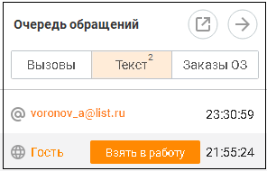
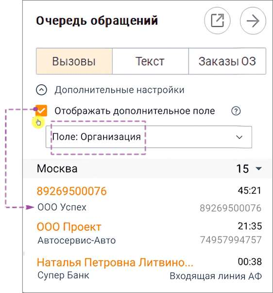
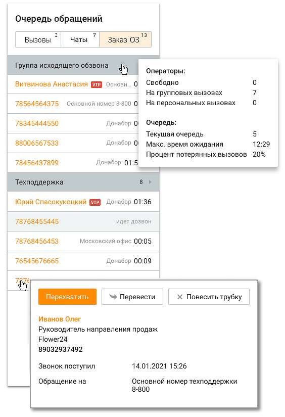

# Инструменты → Обращения → Очередь обращений.

> Трассировка: PDF §2.3 · сквозные стр. 26-32 · источники: ч.1 `kb/sources/mango-cc-manual/CC_manual_1.26.28.1.pdf` с.26-32.

Панель "Очередь обращений" открывается по нажатию на иконку в верхней части окна Контакт-центра.

Панель "Очередь обращений" отображает: • вызовы, находящихся в очереди на ACD-группах и вызовы от абонентов, которые висят на одном из этапов звукового приветствия; • текстовые обращения;

• заказы обратных звонков, оставленных с виджета на сайте.

| Для пользователей, роль которых в Личном кабинете ВАТС предусматривает право |  |  |
| --- | --- | --- |
|  | подключения услуг, на панели также имеется возможность подключения виджетов текстовых |  |
| и звонковых обращений, а также Заказа обратного звонка. |  |  |

Содержимое очереди зависит от выбранной закладки. На каждой закладке указывается количество обращений в очереди.

Кнопки для открепления и закрепления блока очереди обращений. Окно с открепленным блоком может быть расположено в любом месте рабочего стола, и

отображается поверх всех окон. Клик по кнопке приводит к скрытию блока. При клике на автора обращения (например "Гость" или e-mail) всплывает окно с содержимым обращения и кнопками быстрой обработки: Перевести и Спам. 2.3.1. Вызовы Вкладка отображает список вызовов клиентов, ожидающих распределения на сотрудников в очереди на группу, а также вызовы клиентов, которые находятся на этапе голосового меню. Вызовы, распределенные на группу сотрудников, отображаются в соответствующих группах на вкладке. Вызов отображается в очереди на группу во всех состояниях: • Находится в очереди; • Начинается дозвон до оператора; • Идет попытка получения информации о состоянии сотрудника. Вызовы на этапе голосового меню по внешним номерам, на которые позвонил клиент, отображаются в соответствующих группах номеров, на которые позвонил клиент. Во всех состояниях вызова пользователю доступна возможность перехвата вызова. Если вызов уже распределяется пользователю, то дополнительно доступна информация о сотруднике, на которого распределяется данный вызов. В случае поступления вызова с признаком CLIR (признак сокрытия номера), вместо номера подставляется значение "Номер скрыт". Вызовы, создаваемые в рамках исходящего обзвона без участия оператора, не отображаются в очереди. Исключение составляют переводы на оператора или группу из данного модуля.

| Если в Личном кабинете (раздел "Номера, подключенные к АТС") поле "Комментарий" |
| --- |
| для номера заполнено, то вместо номера отображается текст комментария. |

Настройка отображения данных из Карточки контакта в Очереди обращений У оператора есть возможность включить отображение дополнительных данных из Карточки контакта. Как это работает? • Оператор отметил чекбокс Отображать дополнительное поле и включил отображение дополнительного поля Организация – Теперь рядом с именем контакта видно название компании. • Оператор выбрал другое дополнительное поле (например, Статус клиента) – Вызовы обновились, теперь рядом с именем показывается статус. • Оператор отключил чекбокс – Виден только номер или имя контакта.

Дополнительные возможности

Для дополнительных возможностей управления вызовом следует вызвать контекстное меню щелчком правой кнопкой мыши по нужной строке:

Для перехвата вызова нажмите Перехватить. Перехваченный вызов распределяется вне очереди. Если вы не примете перехваченный вызов, то он вернется обратно в очередь. Для перевода вызова на сотрудника или на группу нажмите Перевести.

| Оператор не может переводить чужие вызовы. Супервизор может переводить вызовы |  |  |
| --- | --- | --- |
|  | только на операторов в группах, в которых он является супервизором. Администратор может |  |
| переводить вызовы на любого другого пользователя. |  |  |

После нажатия кнопки на экране отображается окно перевода. Выберите нужного сотрудника или группу Контакт-центра MANGO OFFICE из отсортированного по алфавиту списка. Затем при необходимости выберите номер (способ связи) сотрудника. Нажмите ОК для начала перевода вызова. Для завершения вызова нажмите Повесить трубку.

| Оператор не может завершать чужие вызовы. Супервизор может завершать вызовы только |  |  |
| --- | --- | --- |
|  | на операторов в группах, в которых он является супервизором. Администратор может |  |
| завершать вызовы любого другого пользователя. |  |  |

2.3.2. Текст Монитор очереди обращений содержит список текстовых обращений в порядке их поступления, от старых к новым. Общее количество обращений, не принятых в обработку, отображается в счетчике на переключателе. Для каждого текстового обращения указывается следующая информация: • Иконка, соответствующая каналу поступления обращения; • Наименование контакта. В случае, когда обращение инициировано контактом, занесенным в адресную книгу, в мониторе отображается имя контакта. Если обращение

поступило по каналу "e-mail", отображается адрес электронной почты. В противном случае контакт отмечен как "Гость"; • Иконка наличия обращения от клиента, который уже общается с другим оператором – отображается только на строке обращения от клиента, у которого есть хотя бы одно обращение в статусе "В работе" и назначенное на другого пользователя; • Иконка наличия обращения от клиента, с которым текущий пользователь уже общается – отображается только на строке обращения от клиента, у которого есть хотя бы одно обращение в статусе "В работе" и назначенное на другого пользователя; • Признак VIP – отображается только для контактов, занесенных в адресную книгу и отмеченных как VIP; • Время нахождения обращения в очереди. Для обработки обращения наведите курсор на нужную запись и нажмите Взять в работу. В результате выполняется автоматический переход в модуль Мои Обращения. Чтобы просмотреть подробную информацию, щелкните правой кнопкой мыши по обращению. После этого на экране отображается контекстное меню. Контекстное меню позволяет: • Взять текущее обращение в работу; • Перевести обращение на другого сотрудника; • Отметить обращение как спам. При этом обращение закрывается с результатом "Спам", а сотрудник, закрывший обращение, становится Назначенным на обработку обращения пользователем; • Просматривать информацию об имени клиента (при его наличии); • Просматривать информацию о времени поступления обращения; • Просматривать информацию о точке входа, через которую поступило текущее обращение; • Просматривать последнее сообщение обращения. 2.3.3. Заказы обратного звонка Заказы обратных звонков группируются по виджетам. В шапке виджета указывается его название и количество запланированных обратных звонков. Всплывающие окна содержат детальную информацию о звонке.

В зависимости от типа виджета (ручной, автоматический) в мониторе очереди выводится различная информация.

<!-- изображение на стр. 32: байты не извлечены (PyMuPDF недоступен) -->

Для заказов, оставленных с виджета в автоматическом режиме, в мониторе очереди отображается номер, оставленный клиентом, и дата (если сегодня – то время) следующей попытки дозвона. В списке заказов заказы отображаются в зависимости от выбранных клиентом даты/времени. В момент совершения попытки дозвона заказ обратного звонка удаляется из очереди. В случае планирования очередной попытки дозвона заказ отображается снова. Заказ обратного звонка, по которому исчерпаны все попытки дозвона, не отображается в мониторе очереди. Для заказов, оставленных с виджета в ручном режиме, отображается номер оставленного заказа и кнопка дозвона Позвонить. Если хотя бы один из сотрудников нажал кнопку, то она блокируется у других пользователей. В случае не дозвона кнопка становится доступной. При звонке на номер клиента не из Контакт-центра факт попыток дозвона не отображается. В случае состоявшегося разговора заказ удаляется из списка. Если заказ не был обработан в течение 14 дней, он автоматически удаляется из очереди.
