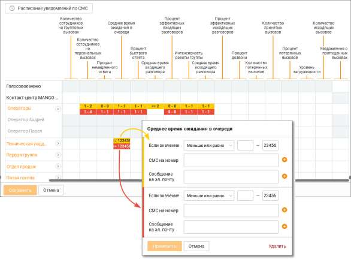
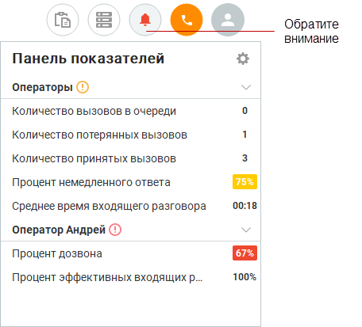
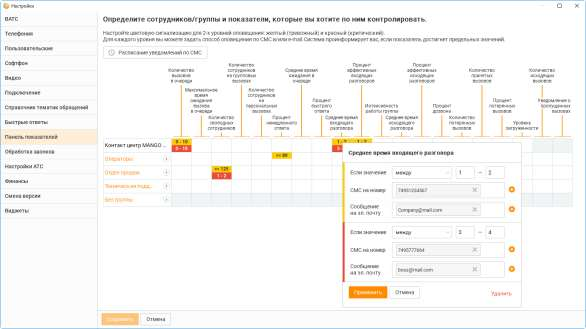
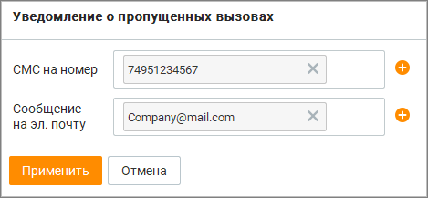
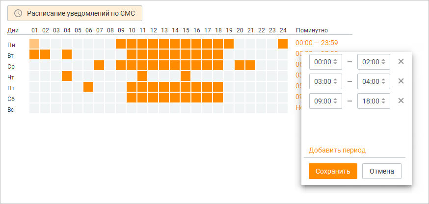

# 2.4. Панель показателей

> Трассировка: PDF §2.4 · сквозные стр. 32-46 · источники: ч.1 `kb/sources/mango-cc-manual/CC_manual_1.26.28.1.pdf` с.32-46.

Контакт-центр MANGO OFFICE позволяет отслеживать в реальном времени эффективность работы сотрудников. Для этого используется набор так называемых показателей производительности, представляющих собой параметры, характеризующие эффективность работы Контакт-центра MANGO OFFICE как системы массового обслуживания. Все показатели производительности рассчитываются за определенный промежуток времени с заданной частотой опроса. Более подробная информация о показателях производительности приведена в разделе Общее описание показателей производительности. Информация о настройке пороговых значений показателей производительности находится в одноименном разделе. Для визуализации отслеживаемых в реальном времени значений показателей производительности для различных логических объектов (Контакт-центр MANGO OFFICE в целом, группа сотрудников или сотрудник) используется панель показателей. Для вызова

панели нажмите в верхней панели.

Кнопки для открепления и закрепления блока панели показателей. Окно с открепленным блоком может быть расположено в любом месте рабочего стола, и отображается поверх всех окон.

Клик по кнопке приводит к скрытию блока.

| Доступность панели показателей зависит от роли текущего пользователя Контакт-центра |  |  |
| --- | --- | --- |
|  | MANGO OFFICE и наличия подключенной услуги для соответствующего продукта Контакт- |  |
| центра MANGO OFFICE. |  |  |

Для настройки панели показателей нажмите на панели.

Изначально окно настройки содержит список групп в свернутом состоянии. После развертывания группы панель показателей принимает вид, как указано на рисунке выше. Чтобы выбрать контролируемый объект (Контакт-центр MANGO OFFICE в целом, группу сотрудников или сотрудника), для которого будет осуществляться мониторинг показателя производительности, кликните ячейку на пересечении столбца с нужным показателем производительности и строки с нужным объектом. Если вы хотите развернуть или свернуть нужный вам объект, щелкните по значку со стрелкой справа от его названия.

| Пользователи, не входящие ни в одну из групп, объединены в псевдогруппу "Без группы". |  |  |  |  |
| --- | --- | --- | --- | --- |
|  | Для таких пользователей показатели производительности настраиваются в индивидуальном |  |  |  |
|  | порядке — выбор показателей для объекта "Без группы" осуществить нельзя. |  |  |  |
|  | Пользовательские настройки панели показателей хранятся отдельно для каждого |  |  |  |
|  | пользователя | Контакт-центра MANGO OFFICE | и сохраняются при входе в систему под |  |
| логином этого пользователя с любого компьютера. |  |  |  |  |

После выхода из окна настроек в панели показателей отображаются значения выбранных показателей производительности для указанных логических объектов. Все отображаемые показатели группируются по объектам с алфавитной сортировкой по краткому наименованию. Используйте значок со стрелкой, чтобы свернуть или развернуть список показателей по выбранному объекту. Объекты в панели показателей отображаются иерархически. Верхние уровни иерархии — Голосовое меню и Контакт-центр MANGO OFFICE в целом. Эти объекты всегда являются верхним. Затем идут группы сотрудников с внутренней сортировкой по алфавиту, затем отдельные сотрудники (пользователи) с сортировкой по алфавиту.

Чтобы изменить порядок отображения групп и сотрудников, выберите нужный объект и, удерживая левую клавишу мыши, перетащите его вверх или вниз. При перетаскивании объектов также переносятся все связанные с ними показатели. Аналогичным образом изменяется и порядок отображения показателей внутри отдельного объекта.

| Пользовательские настройки порядка отображения хранятся локально на конкретном |
| --- |
| компьютере. При входе в систему с другого компьютера они не сохраняются. |

При отображении показателей производительности в рабочей области панели имеют место следующие особенности. Если сотрудник является оператором в нескольких группах, то при выборе показателей производительности в одной из групп они автоматически выбираются и во всех остальных группах. При этом выбранные показатели рассчитываются в целом по Контакт-центру MANGO OFFICE — то есть, для всех групп, в которые входит пользователь, а не в рамках отдельной группы. Если значение показателя превышает указанные пороговые значения (красные или желтые), строка показателя подкрашивается соответствующим цветом.

Если отдельный показатель у объекта превышает указанные пороговые значения, то вся строка объекта подкрашивается желтым или красным цветом. При этом: • если по объекту хоть один показатель превышает красное пороговое значение, объект подкрашивается красным; • если по объекту хоть один показатель превышает желтое пороговое значение, и нет показателей, превышающих красное значение, объект подкрашивается желтым.

2.4.1. Общее описание показателей производительности

|  | Полное | Краткое |  |  | Единица |
| --- | --- | --- | --- | --- | --- |
| № |  |  | Описание | Тип |  |
|  | наименование | наименование |  |  | измерения |
|  |  |  |  |  |  |
| 1 | Нераспределенный вызов в очереди – потенциально потерянный клиент для вашей компании. Настройте уведомление о появлении вызовов в очереди. | Количество вызовов в очереди | Показатель производительности Текущее количество вызовов в очереди (CNCQ) указывает на текущее количество ACD- вызовов, находящихся в очереди: - во всех ACD- группах Контакт- центра MANGO OFFICE; - в выбранной ACD- группе; | Количество | Штука |
| 2 | Ожидание ответа более нескольких минут – причина, по которой клиент может выбрать другую компанию. Контролируя время ожидания в реальном времени, вы предотвратите потерю клиента. | Максимальное время ожидания вызова в очереди | Показатель производительности Максимальная задержка ответа (MDA) указывает на максимальное время за расчетный период, в течение которого вызовы ожидали ответа: - во всех ACD- группах Контакт- центра MANGO OFFICE; - в выбранной ACD- группе. В показателе учитывается время с момента распределения вызова на группу и до поднятия трубки каким-либо оператором группы, включая время попыток дозвона до операторов группы. | Время | Секунда |

|  | Полное | Краткое |  |  | Единица |
| --- | --- | --- | --- | --- | --- |
| № |  |  | Описание | Тип |  |
|  | наименование | наименование |  |  | измерения |
|  |  |  |  |  |  |
| 3 | Отсутствие свободных сотрудников на линии – это сигнал проверить, достаточно ли у вас сотрудников для обслуживания клиентов и чем они сейчас заняты. Иначе велик риск потерять клиентов. | Количество свободных сотрудников | Количество операторов в состоянии "На линии" не занятых разговорами: - во всех ACD- группах Контакт- центра MANGO OFFICE; - в выбранной ACD- группе. | Количество | Штука |
| 4 | Показатель информирует, сколько сотрудников сейчас общается с позвонившими вам клиентами. Вы сможете отследить, в какое время вам наиболее часто звонят клиенты, чтобы правильно спланировать рабочий день сотрудников. | Кол-во сотрудников на групп. вызовах | Текущее количество операторов, обслуживающих ACD-вызовы (вызовы, распределенные алгоритмом автоматического распределения вызовов): - во всех ACD- группах Контакт- центра MANGO OFFICE; - в выбранной ACD- группе. | Количество | Штука |
| 5 | Персональные вызовы сотрудников могут носить частный характер. Вы всегда видите, сколько ваших сотрудников занято персональными вызовами. | Кол-во сотрудников на персон. вызовах | Количество операторов, которые разговаривают на текущий момент по входящим вызовам, которые не были на них распределены из групп, в которых они состоят (Входящие вызовы напрямую на номер оператора, Входящие вызовы, переведенные на операторов): - во всех ACD- группах Контакт- центра MANGO OFFICE; - в выбранной ACD- группе. | Количество | Штука |

|  | Полное | Краткое |  |  | Единица |
| --- | --- | --- | --- | --- | --- |
| № |  |  | Описание | Тип |  |
|  | наименование | наименование |  |  | измерения |
|  |  |  |  |  |  |
| 6 | Процент клиентов за последний час, которые не ждали в очереди, а сразу начали разговор с сотрудником. Чем выше этот показатель, тем больше у вас лояльных клиентов. | Процент немедленного ответа | Показатель производительности Процент немедленного ответа (PIHC) указывает на процент обслуженных вызовов за расчетный период, которые были распределены на операторов без постановки в очередь, по отношению к общему количеству вызовов (как обслуженных, так и потерянных): - во всех ACD- группах Контакт- центра MANGO OFFICE; - в выбранной ACD- группе; | Процент | Процент |
| 7 | Ожидание ответа более нескольких минут – причина, по которой клиент может выбрать другую компанию. Контролируя время ожидания в реальном времени, вы предотвратите потерю клиента. | Среднее время ожидания в очереди | Показатель производительности "Среднее время ожидания в очереди" указывает на среднее время ожидания клиентов в очереди за расчетный период, в течение которого входящие вызовы (исключая вызовы, которые получили немедленный ответ) находятся в очереди. - во всех группах Контакт-центра MANGO OFFICE; - в выбранной группе. В показателе учитывается время с момента распределения вызова на группу и до поднятия трубки каким-либо оператором группы, включая время попыток дозвона до операторов группы. | Время | Секунда |

|  | Полное | Краткое |  |  | Единица |
| --- | --- | --- | --- | --- | --- |
| № |  |  | Описание | Тип |  |
|  | наименование | наименование |  |  | измерения |
|  |  |  |  |  |  |
| 8 | Контролируя уровень обслуживания, вы сможете узнавать о потенциально возможных проблемах (пропущенных вызовах, появление очереди звонков) задолго до их возникновения. | Уровень обслуживания SL 20 секунд | Показатель производительности "Уровень обслуживания SL 20 секунд" указывает на процент внешних вызовов, поступивших на группу и получивших там обслуживание, время ожидания в очереди которых меньше заданного значения (20 секунд) за расчетный период. - во всех группах Контакт-центра MANGO OFFICE; - в выбранной группе; В показателе учитывается время с момента распределения вызова на группу и до поднятия трубки каким-либо оператором группы, включая время попыток дозвона до операторов группы. | Процент | Процент |
| 9 | Каждый пропущенный вызов – это потенциально потерянный клиент. Вы мгновенно получите информацию о каждом факте потери вызова и сможете перезвонить. | Количество потерянных вызовов | Количество входящих вызовов за расчетный период пришедших на группу, по которым не состоялся разговор: - во всех ACD- группах Контакт- центра MANGO OFFICE; Суммарный показатель, вычисляется как сумма пропущенных вызовов во всех группах. - в выбранной ACD- группе; | Количество | Штука |

|  | Полное | Краткое |  |  | Единица |
| --- | --- | --- | --- | --- | --- |
| № |  |  | Описание | Тип |  |
|  | наименование | наименование |  |  | измерения |
|  |  |  |  |  |  |
|  |  |  | - для выбранного оператора ACD- группы Вызовы пришедшие с группы на сотрудника, разговор по которым у него с абонентом не состоялся. Один вызов от клиента учитывается один раз. Если вызов завершается во время проигрывания служебных сообщений (приветствия и т.д.), он считается пропущенным. |  |  |
| 10 | Сравните эффективность работы ваших сотрудников или групп сотрудников за последний час. Количество принятых вызовов – наиболее объективный показатель для этого. | Количество принятых вызовов | Показатель производительности Количество принятых вызовов за расчетный период(NHC): - во всех ACD- группах Контакт- центра MANGO OFFICE; - в выбранной ACD- группе; - для выбранного оператора ACD- группы. | Количество | Штука |
| 11 | Если процент потерянных вызовов по сотруднику стремительно растет, необходимо проверить, что он находится на рабочем месте, готов принимать звонки и правильно пользуется телефонией. | Процент потерянных вызовов | Показатель производительности Процент потерянных вызовов (PAC) указывает на процент потерянных вызовов за расчетный период по отношению к общему количеству вызовов (как принятых, так и потерянных): - во всех ACD- группах Контакт- центра MANGO OFFICE; - в выбранной ACD- группе; - для выбранного оператора ACD- группы. | Процент | Процент |

|  | Полное | Краткое |  |  | Единица |
| --- | --- | --- | --- | --- | --- |
| № |  |  | Описание | Тип |  |
|  | наименование | наименование |  |  | измерения |
|  |  |  |  |  |  |
| 12 | Процент рабочего времени, который сотрудник тратит непосредственно на общение с клиентами. Показатель информирует, какую часть оплачиваемого времени сотрудник тратит на работу, которая приносит компании прибыль. | Уровень загруженности | Показатель производительности Уровень загруженности оператора (AO) указывает на процент времени за расчетный период, потраченного непосредственно на обслуживание внешних вызовов (входящих и исходящих): - во всех ACD- группах Контакт- центра MANGO OFFICE; - в выбранной ACD- группе; - для выбранного оператора ACD- группы. | Процент | Процент |
| 13 | Большое количество Исходящих вызовов – эффективный инструмент продаж, но “любимый” далеко не всеми сотрудниками. Определите такой KPI для сотрудников и контролируйте его выполнение в режиме on-line. | Количество исходящих вызовов | Показатель производительности "Кол-во исходящих вызовов" указывает на количество успешно совершенных исходящих вызовов (без учета неудачных попыток) за расчетный период. - во всех группах Контакт-центра MANGO OFFICE; - в выбранной группе; - для выбранного оператора группы. | Количество | Штука |
| 14 | Вы можете контролировать общее количество совершенных вызовов сотрудниками группы. Но гораздо эффективней измерять среднее количество вызовов, совершенных сотрудниками группы. | Интенсивность работы группы | Показатель производительности "Интенсивность труда" указывает на среднее количество внешних исходящих вызовов, которые совершил сотрудник группы за расчетный период. - для выбранного оператора группы. | Количество | Штука |

|  | Полное | Краткое |  |  | Единица |
| --- | --- | --- | --- | --- | --- |
| № |  |  | Описание | Тип |  |
|  | наименование | наименование |  |  | измерения |
|  |  |  |  |  |  |
| 15 | Если несколько сотрудников в рамках исходящего обзвона совершают одинаковое количество звонков, но с разной эффективностью. Проверьте их продолжительность, а при необходимости и прослушайте их разговоры. | Среднее время исходящих разговоров | Показатель производительности "Среднее время разговора исходящих звонков" указывает на среднее "чистое" время исходящих звонков (исключая время поствызывной обработки, нахождения вызова в очереди и / или на удержании) за расчетный период. - во всех группах Контакт-центра MANGO OFFICE; - в выбранной группе; - для выбранного оператора группы. | Время | Секунда |
| 16 | Помимо количества принятых вызовов сотрудником, важно контролировать их продолжительность. Ведь от их длительности зависит эффективность обслуживания клиентов. | Среднее время входящих разговоров | Показатель производительности "Среднее время разговора входящих звонков" указывает на среднее "чистое" время входящих звонков (исключая время поствызывной обработки, нахождения вызова в очереди и / или на удержании) за расчетный период. - во всех группах Контакт-центра MANGO OFFICE; - в выбранной группе; - для выбранного оператора группы. | Время | Секунда |

|  | Полное | Краткое |  |  | Единица |
| --- | --- | --- | --- | --- | --- |
| № |  |  | Описание | Тип |  |
|  | наименование | наименование |  |  | измерения |
|  |  |  |  |  |  |
| 17 | При совершении холодных звонков важно понимать, сколько клиентов заинтересовались предложением и продолжили разговор, а сколько сразу бросили трубку. Вы можете задать среднюю длительность разговора, чтобы контролировать процент вызовов меньше заданного значения (30 секунд). | Процент успешных исходящих разговоров | Показатель производительности "Глубина исходящих разговоров" указывает на процент исходящих вызовов с длительностью больше заданного порога: - для выбранного оператора группы. | Процент | Процент |
| 18 | При приёме входящих вызовов важно, чтобы сотрудники соблюдали скрипт разговора, а не просто отвечали на вопросы клиента и заканчивали разговор. Вы можете задать среднюю длительность разговора, чтобы контролировать процент вызовов меньше заданного значения (30 секунд). | Процент успешных входящих разговоров | Показатель производительности "Глубина входящих разговоров" указывает на процент входящих вызовов с длительностью больше заданного порога: - для выбранного оператора группы. | Процент | Процент |
| 19 | Если ваши сотрудники участвуют в исходящем обзвоне по внешней базе, рекомендуем контролировать ее качество с помощью показателя Процент дозвона. | Процент дозвона | Показатель производительности "Процент дозвона" указывает на процент общего кол-ва исходящих вызовов по отношению к успешным исходящим вызовам: - во всех группах Контакт-центра MANGO OFFICE; - в выбранной группе; - для выбранного оператора группы. | Процент | Процент |

2.4.2. Настройка пороговых значений показателей производительности

Пороговыми значениями показателей производительности считаются значения или диапазоны значений, при превышении которых (или при попадании в диапазоны) возникает критичная ситуация, о которой необходимо предупредить пользователя. Предусмотрено два типа ситуаций: желтые («внимание») и красные («предупреждение»). Пороговые значения показателей являются общими для всех пользователей данного продукта Контакт-центра MANGO OFFICE. Чтобы настроить пороговые значения показателей производительности, перейдите на вкладку "Панель показателей" в настройках программы. Щелкните на пересечении столбца с нужным показателем производительности и строки с нужным объектом (Контакт-центр MANGO OFFICE в целом, группой сотрудников, сотрудником (оператором). После этого на экране отображается форма ввода пороговых значений.

Используя эту форму, вы можете указать красное и желтое пороговые значения (диапазоны значений), используя поля ввода с соответствующим фоновым цветом. Выберите из списка нужный ограничитель (меньше или равно, между, больше или равно) из списка и введите нужное пороговое значение (значения) в соответствующие поля. После завершения ввода щелкните вне формы для ее закрытия. Напомним, что если показатель у объекта превышает указанные пороговые значения, то вся строка объекта подкрашивается желтым или красным цветом. При этом: • если по объекту хоть один показатель превышает красное пороговое значение, объект подкрашивается красным; • если по объекту хоть один показатель превышает желтое пороговое значение, и нет показателей, превышающих красное значение, объект подкрашивается желтым.

| Если сотрудник (оператор) входит в несколько групп и пороговые значения показателей |  |  |  |  |  |
| --- | --- | --- | --- | --- | --- |
|  | для этих групп настроены индивидуально, то проверка идет по пороговым значениям всех |  |  |  |  |
|  | таких групп. |  |  |  |  |
|  | Если вы выбрали ограничитель между и ввели только нижнюю границу диапазона |  |  |  |  |
|  | значений, условие порогового значения работает по правилу больше или равно (>=). |  |  |  |  |
|  | Если вы выбрали ограничитель между и ввели только верхнюю границу диапазона |  |  |  |  |
| значений, условие порогового значения работает по правилу меньше или равно (<=). |  |  |  |  |  |

| Для удаления пороговых значений показателей щелкните по ссылке Удалить и подтвердите |
| --- |
| свое действие во всплывающем окне уведомления. |

Расписание уведомлений по СМС Для того, чтобы оперативно узнать о превышении предельных (красных и/или желтых) значений показателей, используйте отправку СМС-уведомлений и/или уведомлений на электронную почту. Вы можете указать 10 телефонных номеров и 10 электронных адресов для каждого уровня. В случае, когда значение показателя попадет в обозначенный диапазон, на указанный телефонный номер и/или электронный почтовый ящик будет автоматически отправлено сообщение вида: Текущее значение показателя "Процент потерянных вызовов" по сотруднику "Оператор Павел" достигло 50 и находится в диапазоне предельных значений. Чтобы настроить отправку уведомлений о пропущенных групповых вызовах, щелкните по перекрестию строки с названием группы и столбцом "Уведомление о пропущенных вызовах". По умолчанию в качестве электронного адреса, на который будет отправлено уведомление, указывается e-mail текущего пользователя из карточки сотрудника Личного кабинета

Для указания более одного номера телефона и/или электронного адреса, щелкните по кнопке

. Максимальное количество -10. В результате напротив названия группы, для которой настроена отправка уведомлений, будет

отображаться пиктограмма . На указанные номера и адреса будет отправлено сообщение вида:

Пропущен звонок с номера +79265786677. Группа Отдел Продаж Новосибирск. Если номер клиента на пропущенных вызовах совпадает, то отправка сообщений осуществляется не чаще, чем один раз в 5 минут. Отправка СМС-уведомлений осуществляется согласно расписанию. Для его настройки щелкните по ссылке "Расписание уведомлений по СМС" в поясняющем сообщении в верхней части окна.

Для изменения расписания предусмотрено два способа: 1. Щелчком левой кнопки мыши по определенному прямоугольнику. Каждый прямоугольник обозначает один час. Первый щелчок выделяет один час, второй щелчок снимает выделение; 2. Щелчком левой кнопки мыши по значению в поле "Период времени". Значения вводятся во всплывающем окне, здесь же предусмотрена возможность указания нескольких временных периодов. Сообщение о превышении значения показателя по одному условию (т. е. при достижении желтого или красного уровня) отправляется не чаще, чем один раз в пять минут. Для СМС- уведомлений – согласно расписанию.
