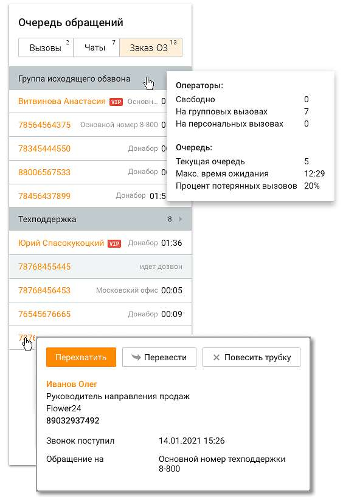

# 2.3.3. Заказы обратного звонка

Заказы обратных звонков группируются по виджетам. В шапке виджета указывается его название и количество запланированных обратных звонков. Всплывающие окна содержат детальную информацию о звонке.

В зависимости от типа виджета (ручной, автоматический) в мониторе очереди выводится различная информация.

Для заказов, оставленных с виджета в автоматическом режиме, в мониторе очереди отображается номер, оставленный клиентом, и дата (если сегодня – то время) следующей попытки дозвона. В списке заказов заказы отображаются в зависимости от выбранных клиентом даты/времени. В момент совершения попытки дозвона заказ обратного звонка удаляется из очереди. В случае планирования очередной попытки дозвона заказ отображается снова. Заказ обратного звонка, по которому исчерпаны все попытки дозвона, не отображается в мониторе очереди. Для заказов, оставленных с виджета в ручном режиме, отображается номер оставленного заказа и кнопка дозвона Позвонить. Если хотя бы один из сотрудников нажал кнопку, то она блокируется у других пользователей. В случае не дозвона кнопка становится доступной. При звонке на номер клиента не из Контакт-центра факт попыток дозвона не отображается. В случае состоявшегося разговора заказ удаляется из списка. Если заказ не был обработан в течение 14 дней, он автоматически удаляется из очереди.
