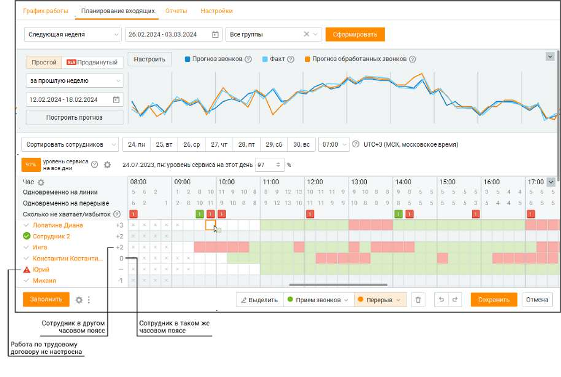
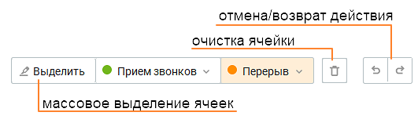
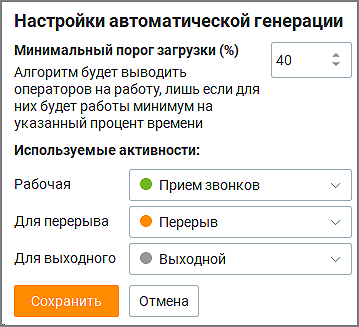
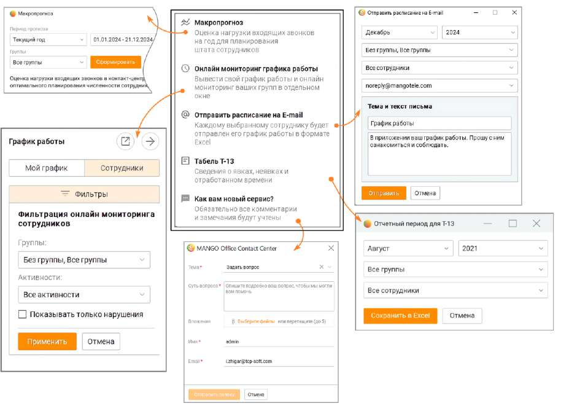
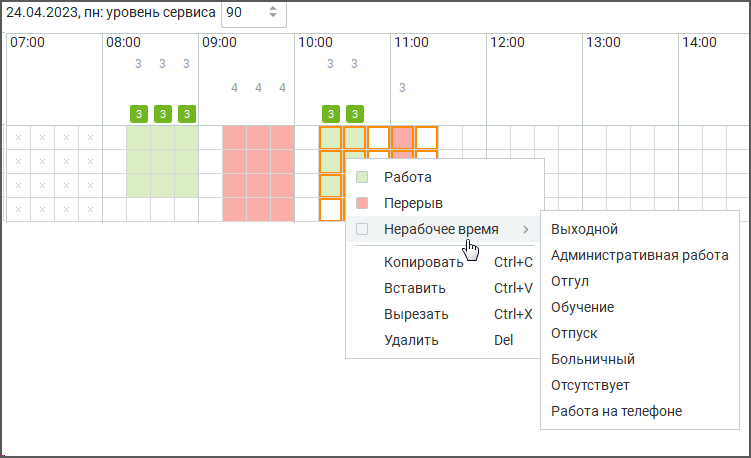

# 8.2. Планирование входящих

> Трассировка: PDF §8.2 · сквозные стр. 251-256 · источники: ч.1 `kb/sources/mango-cc-manual/CC_manual_1.26.23_compressed.pdf` с.251-256.

| Раздел отображается только для пользовательских ролей Администратор и Руководитель |
| --- |
| компании при подключенной в ЛК ВАТС услуге "Планирование работы (WFM)". |

При помощи планирования входящих звонков руководитель может внести "поправочные коэффициенты" и с их помощью увидеть плановую загрузку сотрудников за требуемый период: • Руководителю доступна информация для ввода об основных показателей работы подразделения за выбранный период (SLA, ATH и т.д) • Руководитель получает информацию о расчетном количестве сотрудников (плановом) за каждые 15 минут рабочего дня • Руководитель может заполнить согласно плановым данным расписание на следующий период Окно планирования содержит четыре блока: блок фильтров, блок графика прогноза, блок уровня сервиса и таблица настроек количества сотрудников.

Блок фильтров Пользователю доступна фильтрация по периоду (следующая неделя, следующий месяц, произвольный) и группе. Блок графика прогноза

Чтобы получить прогноз о количестве входящих и обработанных звонков следует выбрать временной период, на основании которого будут строится графики, и нажать кнопку Получить прогноз. Данные рассчитываются по формуле Эрланга. Пользователям доступны два уровня прогнозирования обращений: простой и продвинутый. При подключенной в ЛК ВАТС услуге "WFM Pro" пользователи могут воспользоваться продвинутым уровнем прогнозирования, который учитывает различные факторы, такие как сезонность, тренды, выходные и праздничные дни. Кроме того, этот прогноз способен автоматически сглаживать пиковую нагрузку, обеспечивая эффективное управление обработкой обращений. График прогноза состоит из трех частей: • график запланированной нагрузки (синяя линия) – получен путем расчетов на основании данных предыдущего временного периода • график фактически распределенной нагрузки (оранжевая линия) – максимальное количество обработанных входящих звонков при текущей нагрузке и запланированном количестве сотрудников • график фактической нагрузки (голубая линия) – действительное количество входящих звонков Если на графике оранжевая линия будет ниже синей, это означает, что часть входящих звонков не будет обработана. В этом случае рекомендуется увеличить количество операторов, работающих на линии. Клик по шкале графика откроет всплывающее окно с данными о сотрудниках за выбранный день. Клик по названию графика отключает/включает график. Также данные частично отражаются в блоке ниже.

| Кнопка Настроить - дополнительные пользовательские настройки Для корректного построения графика работы пользователь имеет возможность настраивать: • Время поствызывной обработки • Время ожидания на линии • Время разговора Пример использования: У компании за полгода значительно сократилось время ожидания на линии и постзвонковая обработка. Компании необходимо использовать эти данные. С помощью пользовательских график прогноза дня конкретной компании будет более точным. |  |  |
| --- | --- | --- |
|  | Пример использования: |  |
|  | У компании за полгода значительно сократилось время ожидания на линии и постзвонковая |  |
|  | обработка. Компании необходимо использовать эти данные. С помощью пользовательских | настроек |
|  | график прогноза дня конкретной компании будет более точным. |  |

Блок уровня сервиса • Уровень сервиса – процентный показатель количества звонков, отвеченных сотрудником, по отношению к общему количеству вызовов. В блоке пользователь может установить дневной уровень сервиса. Постоянный уровень сервиса задается пользователем в подвкладке "Настройки".

• Час – диапазон времени. Клик по пиктограмме открывает окно настройки отображения информации о звонках. • Одновременно на линии – количество сотрудников, работающих в статусе "На линии". • Одновременно на перерыве – количество сотрудников, работающих в статусе "Перерыв". • Сколько не хватает/избыток:

|  | – число в строке показывает сколько необходимо сотрудников для заданного уровня сервиса, |
| --- | --- |
| на основании расчета прогноза количества входящих звонков и среднего времени обработки |  |
| вызова сотрудником. Увеличьте |  |

уровня сервиса.

- уменьшите количество сотрудников на указанное число для оптимизации трудовых ресурсов. Увеличить или уменьшить количество работающих сотрудников можно в таблице ниже. Таблица настроек количества сотрудников

Таблица содержит список сотрудников и данные о рабочем времени сотрудников на каждые 15 минут дня. Редактировать данные таблицы можно в окне таблицы, выбирая нажатием левой кнопки мыши на панели редактирования соответствующий маркер окраски и вставляя его в таблицу.

Кнопка ЗАПОЛНИТЬ Пользователь (с соответствующими правами доступа) имеет возможность выполнять автоматическую генерацию расписания сотрудников в Контакт-центре. Клик по кнопке Заполнить в левом нижнем углу экрана открывает форму быстрого заполнения графика работы сотрудников с учетом количества сотрудников на перерыве одновременно (1-10) и желаемого уровня экономии оплаты труда (минимальный, средний, максимальный).

Клик по кнопке Сохранить сохраняет внесенные данные и закрывает форму. В предыдущем окне автоматически заполняется таблица настроек количества сотрудников. Дополнительные возможности на вкладке.

Кнопка

Клик по кнопке в нижней части экрана открывает всплывающее окно с настройками автоматической генерации

Кнопка .

Клик по кнопке в нижней части экрана открывает всплывающее окно с дополнительными опциями вкладки.

Макропрогноз – открывает вкладку Макропрогноз для оценки нагрузки входящих вызовов на год, что позволяет планировать нагрузку сотрудников компании на длительный срок.

<!-- изображение на стр. 256: байты не извлечены (PyMuPDF недоступен) -->

Онлайн мониторинг графика работы – выводит в боковом окне график работы пользователя или подконтрольных ему сотрудников и позволяет отслеживать текущее состояние работы. Отправить расписание на E-mail – предоставляет возможность отправки графика работы выбранным сотрудникам в формате Excel на их электронную почту. Настраивается месяц, год, группа сотрудников и текст сообщения.

| Отчет по форме Т-13: Администратор может сохранить график работы сотрудника за месяц |
| --- |
| в форме "отчетного периода для Т13". Для этого необходимо выбрать месяц и группу, |
| отметить чекбоксы сотрудников и нажать кнопку "Сохранить в Exel". |

Как вам новый сервис? Пользователь может оставить в форме свой комментарий по качеству сервиса и предложения по его улучшению. Для упрощения работы пользователь имеет возможность работать с таблицей в планировании загрузки при помощи следующих комбинации клавиш:

| Клавиши | Действие |
| --- | --- |
| Ctrl+A | выбрать всю таблицу |
| ESC | отменить выделение |
| Ctrl+C, Ctrl+Insert | копировать выбранную область таблицы |
| Ctrl+X, Shift+Delete | вырезать выбранную область таблицы |
| Ctrl+V, Shift+Insert | вставить выбранную область таблицы |
| Ctrl+Z | отменить |
| Ctrl+Y | вернуть |
| Delete | удалить значение в выбранных ячейках |

Также пользователь имеет возможность выделять диапазон ячеек при помощи клавишей мыши или кнопки "Выделить," и в дальнейшем управлять выбранным диапазоном.

<!-- изображение на стр. 256: байты не извлечены (PyMuPDF недоступен) -->
