# 3. Раздел «Показатели разговора»

> Трассировка: PDF §3 · сквозные стр. 459-471 · источники: ч.1 `kb/sources/mango-cc-manual/CC_manual_1.26.28.1.pdf` с.459-471.

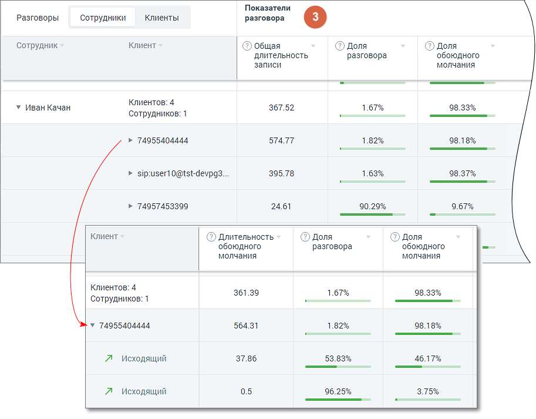

Раздел таблицы содержит следующие столбцы: • Общая длительность записи • Длительность разговора • Длительность обоюдного молчания • Доля разговора • Доля обоюдного молчания • Количество перебиваний сотрудником • Количество перебиваний клиентом • Доля обоюдного разговора • Доля разговора сотрудника • Доля разговора клиента • Скорость разговора сотрудника • Скорость разговора клиента Чтобы узнать правило расчета каждого из показателей, наведите курсор на пиктограмму возле наименования показателя. Подробнее о значениях показателей узнайте здесь. Для фильтрации данных отчета по возрастанию/убыванию следует щелкнуть по наименованию столбца. Детализация разговоров

По клику на пиктограмму открывается окно детализации звонка:

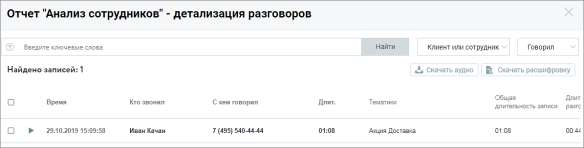

Окно детализации разговоров содержит следующие данные о звонках: • Дату и время звонка • Кто звонил • С кем говорил • Эмоции клиента • Эмоции сотрудника • Длительность разговора • Список тематик, которые присвоены звонку • Общая длительность записи • Длительность обоюдного молчания • Доля разговора/обоюдного молчания • Количество перебиваний сотрудником/клиентом • Доля обоюдного разговора/сотрудника/клиента • Скорость разговора сотрудника/клиента В окне детализации разговоров пользователю доступны следующие действия: поиск по записям, прослушивание, просмотр расшифровки разговора (при наличии), скачивание аудиозаписи и расшифровки разговора. 16.1.3. Отчет "Анализ разговоров" Отчет «Анализ разговоров» состоит из двух блоков: • Блока таблицы • Блока визуализаций: Тематики по словам и Динамика по времени. Блоки визуализаций отображаются по щелчку на соответствующей вкладке:

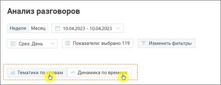

Визуализация “Тематики по словам” В поле визуализации “Тематики по словам” отображается:

• Топ 5 выбранных тематик – наиболее популярные тематики (не более 5-ти) из тематик, выбранных пользователем во всплывающем окне Показатели, подраздел Количество разговоров по тематикам. Позволяет определить – какие из установленных тематик содержат наибольшее количество звонков. Таким образом руководитель может видеть, к примеру, вектор заинтересованности клиентов в тех или иных товарах. Клик по любой из предложенных тематик позволяет увидеть подробную детализацию по этой тематике. • Что говорят в тематике – для тематики, выбранной в “ТОП-5 популярных тематик”, показывает процентное соотношение распознанных терм по отношению к общему количеству терм тематики. В гистограмме отображается не более 10 строк. Если тематика содержит более 10 терм, наименее популярные из них помечаются, как Прочие.

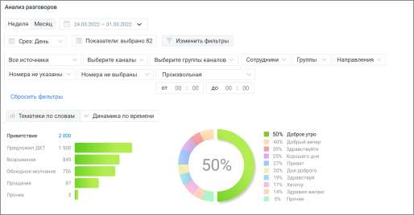

Визуализация “Динамика по времени” Визуализация “Динамика по времени” представляет собой график изменений выбранного показателя в заданный период времени. Выпадающий список в левом верхнем углу графика содержит доступные для выбора показатели. При наведении курсора на элементы графика отображается всплывающая подсказка с информацией по соответствующему дню/месяцу.

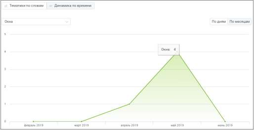

Блок таблицы Таблица формируется по срезу День/Месяц/Год и заданным пользователем в окне "Показатели" параметрам.

| Для типа записи разговора «Текстовые коммуникации» в качестве показателей |
| --- |
| отображаются только данные разговоров по тематикам. |

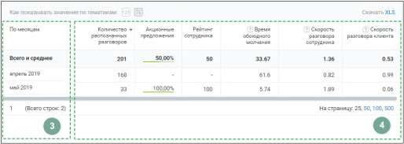

Таблица может включать следующие данные:

Срез: день, месяц или год. Этот показатель присутствует в таблице всегда.

Показатели: • название тематики – в примере на скриншоте выбрана тематика «Акционные предложения». При выборе для отчета большего количества тематик, данные по каждой из них будут отображаться в отдельном столбце. Где заголовок – название выбранной тематики.

| Данные столбца могут отображаться в двух вариантах: 1) в виде процентного соотношения |  |  |
| --- | --- | --- |
|  | разговоров в срезе, отнесенных к данной тематике, к общему числу разговоров в срезе 2) в |  |
| числовом виде – количество разговоров в срезе, отнесенных к данной тематике. |  |  |

• Количество распознанных разговоров. Этот показатель присутствует в таблице всегда • Время обоюдного молчания • Скорость разговора клиента • Скорость разговора сотрудника • Рейтинг сотрудника Для фильтрации данных отчета по возрастанию/убыванию следует щелкнуть по наименованию столбца. Предусмотрен экспорт файла отчета «Тематики по словам» в формате XLS. После клика на кнопку XLS будет открыто стандартное диалоговое окно браузера, позволяющее сохранить файл. Как настраивается отчет “Анализ разговоров” Для построения отчета “Анализ разговоров” выберите временной период, срез (день/месяц/год) и показатели, по которым будет формироваться отчет.

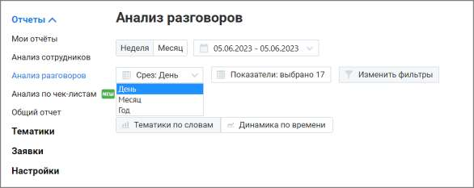

О показателях, по которым осуществляется формирование отчета, подробнее здесь. Данные выбранных чекбоксов в таблице отчета “Анализ разговоров” отображаются, как столбцы. Для сохранения внесенных изменений нажмите на кнопку Применить.

| Если нажать кнопку «Отменить» или пиктограмму , изменения не будут внесены, а |
| --- |
| выборка показателей вернется к последней сохраненной версии. |

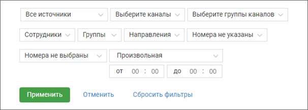

По завершению работы указанных выше фильтров отчет будет сформирован автоматически. Для дополнительной фильтрации данных в отчете откройте выпадающий список Изменить фильтры. Откроются поля дополнительных фильтров.

Источник записи – выбор типа записи разговора: телефонные разговоры/ офлайн-записи /текстовые коммуникации. Каналы коммуникации – выбор из выпадающего списка доступных в разделе «Текстовые коммуникации» ЛК ВАТС каналов коммуникации. Варианты: Чат на сайте, ВКонтакте, Telegram, Max, WhatsApp, Авито, Max.. При выборе типа записи разговора «телефонные разговоры» фильтр недоступен. Группы каналов – выбор из выпадающего списка созданных в разделе «Текстовые коммуникации» ЛК ВАТС групп каналов коммуникации. При выборе типа записи разговора «офлайн-записи» или «телефонные разговоры» фильтр недоступен. Сотрудники – список всех сотрудников, сгруппированный по группам. При выборе типа записи разговора «текстовые коммуникации» в списке доступны только выбранные в разделе Настройки/Аналитика текстовых коммуникаций сотрудники. Если ни один сотрудник не выбран, отчет формируется по всем сотрудникам. Группы – при установке флага напротив наименования группы сформированный отчет будет включать только выбранные группы. Для быстрого выбора всех групп предусмотрен общий флаг.

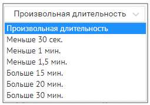

Направление – входящий, исходящий, внутренний звонок или текстовое сообщение. Номера клиента – фильтрация только по любым добавленным номерам. При выборе типа записи разговора «текстовые коммуникации» фильтр недоступен. Номер ВАТС – фильтрация только выбранным номерам ВАТС. При выборе типа записи разговора «текстовые коммуникации» или «офлайн-записи» фильтр недоступен. Длительность – продолжительность разговора. По умолчанию установлен параметр «произвольная длительность». При выборе типа записи разговора «текстовые коммуникации» фильтр недоступен.

| Внутри фильтра действует принцип фильтрации – ИЛИ (когда одно из условий истинно). |
| --- |
| Между фильтрами действует принцип фильтрации – И (когда все условия истинны). |

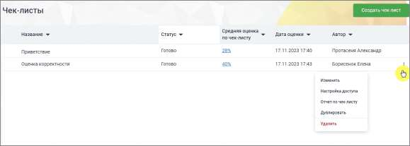

Кнопкой Выбрать сохраните внесенные изменения. 16.1.4. Анализ по чек-листам Отчет предназначен для автоматической оценки разговора сотрудника с клиентом на соответствие стандартам компании. Клик по строке меню «Анализ по чек-листам» открывает перечень всех созданных пользователем чек-листов для оценки разговоров операторов. В окне списка доступен просмотр статистики по созданным чек-листам и создание нового чек-листа в Конструкторе.

Заголовки столбцов (доступна сортировка): Название – задается автором на странице Конструктора Средняя оценка по чек-листу – отображается если чек-лист был просчитан. Может отображаться как цифрами, так и в процентах. Если чек лист не был просчитан – ставится прочерк

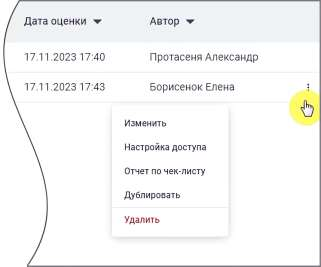

Дата оценки – дата и время, когда была выставлена оценка (задается автоматически). Если чек-лист не был просчитан – ставится прочерк Статус – чек-лист может находиться в одном из следующих статусов, задаваемых автоматически: • Черновик – анализ по чек-листу не проводился, статистики нет; • В процессе – чек-лист находится на этапе просчета; • Ошибка просчета – любая из ошибок. При появлении ошибки рекомендуется запустить оценку по чек-листу повторно; • Готово – чек-лист оценен и есть цифровое значение. Ячейка с цифровыми данными является кнопкой, которая переводит на страницу Статистики.

Клик по пиктограмме в строке выделенного чек-листа открывает выпадающее меню: • Удалить – после подтверждения согласия на удаление чек-лист удаляется; • Дублировать – создание дубля чек-листа, в котором все поля кроме Названия и Описания заполнены так же, как и в оригинале. Если в списке уже создано 10 чек-листов кнопка не работает; • Отчет по чек-листу – переход на страницу Статистики по данному чек-листу; • Изменить – переход на страницу Конструктора, с возможностью редактировать чек-лист. 16.1.4.1. Конструктор чек-листов Возможно создание не более 20-ти чек-листов. Для создания нового чек-листа необходимо нажать на кнопку Создать чек-лист. Вы можете выбрать один из трёх вариантов: «Чек-лист для отдела продаж», «Чек-лист для отдела поддержки» или «Пустой чек-лист». Готовые шаблоны уже содержат ключевые критерии для оценки качества работы менеджеров, что помогает сразу выявлять типовые ошибки и точки роста. Выбранный шаблон можно сразу использовать для анализа или адаптировать под свои задачи, изменив, добавив или удалив пункты.

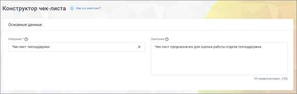

«Пустой чек-лист» позволяет создать список с нуля, если требуется полностью индивидуальный подход.

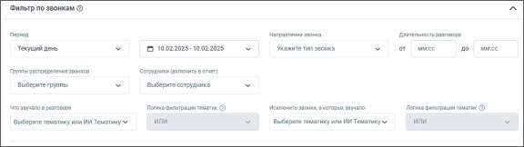

Основные данные: • Название – название, под которым чек-лист будет отображаться в списке чек-листов, не более 65 символов. Название должно быть уникальным в рамках списка чек-листов ЛК ВАТС. Поле обязательно для заполнения; • Описание – описание чек-листа, не более 255 символов;

Фильтр по звонкам: • Период – в какой период были осуществлены звонки, которые должны войти в отчет. Выпадающее меню, с вариантами периода: произвольный, текущий день, вчера, текущая неделя, текущий месяц, с прошлого месяца, с прошлого месяца; • Календарь – для указания временного промежутка, когда были осуществлены разговоры, которые должны войти в отчет. После выбора дат, нужно подтвердить выбор кнопкой «Выбрать»; • Длительность разговора – какой длительности должны быть разговоры, которые должны войти в отчет; o Если в ячейке не указана цифра «от», то будут анализироваться все разговоры без учета нижней границы; o Если в ячейке не указана цифра «до», то будут анализироваться все разговоры без учета верхней границы; o Если в ячейке не указаны цифра «от» и «до», то будут анализироваться все разговоры, без учета этого фильтра; • Тип звонка – какого типа звонки должны войти в отчет. Выпадающее меню с вариантами: исходящий, входящий, внутренний. После выбора показателей нужно подтвердить выбор кнопкой Выбрать; • Сотрудники – по разговорам каких сотрудников будет строиться отчет. Выпадающее меню, в котором можно выбрать одного, нескольких или всех сотрудников;

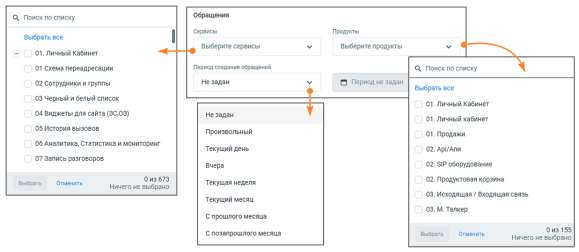

• Группы сотрудников – при выборе каких-либо групп в отчетах будут отображаться только разговоры сотрудников, принадлежащих к выбранным группам. Если ни одно группа не выбрана, отчет формируется по всем группам; • Звонки, в которых звучали тематики – выбор одной или нескольких тематик для оценки по чек-листу; • Исключить звонки с тематиками – звонки, которым проставились выбранные тематики, не будут участвовать в оценке по чек-листу; • Логика фильтрации – для включающего и исключающего тематики фильтра необходимо задать один из вариантов логики: o «И» – ищет диалоги, где встречается тематика 1 И тематика 2 И остальные выбранные тематики; o «ИЛИ» – ищет диалоги, где встречается хотя бы одна из выбранных тематик.

Фильтры по обращениям: • Сервисы – поле выбора категорий сервисов. Выпадающий список включает все сервисы ЛК ВАТС. Содержит элементы для поиска и массового выбора. • Продукты – поле выбора категорий продуктов. Выпадающий список включает все продукты ЛК ВАТС. Содержит элементы для поиска и массового выбора. • Период создания обращений – выпадающий список с вариантами периода. Доступные варианты: o Не задан, o Произвольный, o Текущий день, o Вчера, o Текущая неделя, o Текущий месяц, o С прошлого месяца, o С позапрошлого месяца. Фильтры по CRM Инструмент фильтрации звонков по этапам сделок позволяет оценивать эффективность работы сотрудников не только по содержанию разговора, но и в контексте хода сделки.

| Функция доступна при подключённой в ЛК ВАТС интеграции «Расширенный пакет |  |  |
| --- | --- | --- |
|  | Битрикс24». В настройках интеграции должен быть отмечен чекбокс «Передавать данные в |  |
| Речевую аналитику». |  |  |

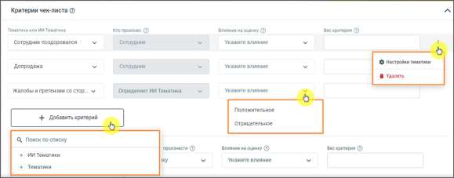

В выпадающем списке блока фильтров вы можете выбрать: • Тип воронки (например, «Продажи», «Поддержка»); • Этап сделки (например, «Первичный контакт», «Закрыто успешно»). После выбора параметров в таблице результатов отображается колонка «CRM», где для каждого разговора указываются статус сделки и её текущий этап в Битрикс24. Благодаря этим данным можно сразу увидеть, как конкретные звонки влияют на продвижение сделок и оценить эффективность работы менеджеров на разных стадиях продаж. Критерии чек-листа:

Доступные критерии: 1) Тематики и ИИ Тематики При создание нового чек-листа в блоке Критериев по умолчанию отображаются три тематики-

критерия. Клик по пиктограмме в строке выделенного чек-листа открывает выпадающее меню: • Настройки тематики – переход в раздел Создание и редактирование тематик; • Удалить – удаление тематики из чек-листа. Клик по кнопке Добавить критерий открывает список всех доступных тематик и ИИ тематик с возможностью выбора одного из них. В список критериев добавляется строка с выбранной тематикой или запросом и полями для ввода и выбора данных: • Кто произнес – в каком канале звучала тематика или запрос: сотрудник, клиент, клиент или сотрудник; • Влияние на оценку – задается влияние тематики или запроса на общую оценку (положительное или отрицательное);

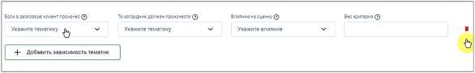

• Вес критерия – оценка в баллах, как повлияет срабатывание критерия, на общую оценку, максимум можно вводить 4 цифры; Отображение поля «Кто произнес» для выбранных тематик и запросов: • Если в расширенных настройках Тематики пользователь указал вариант «клиент или сотрудник», то в чек-листе есть возможность выбрать или клиента, или сотрудника или оставить обоих. • Если тематика или запрос настроены на «клиент» или «сотрудник», то у пользователя в чек- листах не будет возможности выбрать – в ячейке будет указан или «клиент», или «сотрудник» по умолчанию. • Если у пользователя не было расширенных настроек, то данную ячейку пользователь заполняет в интерфейсе конструктора чек-листов самостоятельно. 2) Зависимость тематик

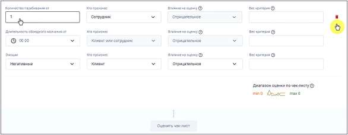

Эта настройка устанавливает зависимость ответа сотрудника от запроса клиента. У пользователя есть возможность выбрать тематики запроса и ответа, а также влияние критерия на оценку и вес критерия. Клик по кнопке "Добавить зависимость тематик" добавляет строку с полями для ввода/выбора данных. 3) Характеристики разговора

Также при создании чек-листа в блоке по умолчанию отображаются критерии – характеристики разговора: • Количество перебиваний – влияние на оценку автоматически проставлено как «отрицательное», вес не указан o Количество перебиваний от __ – количество перебиваний в разговоре сотрудником или клиентом (выбирается в следующем поле); o Кто произнес – для кого считается количество перебиваний. Варианты: сотрудник, клиент, клиент или сотрудник; o Влияние на оценку – по умолчанию проставлено как «отрицательное», изменение невозможно; o Вес критерия – оценка в баллах, как повлияет срабатывание критерия, на общую оценку, максимум можно вводить 4 цифры;

<!-- изображение на стр. 471: байты не извлечены (PyMuPDF недоступен) -->

• Длительность обоюдного молчания – по умолчанию проставлено как «отрицательное», изменение невозможно; o Длительность обоюдного молчания от__ вводится в формате ММ:СС. Пользователь может ввести цифру самостоятельно, либо выбрать из выпадающего меню, с шагом 10 секунд. o Кто произнес – имеется в виду «для кого считается длительность молчания». Вариант: сотрудник или клиент, изменение невозможно; o Влияние на оценку – по умолчанию проставлено как «отрицательное», изменение невозможно; o Вес критерия – оценка в баллах, как повлияет срабатывание критерия, на общую оценку, максимум можно вводить 4 цифры. После ввода веса каждого критерия, под таблицей автоматически считается и отображается диапазон оценок по чек-листу – максимальная и минимальная возможные оценки сотрудников. Для подсчета статистики по чек-листу нажмите кнопку «Оценить чек-лист». После нажатия кнопки все поля критериев будут недоступны для редактирования. Чтобы отредактировать критерии после подсчета статистки, прокрутите страницу чек-листа вверх и нажмите кнопку «Изменить чек-лист». Статистика по данному чек-листу будет сброшена, чек-лист перейдет в статус «черновик» до момента следующей оценки. 16.1.4.2. Статистика по чек-листам Статистика отчета по Чек-листам содержит вкладки «Таблица» и «График», которые позволяют комплексно анализировать результаты оценок в отчете.
