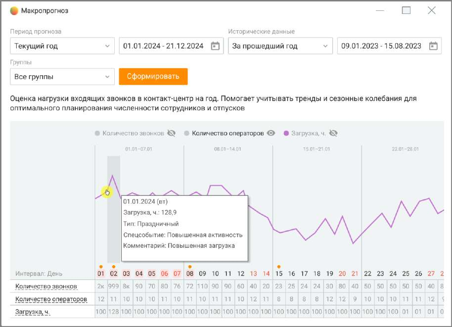

# 8.2.1. Макропрогноз

Макропрогноз предназначен для стратегического планирования нагрузки и численности сотрудников компании на год. Этот инструмент помогает оптимально распределить ресурсы, планировать отпуска и тренинги сотрудников, а также учитывать сезонные колебания нагрузки.

Инструмент содержит: 1. Периоды прогноза и исторические данные: o Пользователь может выбрать один из доступных периодов для формирования прогноза: ▪ Текущий год — рассчитывается с текущей даты до конца года. ▪ Следующий год — отображает данные с 1 января следующего года. ▪ Текущий месяц — включает прогноз на оставшуюся часть текущего месяца. ▪ Произвольный период — позволяет пользователю задать любой период времени. o Исторические данные используются для анализа трендов и формирования прогноза. Для исторических данных доступны выборки: ▪ Прошлый год. ▪ Все время. ▪ Произвольный период. 2. Фильтр по группам. Этот фильтр позволяет учитывать особенности нагрузки разных отделов или категорий сотрудников. Пользователь может выбрать, для какой группы сотрудников формируется прогноз: o Все группы — данные рассчитываются по всем доступным группам. o Конкретная группа — прогноз формируется только для выбранной группы сотрудников. 3. Формирование прогноза. На основе выбранных параметров и исторических данных программа формирует прогноз с выводом следующих метрик:

o Количество звонков. o Необходимое количество операторов. o Загрузка операторов (в часах). 4. Отображение прогноза: o Прогноз доступен в виде графика, который показывает: ▪ Динамику звонков по выбранному периоду. ▪ Необходимое количество сотрудников. ▪ Общую загрузку в часах. o Под графиком выводится таблица, содержащая детализированные данные по дням: ▪ Количество звонков. ▪ Количество операторов. ▪ Загрузка в часах. 5. Учет специальных событий. Контакт-центр позволяет учитывать специальные события (например, праздничные дни или пиковые нагрузки), которые добавляются в производственный календарь. Эти события отображаются на графике и влияют на расчет нагрузки. o Перейдите в производственный календарь и добавьте нужные события (например, праздничные дни). o События автоматически отобразятся на графике прогноза. 6. Функционал наложения активностей: o В прогноз можно наложить дополнительные активности (например, отпуска, тренинги), что автоматически корректирует необходимые данные по нагрузке и численности операторов. Прогноз обновится с учетом этих изменений.
