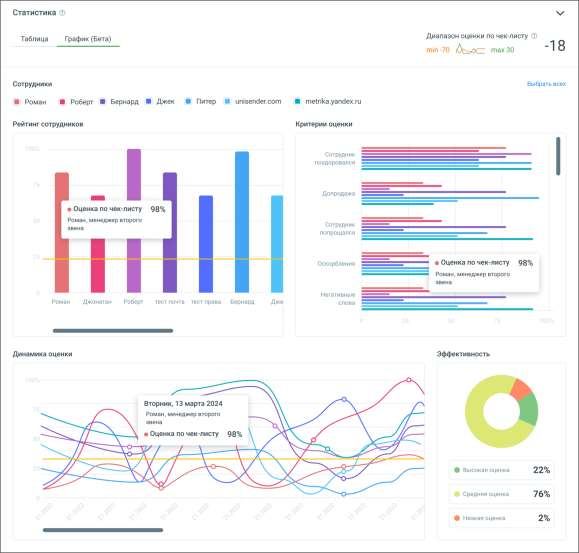
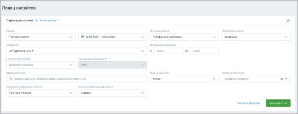
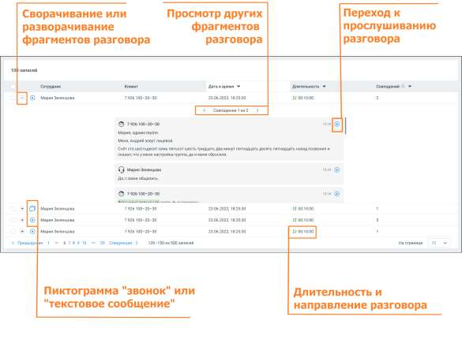
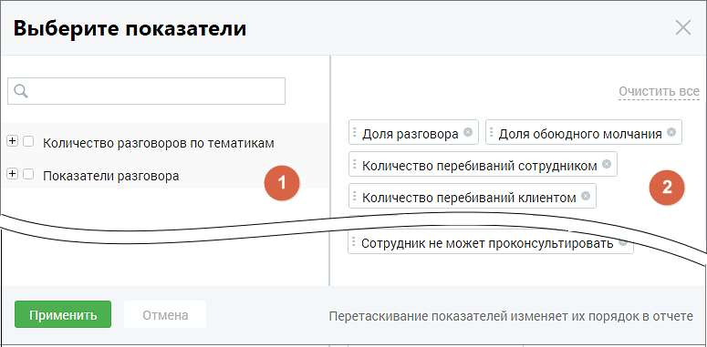

# Вкладка "График"

> Трассировка: PDF §3 · сквозные стр. 473-477 · источники: ч.1 `kb/sources/mango-cc-manual/CC_manual_1.26.28.1.pdf` с.473-477.

Вкладка "График" содержит следующие элементы: • Рейтинг сотрудников: Бары отображают сравнительный рейтинг выбранных в чек-листе сотрудников. • Критерии оценки: Горизонтальные линейные графики показывают распределение различных оценочных критериев применительно к сотруднику. • Динамика оценки: Линейные графики для анализа изменений оценок каждого из сотрудников во времени. • Эффективность: Круговая диаграмма для визуализации процентного распределения оценок по сотрудникам.

16.1.5. Ловец инсайтов Данные отчета позволяют прослеживать – как фраза или тематика разговора повлияла на ход разговора. Таким образом отчет Ловец инсайтов позволяет в наглядном виде ознакомиться с причинами, которые не позволяют сотруднику работать на максимуме своей эффективности. Отчет состоит из двух блоков: 1) Блок параметров 2) Блок результатов Блок параметров

При формировании отчета пользователям доступна фильтрация: Период – в какой период состоялись диалоги, которые должны войти в отчет. Выпадающее меню, с вариантами периода: произвольный, текущий день, текущая неделя, текущий месяц, с прошлого месяца, с позапрошлого месяца; Источники записи – выбор типа записи разговора: телефонные разговоры, текстовые коммуникации; Направление звонка – входящий, исходящий, внутренний звонок или текстовое сообщение; Сотрудники – список всех сотрудников, сгруппированный по группам. Если ни один сотрудник не выбран, отчет формируется по всем сотрудникам; Длительность разговора – продолжительность разговора; Тематика разговора – выбор одной или нескольких тематик, которые звучали в разговоре. Как учитывать тематики – выбор логики для тематик, с помощью которой будут фильтроваться звонки. И – в отчёт попадут разговоры, где прозвучала каждая из выбранных тематик. ИЛИ – в отчёт попадут разговоры, где прозвучала хотя бы одна из выбранных тематик; Фраза-событие – триггер, т.е. слово или фраза, характеризующие важное для бизнеса событие, причины и реакции которых необходимо проанализировать. Для уточнения поиска используйте символы ! и " ", как указано в пункте Правила и советы по настройке тематик; Поиск в канале – выбор канала Клиент или Сотрудник, в котором необходимо найти событие. Тематика-событие – выбор тематики, характеризующей важное для бизнеса событие, причины и реакции которой необходимо проанализировать. В выпадающем окне доступны тематики, настроенные для выбранного ранее канала.

Настройки отображения отчёта: Причина – это фрагмент разговора сотрудника или клиента, который звучал до искомого события. Реакция – это фрагмент разговора, который звучал после события. Если не выбран ни один из показателей, в отчете отобразится только контекст события; Глубина отображения фрагмента – количество фраз, которые отобразятся в Блоке результатов отчета; Клик по кнопке Очистить фильтры очищает выбранные параметры фильтрации. Клик по кнопке Показать отчет отображает блок результатов. Блок результатов Блок содержит подробную информацию о срабатывание триггера, с отображением причины и результата срабатывания.

Блок результатов содержит следующие данные: • Клиент и сотрудник, участники разговора • Источник записи • Длительность и направление разговора • Дата и время разговора • Количество совпадений с триггером в разговоре. Если в разговоре триггер сработал несколько раз, то для навигации по срабатываниям используйте пиктограммы влево <, и вправо > • Фрагменты разговора, в которых сработал триггер. В каждом фрагменте есть пиктограмма, которая открывает плеер или осциллограмму разговора: o с первой фразы причины триггера (для настроек отображения – Причина и Реакция)

o с фразы, где имеется триггер (для настроек отображения – Реакция) 16.1.6. Показатели отчетов Для построения отчетов устанавливаются показатели, по которым будет формироваться отчет.

Окно выбора показателей содержит две группы: 1. В группе «Количество разговоров по тематикам» отображаются все тематики продукта: предустановленные и созданные пользователем, включая неактивные. По этим показателям можно проанализировать корректность речи сотрудника и речь клиента. 2. Группа «Показатели разговора» включает в себя следующие характеристики звонка: Общая длительность записи – показывает общую длительности записи с момента подъема трубки до окончания разговора; Длительность разговора – показывает суммарное количество времени, когда хотя бы один из участников разговора говорил; Длительность обоюдного молчания – показывает, сколько времени сотрудник тратит на поиск информации, требующейся клиенту, а также насколько быстро сотрудник может ответить на вопросы клиента; Доля разговора – отношение длительности разговора к общей длительности записи. Позволяет понять, какую долю от общего времени записи собеседники были заняты разговором; Доля обоюдного молчания – отношение длительности обоюдного молчанию к длительности записи. Позволяет понять, какую долю от общего времени записи клиент ожидает ответа сотрудника; Количество перебиваний сотрудником – позволяет понять, сколько раз сотрудник перебил клиента; Количество перебиваний клиентом - позволяет понять, сколько раз клиент перебил сотрудника. Если у какого-то сотрудника этот показатель сильно отличается от остальных, то, вероятно, способ донесения сотрудником информации не соответствует ожиданиям клиента;

Доля обоюдного разговора – доля разговора, когда клиент и сотрудник говорили одновременно. Позволяет понять стиль общения сотрудника с клиентом; Доля разговора сотрудника – доля разговора, когда говорил только сотрудник. Позволяет понять, ведет ли сотрудник беседу, или её ведет клиент; Доля разговора клиента – доля разговора, когда говорил только клиент. Позволяет понять, ведет ли сотрудник беседу, или её ведет клиент; Скорость разговора клиента (количество слов в секунду); Скорость разговора сотрудника (количество слов в секунду) – позволяет анализировать, как сотрудник подстраивается под скорость речи клиента. Сравнив этот показатель среди всех сотрудников можно понять, кто слишком быстро говорит, а кто говорит чересчур медленно. Данные выбранных чекбоксов в таблице «Показатели разговора» отчета «Анализ сотрудников» отображаются, как столбцы. Выбранные показатели отображаются на правой стороне окна показателей (блок 2). Для

удаления показателя из списка выбранных нажмите пиктограмму удаления в строке показателя. Для сохранения внесенных изменений нажмите на кнопку «Применить».

Если нажать кнопку «Отменить» или пиктограмму , изменения не будут внесены, а выборка показателей вернется к последней сохраненной версии.
