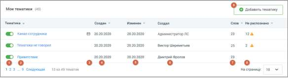
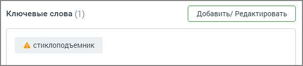
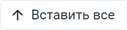
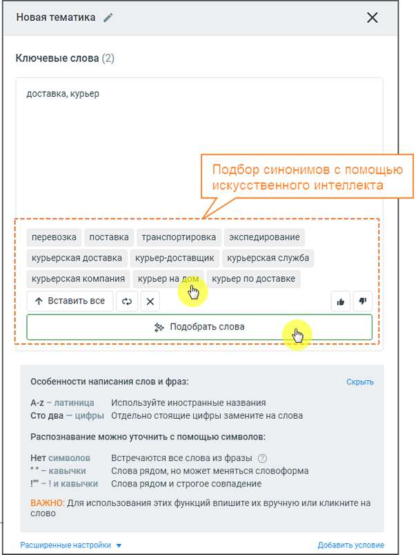
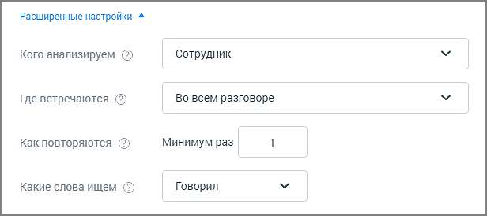
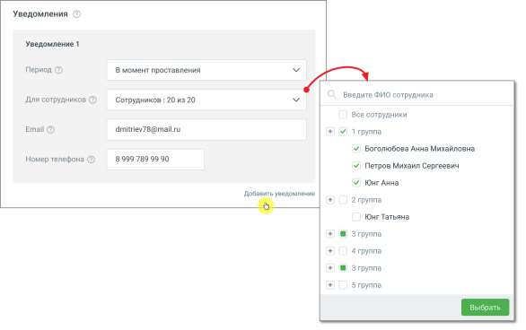

# 16.2. Тегирование разговоров в Речевoй аналитике

> Трассировка: PDF §16.2 · сквозные стр. 477-483 · источники: ч.1 `kb/sources/mango-cc-manual/CC_manual_1.26.28.1.pdf` с.477-483.

В Речевой аналитике тегирование разговоров выполняется автоматически на основе настроенных тематик, ключевых слов и анализа с использованием чата ИИ. Тематика – метка на разговор, которая устанавливается в зависимости от правил, заданных пользователем, и учитывающих вхождение введенных пользователем терм. Речевая аналитика позволяет автоматически проставлять звонку тематику. Таким образом Речевая аналитика классифицирует звонки, основываясь на наличии в разговоре заданных слов или фраз.

| Одному звонку может быть проставлено более одной тематики. Тематика может иметь |
| --- |
| статус Активна/Неактивна. Распознанному звонку может присваиваться только активная |
| тематика. |

По умолчанию в Речевой аналитике включены 35 предустановленных тематик. Рабочая область вкладки Тематики содержит список всех тематик Речевой аналитики: Мои тематики, Совместные, Предустановленные, а также строку поиска по наименованию тематики, ее создателю или ключевым словам.

1. Тумблер (в демо-версии цвет включенного тумблера – желтый) для новых тематик по умолчанию включен. Система проверяет на вхождение только записи, распознанные после включения тумблера; 2. Название тематики; 3. Пиктограмма «e-mail» – отображается в случае настроенного уведомления на E-mail и/или СМС; 4. Когда создана тематика – дата в формате "ДД.ММ.ГГГГ"; 5. Когда изменена тематика – дата в формате "ДД.ММ.ГГГГ"; 6. Кем создана тематика – ФИО, для всех тематик, кроме предустановленных; 7. Количество слов в тематике – общее количество распознанных и нераспознанных терм в составе тематики; 8. Количество не распознанных слов – общее количество нераспознанных терм в составе тематики на момент отображения данных; 9. Кнопка добавления новой тематики. Для сортировки данных таблицы кликните по наименованию столбца. 16.2.1. Создание и редактирование тематики Для добавления новой тематики щелкните по кнопке "Добавить тематику". Максимальное количество тематик в рамках одного продукта ВАТС – 200. По достижении лимита появляется окно уведомления о необходимости удалить ранее созданные неактуальные тематики. Для редактирования тематики кликните левой кнопкой мыши на название тематики, которую требуется изменить. Внесите необходимые изменения в открывшемся окне тематики. Нажмите кнопку "Сохранить".

| Если во вкладке Настройки отмечен чекбокс “Перезаписывание тематик” после |  |  |
| --- | --- | --- |
|  | редактирования тематики все распознанные записи звонков за последние 90 календарных |  |
|  | дней будут проверены на соответствие изменившимся условиям. Это может привести к |  |
| изменениям данных отчетов. |  |  |

Подробнее о функции Перезаписывание тематик здесь. Панель создания (редактирования) тематики состоит из трех блоков: 1. Блок Ключевых слов (терм) 2. Блок Расширенные настройки 3. Блок Настройки уведомлений

Блок Ключевые слова Блок ключевых слов содержит следующие поля: Название тематики. По умолчанию новая тематика именуется Тематика. Изменить название

можно, щелкнув по пиктограмме . Допускается ввод не более 62 символов. Ключевые слова. При вводе терм в поле "Ключевые слова" производится проверка на наличие каждого слова в словаре распознавания (с учетом словоформ). Если введенное слово отсутствует в словаре, оно выделяется пиктограммой «!». Вероятно, в написании слова имеется ошибка, поэтому оно не может быть распознано. Речевая аналитика предложит исправить слово или добавить его в словарь распознавания.

Подробнее о том, как сформулировать поисковый запрос, узнайте здесь. Блок ИИ. При помощи ИИ (искусственного интеллекта) пользователь может подобрать синонимы и аналогичные выражения к своему списку ключевых слов. Для этого требуется указать несколько ключевых слов и нажать на кнопку «Подобрать слова». После этого в появившемся списке можно выбрать любое слово, и оно автоматически добавится в поле ключевых слов тематики. Также в блоке Искусственного интеллекта доступны следующие действия:

– клик по кнопке добавляет все предложенные синонимы в поле ключевых слов тематики.

– обновить список синонимов.

– удалить все синонимы.

– отметить предложенные синонимы как подходящие или неподходящие.

После ввода ключевых слов следует настроить опции распознавания, кликнув по кнопке Расширенные настройки.

Блок Расширенные настройки

Блок добавления условий содержит следующие поля: Кого анализируем – выбор канала для анализа. Если выбран канал «сотрудник», поиск вхождений ведется в том числе и по внутренним разговорам. Если выбран канал «клиент», поиск вхождений по внутренним разговорам не ведется. Где встречаются - укажите в каком месте разговора искать термы (выберите из выпадающего списка): • Во всем разговоре; • В начале разговора: первые 20% длительности разговора; • В середине разговора: отрезок между началом и концом разговора; • В конце разговора: последние 20% длительности разговора; Для второго и третьего условия выпадающий список "Где встречаются" содержит дополнительные элементы: • В следующей фразе: только в следующем фрагменте разговора после срабатывания предыдущего условия; • В следующих фразах: во всех следующих фрагментах разговора после срабатывания предыдущего условия; Как повторяются - задайте минимальное количество вхождений, необходимое для срабатывания условия. Допускается ввод целого положительного числа, содержащего не более 3 цифр. Данное поле является обязательным для заполнения. Выбор числа, превышающего единицу, исключает возможность единичной ошибки распознавания термы при присвоении звонку тематики.

| Эта функция требует осознанного подхода к использованию, так как при этом некоторые |
| --- |
| целевые звонки могут быть исключены из поиска. |

Какие слова ищем – выпадающий список Говорил/Не говорил задает поиск по наличию либо отсутствию терм в распознанных записях разговоров. Добавить дополнительные условия для данной тематики можно, щелкнув по кнопке Добавить условие. Для одной тематики можно добавить не более трех блоков условий. Модуль Речевая аналитика проверяет звонок на соответствие каждому из условий, в порядке их следования. Только если срабатывают все заданные условия, звонку присваивается тематика. Настройка уведомлений При добавлении тематики пользователь задает ряд условий. Если срабатывают все заданные условия и звонок отмечается на соответствие тематике, пользователь получает уведомление по электронной почте или посредством СМС-сообщения.

Выпадающий список выбора уведомлений содержит значения: Период: • Не выбрано – установлено по умолчанию; • В момент проставления – при выборе этого значения вам понадобится указать действующий адрес электронной почты, на который будут поступать уведомления о простановке звонку тематики; • За прошлый день – уведомление о проставлении звонкам тематик будут поступать один раз в день, в 11 часов по московскому времени. При выборе этого значения вам также необходимо указать действующий адрес электронной почты и/или номер телефона для СМС-сообщений; • За прошлую неделю – уведомление о проставлении звонкам тематик будут поступать каждый понедельник, в 11 часов по московскому времени. При выборе этого значения необходимо указать действующий адрес электронной почты и/или номер телефона для СМС-сообщений (дополнительной оплаты доставки СМС-сообщений не требуется); Для сотрудников – выбор списка сотрудников/групп, в разговорах которых проверяется срабатывание текущей тематики. E-mail – адрес электронной почты, на который предусмотрена отправка уведомлений. Номер телефона – номер, на который предусмотрена отправка смс-уведомлений. Кнопка «Добавить уведомление» – добавление нового уведомления. Допустимое количество уведомлений для тематики не более 5.

| После установки обновления модуля «Речевая аналитика» параметры уведомлений, |
| --- |
| настроенные до обновления, сохраняются. |

