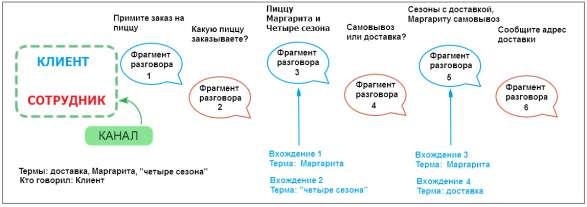
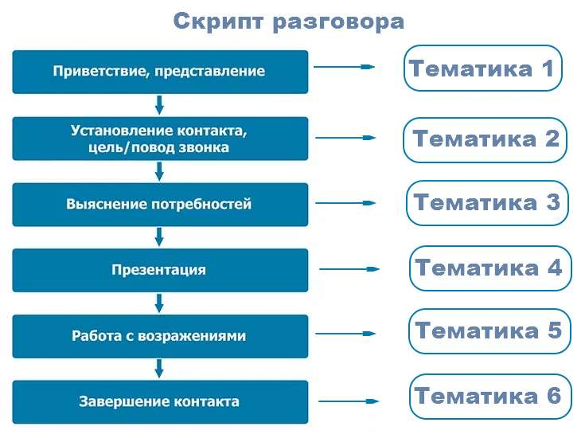
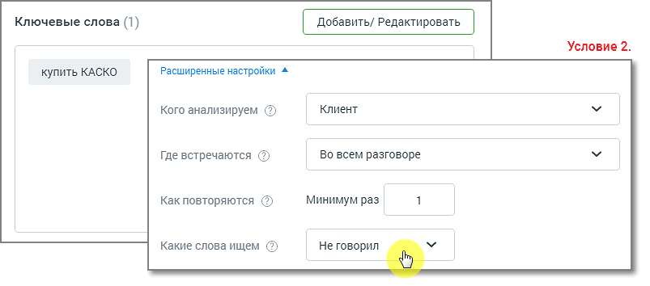
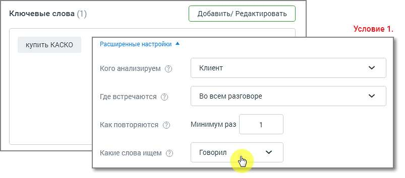
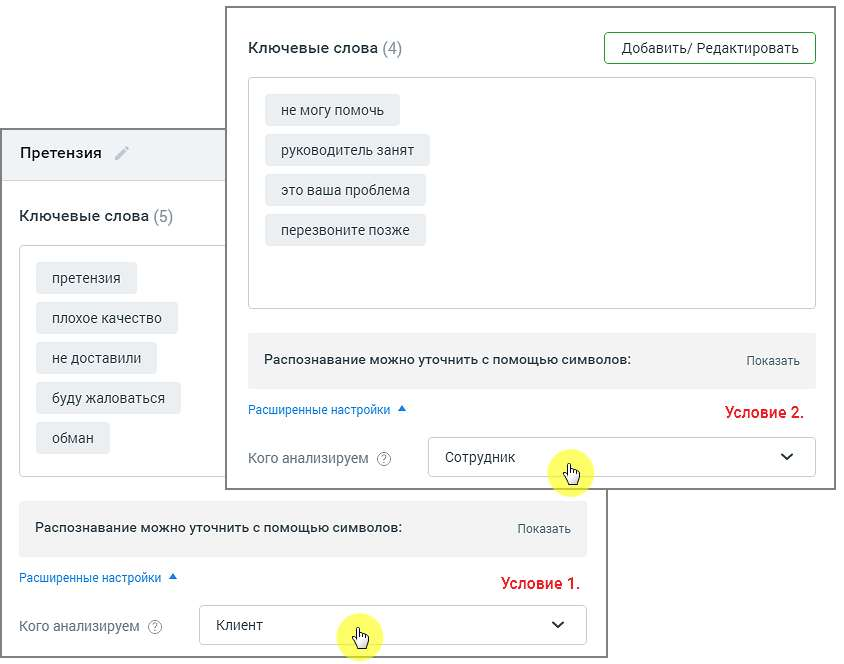
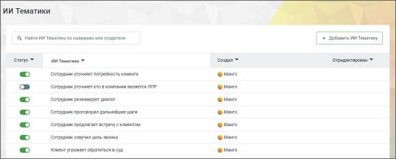

# Правила рассылки уведомлений:

> Трассировка: PDF §16.2 · сквозные стр. 483-490 · источники: ч.1 `kb/sources/mango-cc-manual/CC_manual_1.26.28.1.pdf` с.483-490.

1. Отдельные уведомления независимы друг от друга.

| ПРИМЕР: |
| --- |
| В двух уведомлениях выбраны идентичные сотрудники, e-mail и номера телефона. В этом случае |
| каждое из этих уведомлений рассылается независимо от другого. |
| • Если на один e-mail/номер телефона настроено более одного уведомления "за прошлый |
| день" (на, соответственно, более чем одну тематику), то информация агрегируется в |
| одном письме/СМС. |
| • Если на один e-mail/номер телефона настроено более одного уведомления "за прошлую |
| неделю" (на, соответственно, более чем одну тематику), то информация агрегируется в |
| одном письме/СМС. |

16.2.2. Примеры использования тематик Пример 1. Тематика “Информирование о спецпредложении” Для увеличения среднего чека сотрудник в каждом разговоре должен рассказать клиенту о спецпредложении. Создается тематика “Информирование о спецпредложении”. Из отчета Анализ сотрудников понятно – кто из сотрудников предлагал акцию, а кто нет. Пример 2. Тематика “Недобросовестные сотрудники” Руководителю необходимо понять, какие сотрудники негативно влияют на продажи/обслуживание. Создается тематика “Недобросовестные сотрудники”. Данные в отчете Анализ сотрудников покажут, какие сотрудники некорректно себя ведут в разговорах с клиентами. Пример 3. Тематика “Потребность в дополнительных услугах” Необходимо выяснить, какие дополнительные услуги востребованы у клиентов. Создается тематика “Потребность в дополнительных услугах”. В отчете Анализ разговоров будет сформирован список наиболее востребованных услуг. 16.2.3. Правила и советы по настройке тематик Терма – ключевое слово или словосочетание, которое необходимо найти в тексте записи разговора. При вводе терм допускается использование следующих символов: • Кавычки (" " или «») – для поиска точного соответствия поисковому запросу; • Дефис (тире) – для составных слов; • Буквы (кириллица, латиница); • Цифры; • Пробел; • Восклицательный знак (!).

Виды терм

Простое слово. Например, слово окно. Допустим, пользователь ищет это слово в речи клиента. Вхождение засчитывается, когда слово окно (с учетом словоформ: окна, окон и т. д.) будет найдено в каком-то из фрагментов разговора клиента. Если слово окно будет найдено 5 раз в одном фрагменте или слово окно будет найдено в 5-ти разных фрагментах, то количество вхождений слова окно будет равно 5. Словосочетание Например словосочетание купить окно. Допустим, пользователь ищет это словосочетание в речи клиента. Вхождение засчитывается, когда одновременно слово купить и слово окно (с учетом словоформ) встретятся во фрагменте разговора клиента. Например, если клиент сказал Хочу купить ваше пластиковое окно, терма купить окно засчитается. Словосочетание в точном соответствии Например “купить окно” (отличается от обычной фразы ТОЛЬКО кавычками). Допустим, пользователь ищет в речи клиента словосочетание “купить окно”. Вхождение засчитается только в том случае, когда во фрагменте речи клиента встретится фраза купить окно (с учетом словоформ). Например, если клиент сказал Хочу купить ваше пластиковое окно, терма “купить окно” НЕ засчитается. А если клиент сказал Я очень хочу купить окна, терма “купить окно” засчитается. Слово или словосочетание без учета словоформ Например !окно (отличается от обычной фразы ТОЛЬКО символом «!») Допустим, пользователь ищет это слово в речи клиента Вхождение засчитывается, когда слово окно (без учета словоформ) будет найдено в каком-то из фрагментов разговора клиента. Например, если в каком-то из фрагментов разговора клиент скажет Я купил одно окно в этой организации. Чтобы закрепить все словоформы словосочетания, необходимо использовать символ «!» перед первым словом словосочетания – !купить окно. Вхождение засчитывается, если в каком-то из фрагментов разговора клиент скажет Я хочу купить одно окно в этой организации.

| Важно: Закрепить одно слово в словосочетании нельзя. Терма вида купить !окно является |
| --- |
| некорректной. |

Для поискового запроса !окно, найденные слова "окна", "окон" НЕ засчитываются как вхождение. Слово или словосочетание в точном соответствии, без учета словоформ «!купить окно» – используйте кавычки и символ ! для закрепления словоформы поискового запроса в точном соответствии. !«купить окно» – второй вариант для закрепления словоформы поискового запроса в точном соответствии. Вхождение засчитывается, если в каком-то из фрагментов разговора клиент скажет Я хочу купить окно с установкой. 1. Создавайте простые тематики, чтобы одна тематика решала максимум одну задачу. Лучше задать несколько узконаправленных тематик, нежели одну общую.

| ПРИМЕР |
| --- |
| Известны основные конкуренты компании, их преимущества, отличия и т. д. Клиенты в разговоре с |
| сотрудниками сравнивают продукты компании с продуктами конкурентов, и руководителю важно |
| понимать, с какими конкурентами сравнивают. Знать параметры – по каким компания выигрывает, |
| по каким проигрывает. Таким образом можно запланировать изменения в продукте/ ценовой |
| политике/ позиционировании на рынке и т. д. |
| Решение: Создаем отдельные тематики для каждого из конкурентов с условиями Клиент, Говорил, |
| Во всем разговоре и смотрим, как их упоминание меняется в динамике по времени. |
| На основании полученных данных в работу компании вносятся изменения: меняется ценовая |
| политика, корректируются позиционирование продукта, уникальное торговое предложение, |
| скрипты продаж. |

2. Создавайте несколько тематик для решения одной задачи. По данным отчетов вы сможете увидеть, на каком этапе разговора у сотрудников возникают проблемы.

3. Создавая тематики на негативные сценарии, используйте фильтр НЕ ГОВОРИЛ Помните, что тематики “отрицательной” направленности – Недобросовестные сотрудники, Отказ в услуге и т. д. – могут повлиять на результаты расчета рейтинга сотрудника/группы. 4. При настройке тематик не задавайте противоречащие друг другу условия. Пример двух противоречащих условий в одной тематике:

5. Создавайте тематику из нескольких условий, только если это необходимо для решения конкретной задачи. Например, если в одном разговоре требуется проанализировать отдельно два канала – сотрудник и клиент – на соответствие разным условиям.

16.2.4. ИИ Тематики Модуль Речевая аналитика поддерживает семантический анализ разговоров на основе запросов к ИИ, что делает возможным анализ диалогов без необходимости подбора ключевых слов. Модуль содержит 15 предустановленных ИИ тематик, которые дают возможность отфильтровать диалоги по используемым в них запросам.

Для фильтрации диалога по тематике следует установить переключатель соответствующего запроса в положение “включено”. Клик по кнопке “Добавить ИИ Тематику” открывает окно добавления новой тематики. Ознакомьтесь с информацией в открывшемся окне и выберите подходящий вариант создания.

| Если у пользователя не подключена соответствующая услуга (которую активирует |  |  |  |  |
| --- | --- | --- | --- | --- |
|  | Персональный менеджер), при нажатии на кнопку | Добавить ИИ Тематику | будет |  |
|  | предложено выбрать способ создания тематики. После этого система предложит заполнить |  |  |  |
|  | форму обратной связи на подключение услуги. Далее с пользователем свяжется менеджер |  |  |  |
| для активации услуги. |  |  |  |  |

При создании тематики с помощью ИИ важно формулировать ее четко и конкретно. Указывайте контекст или дополнительные условия, если они необходимы для правильного понимания тематики. Вопрос должен быть сформулирован таким образом, чтобы на него можно было ответить только "да" или "нет". Чем точнее будет вопрос-промт, тем более конкретный и полезный результат вы получите. После сохранения ИИ Тематика будет автоматически активирована. Система начнет тегировать звонки согласно тематике. Ограничения: • Лимит символов: Текст тематики может содержать не более 400 символов. Название – до 64 символов. Поддерживаются символы: А-я, A-z, ёЁ, пробелы, знаки пунктуации (/, – . ?). • Лимит: Вы можете создать не более 500 ИИ тематик. • Лимит активных ИИ тематик: Если в системе уже активировано 20 ИИ тематик, новая ИИ тематика будет добавлена в выключенном состоянии. После сохранения ИИ тематики пользователь имеет возможность отредактировать ее или удалить. Для удаления ИИ тематики необходимо подтверждение действия.

