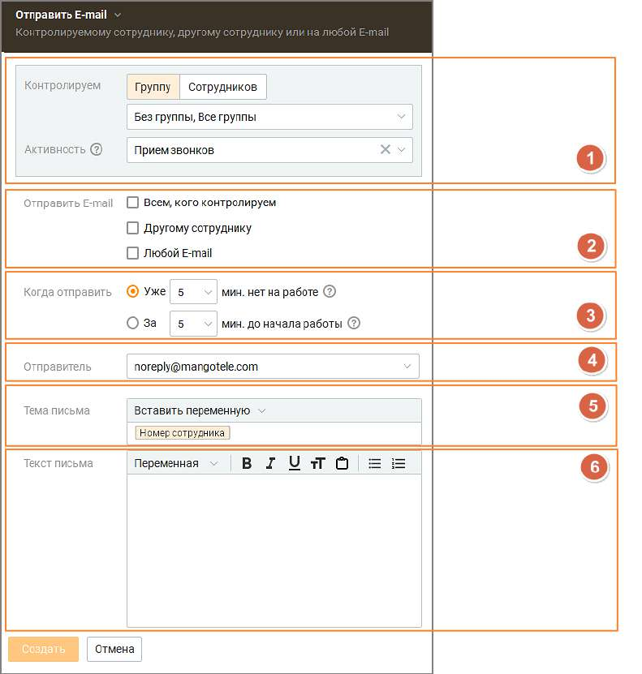
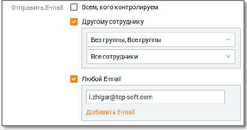
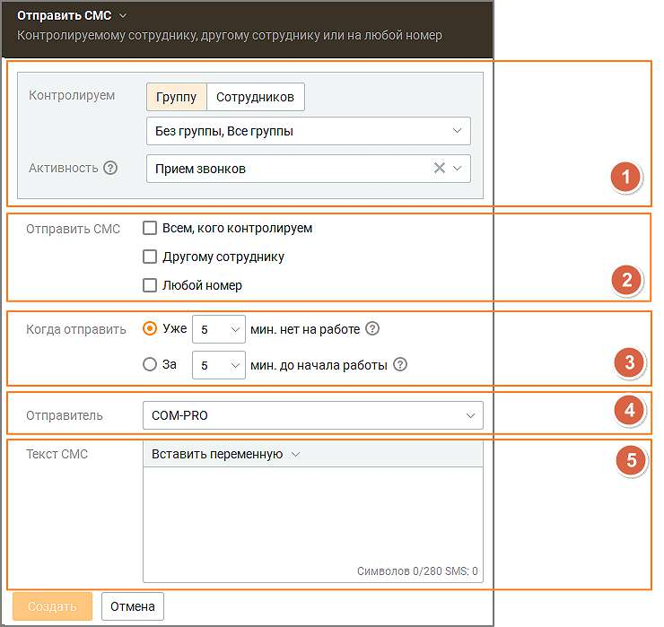
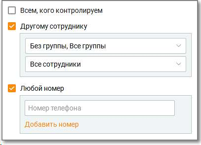
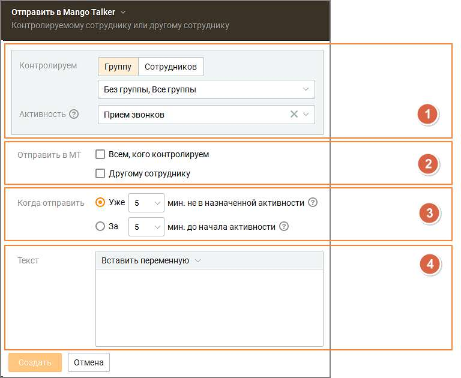

# 8.5.1. Автоматические действия (WFM)

Пользователь Контакт-центра с ролью "Администратор" имеет возможность уведомлять сотрудников о нарушении рабочего времени, чтобы уменьшить опоздание и заранее направить предупреждение.

После настроек триггера выбранным сотрудникам или группам сотрудников приходит MangoTalker-, E-mail или СМС уведомление: • о начале рабочей смены – MangoTalker, E-mail или СМС уведомление; • о заданном графике работы в течении дня – MangoTalker, E-mail или СМС уведомление; • об изменении графика работы – E-mail уведомление. При выборе нескольких сотрудников каждому из них будет отправлен отдельный файл только с его расписанием. Максимальное количество автоматических действий – 20.

Отправка письма с заданным текстом и переменными на E-mail

В триггере необходимо задать следующие настройки: 1. Контролируем: Выбор сотрудника или группы сотрудников с указанной активностью. Для уведомления "об изменении графика работы" активность не указывается. 2. Отправить e-mail: • всем, кого контролируем – уведомление будет направлено на адреса электронной почты всех выбранных сотрудников; • другому сотруднику – при выборе открываются выпадающие списки для выбора сотрудников, которым будет направлено уведомление; • любой e-mail – при выборе открывается поле для ввода адреса электронной почты, куда будет направлено уведомление;

3. Когда отправить – настройка времени отправки уведомления. Диапазон настройки 5 – 60 минут. Шаг настройки – 5 минут. 4. Отправитель: При создании уведомления адрес отправителя указан по умолчанию – это авторизованный электронный адрес компании. Также можно выбрать e-mail отправителя из авторизованных на вкладке Телефония и E-mail. Пользователь может выбрать из списка только авторизованные адреса компании. 5. Тема письма – тема уведомления. Доступны переменные: ФИО сотрудника, номер телефона сотрудника. 6. Текст письма – поле для текста уведомления. Доступны переменные: ФИО сотрудника, номер телефона сотрудника. Сохраните внесенные изменения кнопкой Сохранить. Отправка СМС с заданным текстом и переменными

В триггере необходимо задать следующие настройки:

1. Контролируем: Выбор сотрудника или группы сотрудников с указанной активностью. 2. Отправить СМС: • всем, кого контролируем – уведомление будет направлено на мобильный номер телефона всех выбранных сотрудников; • другому сотруднику – при выборе открываются выпадающие списки для выбора сотрудников, которым будет направлено уведомление; • любой номер – при выборе открывается поле для ввода мобильного номера телефона, куда будет направлено уведомление. Формат номера телефона 7XXXXXXXXXX или 8XXXXXXXXXX.

3. Когда отправить – настройка времени отправки уведомления. Диапазон настройки 5 – 60 минут. Шаг настройки – 5 минут. Для уведомления "об изменении графика работы" не настраивается. 4. Отправитель: выбора имени отправителя. Доступен при подключении услуги "Отраслевое имя отправителя СМС" или "Индивидуальное имя отправителя СМС" в Личном кабинете ВАТС. 5. Текст СМС – поле для текста уведомления. Доступны переменные: ФИО сотрудника, номер телефона сотрудника. Сохраните внесенные изменения кнопкой Сохранить.

Отправка сообщения на Mango Talker

В триггере необходимо задать следующие настройки: 1. Контролируем: Выбор сотрудника или группы сотрудников с указанной активностью. 2. Отправить в Mango Talker: • всем, кого контролируем – уведомление будет направлено на мобильный номер телефона всех выбранных сотрудников; • другому сотруднику – при выборе открываются выпадающие списки для выбора сотрудников, которым будет направлено уведомление; 3. Когда отправить – настройка времени отправки уведомления. Диапазон настройки 5 – 60 минут. Шаг настройки – 5 минут. 4. Текст – поле для текста уведомления. Доступны переменные: ФИО сотрудника, номер телефона сотрудника. Сохраните внесенные изменения кнопкой Сохранить.
