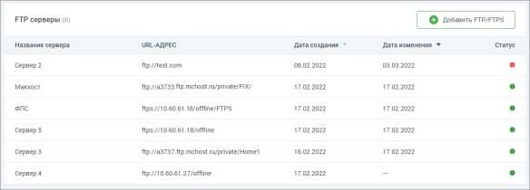
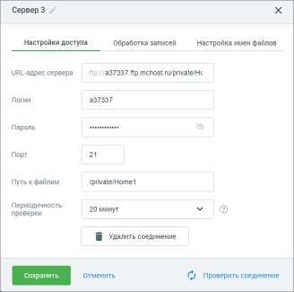
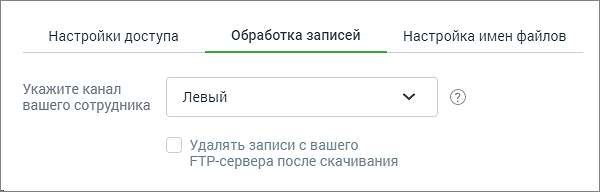

# 16.4. Подключенные каналы

> Трассировка: PDF §16.4 · сквозные стр. 498-500 · источники: ч.1 `kb/sources/mango-cc-manual/CC_manual_1.26.28.1.pdf` с.498-500.

Для клиентов, использующих оффлайновые источники аудиозаписей в "Речевой аналитике" предусмотрена возможность настроить один или несколько способов получения записей разговоров. Раздел содержит три вкладки: • Получение записей через FTP • Получение записей через API • Загрузка записей вручную 16.4.1. Получение записей через FTP

| Вкладка доступна, если к Личному кабинету пользователя ВАТС подключена услуга |
| --- |
| офлайн-скоринга. |

Клик по пиктограмме открывает список ftp-серверов, подключенных к Личному кабинету.

Таблица содержит: • URL сервера • Название сервера • Дата создания сервера • Дата последнего изменения параметров сервера • Статус: o зеленый, если последняя попытка соединиться с сервером была успешной (вне зависимости от того, были ли скачаны данные); o красный, если последняя попытка соединиться с сервером была неуспешной. Чтобы добавить новый FTP-сервер нажмите на кнопку "Добавить FTP/FTPS". Открывшееся окно добавления FTP-сервера содержит три вкладки: Настройки доступа

В открывшемся окне заполните поля: • URL-адрес сервера – клик на префикс FTP/FTPS позволяет выбрать протокол и проставить префикс адреса. Поле обязательно для заполнения. • Логин – логин доступа к серверу. Поле обязательно для заполнения. • Пароль – пароль доступа к серверу. Поле обязательно для заполнения. • Порт – порт для входа на сервер, по умолчанию 21.

• Путь к файлам – путь, куда будут сохранятся файлы записей, заполняется вручную. • Периодичность проверки – как часто сервер будет проверяться на наличие новых записей. Допустимые значения: 10 мин, 20 мин, 1 час, 3 часа, 8 часов, 24 часа. • 1. Кнопка "Проверить соединение" – клик по кнопке инициирует попытку входа на сервер с использованием данных, введенных в форму. 2. Кнопка "Сохранить" (при редактировании) или кнопка "Создать" (при создании) – клик по кнопке инициирует попытку входа на сервер с использованием данных, введенных в форму. Кнопка активна только при условии заполненности всех обязательных полей. 3. Кнопка "Удалить соединение" – клик по кнопке открывает окно подтверждения удаления. После подтверждения действия выбранный сервер удаляется. Обработка записей

Заполните поля: Укажите канал вашего сотрудника – доступные варианты: левый, правый.

| Для успешного речевого анализа каналы голоса сотрудника и голоса клиента должны |  |  |
| --- | --- | --- |
|  | различаться. Записи с противоположной принадлежностью каналов размещайте в разных |  |
| папках ftp-сервера, с отдельными доступами к ним. |  |  |

<!-- изображение на стр. 500: байты не извлечены (PyMuPDF недоступен) -->

Переключатель "Удалять записи с FTP-сервера после скачивания" – по умолчанию включён. При выключении, после успешного получения файла с сервера, файлы сохраняются в одной из двух создаваемых папок: "успешные" или "с ошибками". Настройте хранение записей разговоров Настройте 1. Шаблон имени файла (привязанного к сотруднику): <уникальный код сотрудника, зарегистрированный в ЛК>_<дата и время начала разговора в формате ДД-ММ-ГГГГ_ЧЧ-ММ-СС>.<расширение файла: wav>. Пример: 85763_29-05-2021_20-04-33.wav 2. Шаблон имени файла (привязанного к номеру устройства звукозаписи): D-<код устройства, связанного с сотрудником в ЛК>_<дата и время начала разговора в формате ДД-ММ-ГГГГ_ЧЧ-ММ-СС>.<расширение файла: wav>. Пример: D-1436fgk_29-05-2021_20-04-33.wav
