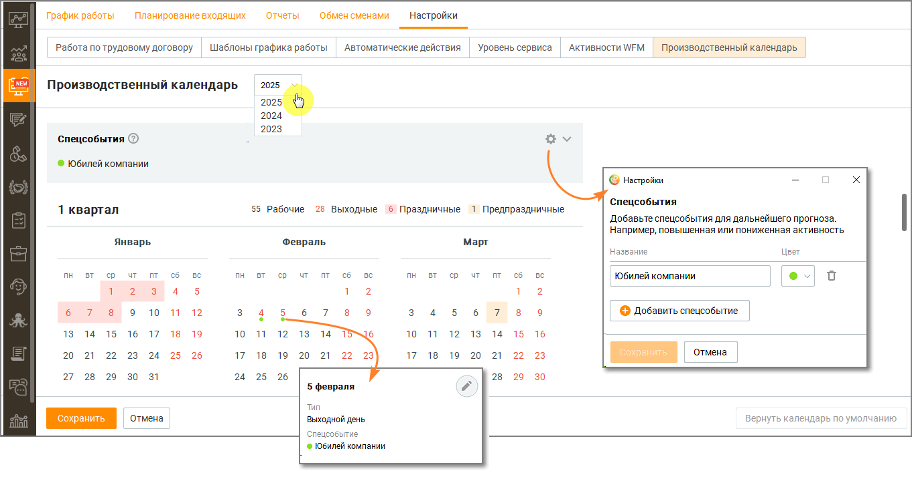

# 8.5.2. Производственный календарь

> Трассировка: PDF §8.5.2 · сквозные стр. 274-276 · источники: ч.3 `kb/sources/mango-cc-manual/CC_manual_1.26.23-part-3.pdf` с.72-74.

Вкладка Производственный календарь предназначена для настройки и использования нормативов работы сотрудников в рамках системы WFM, а также для учета рабочих часов в соответствии с производственным календарем (ПК). Зачем это нужно? Автоматизация соблюдения нормативов рабочего времени и исключение ошибок при планировании помогает избежать нарушений трудового законодательства, обеспечивая точный учет рабочих и выходных дней. Что снижает риски штрафов контролирующих органов, конфликтов с сотрудниками и неэффективного распределения ресурсов.

Производственный календарь доступен только в тарифе PRO.

На вкладке пользователю доступны следующие функции: 1. Отображение производственного календаря: o Вкладка показывает производственный календарь за выбранный год. o По умолчанию отображаются следующие данные: ▪ Рабочие, выходные и праздничные дни. ▪ Нагрузка в человеко-часах в разрезе квартала и месяца ▪ Расширенное описание для типов дней и специальных событий. 2. Настройки календаря: o Загрузка производственного календаря на 2023-2025 год. o Изменение типов дней: рабочий, выходной, праздничный, предпраздничный. o Создание специальных событий (до 10 событий) с привязкой к конкретным дням для учета в прогнозировании. 3. Учет нормативов работы: o Календарь используется для расчета графиков работы сотрудников на основе схем 5/2 и 2/2. o Руководитель может видеть норму часов по ПК в разделе График работы. o Нормативы рассчитываются: ▪ Для графика 5/2: 8 часов * количество рабочих дней. ▪ Для графика 2/2: 12 часов * количество рабочих дней. o В случае отсутствия подходящего графика отображаются прочерки. 4. Загрузка и обновление календаря: o Календарь на следующий год загружается автоматически при обновлении версии Контакт- центра. o Пользователь может выбрать между загрузкой стандартного календаря или календаря с пользовательскими изменениями. ▪ При выборе "с моими настройками" пользовательские данные сохраняются, а стандартные обновляются.

▪ При выборе "только дефолтный" все пользовательские изменения сбрасываются. 5. Учет специальных событий: o Специальные события можно использовать для прогнозирования нагрузки и планирования. o События создаются и редактируются в календаре, с автоматическим пересчетом человеко- часов.
