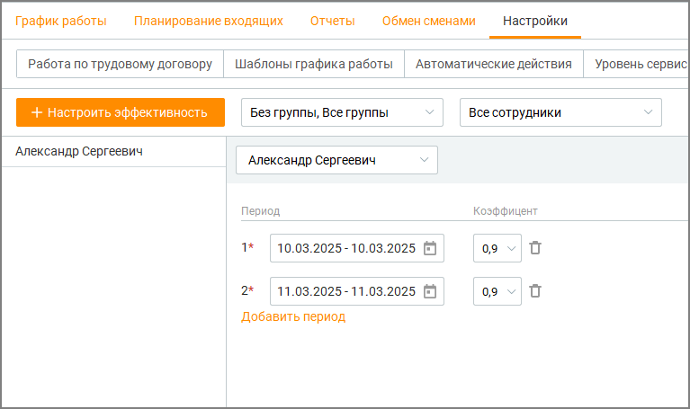
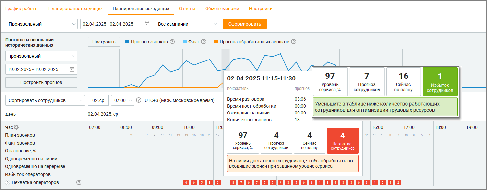

# 8.5.3. Эффективность сотрудника

> Трассировка: PDF §8.5.3 · сквозные стр. 276-277 · источники: ч.3 `kb/sources/mango-cc-manual/CC_manual_1.26.23-part-3.pdf` с.74-75.

На вкладке Эффективность сотрудника модуля WFM можно задать индивидуальные коэффициенты эффективности для сотрудников, особенно полезные при работе с новичками или временно сниженной продуктивностью.

Для получения доступа к вкладке обратитесь к Персональному менеджеру. Интерфейс позволяет руководителю указать, насколько эффективно сотрудник может выполнять свои задачи в конкретные периоды времени. Это помогает точнее оценивать производительность и учитывать особенности в планировании.

Можно задать до трёх разных временных интервалов для одного сотрудника. В каждом из них устанавливается свой показатель эффективности — от 0.1 до 0.9. Значение по умолчанию составляет 1, что означает стандартную эффективность. Указанные интервалы не должны пересекаться между собой — система проверяет это и предупредит, если значения наложатся. Когда один из интервалов завершится, можно задать новый. Все ранее заданные интервалы сохраняются — история сохраняется в системе и может использоваться для анализа. В левой части экрана отображается список сотрудников, для которых уже задана эффективность. При выборе конкретного сотрудника справа отображаются все его интервалы и соответствующие им значения эффективности. Интерфейс поддерживает фильтрацию — можно отфильтровать сотрудников по группам или найти конкретного по имени.

Если у сотрудника установлен коэффициент эффективности меньше 1, это учитывается при формировании расписания: например, если у одного сотрудника установлен коэффициент 0.5, система запланирует ещё одного сотрудника на то же время, чтобы суммарная эффективность была не меньше 1.

Таким образом достигается равномерная и реалистичная загрузка команды, даже если в составе есть новички или временно менее продуктивные сотрудники.
