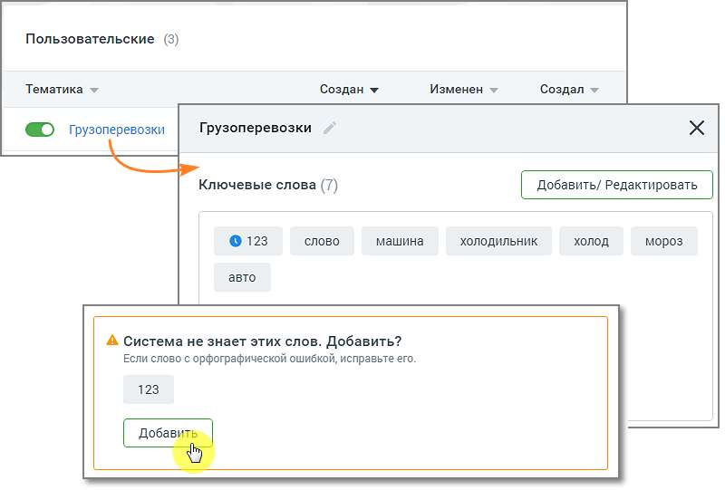
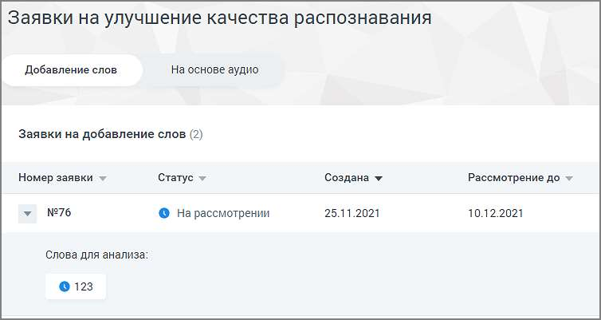
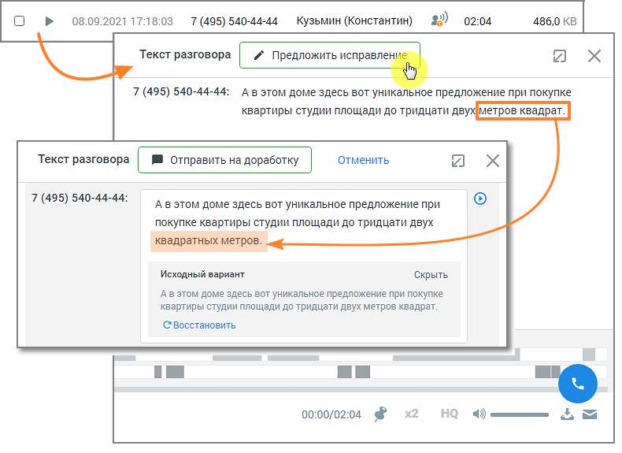
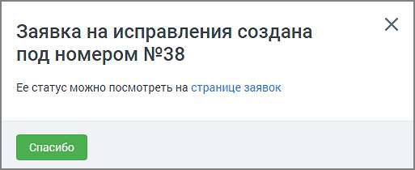
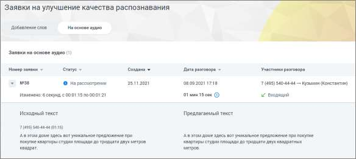

# 16.5. Заявки на улучшение качества распознавания

> Трассировка: PDF §16.5 · сквозные стр. 500-504 · источники: ч.1 `kb/sources/mango-cc-manual/CC_manual_1.26.28.1.pdf` с.500-504.

Пользователь, который выбрал для распознавания технологию 3iTech, может отправить заявку на улучшение качества распознавания и отслеживать статус заявки.

| Для доступа пользователя к разделу необходимо наличие права «Просматривать и |
| --- |
| создавать/изменять тематики». |

Подраздел Заявки содержит две вкладки: • Добавление слов • На основе аудио 16.5.1. Добавление слов Чтобы отправить заявку на добавление слова, которое не знакомо «Речевой аналитике», следует в разделе «Тематики» выбрать тематику, в которой имеются незнакомые слова, и открыть карточку тематики.

Внизу карточки тематики будет присутствовать уведомление о незнакомом слове и предложение добавить его в систему. Нажмите кнопку Добавить. Заявка отобразится в окне раздела «Заявки на улучшение качества распознавания», на вкладке «Добавление слов».

Окно заявки содержит следующие данные: • Номер заявки • Статус заявки – на рассмотрении, исправления приняты, исправления отклонены. • Дата создания заявки • Дата, до которой будет рассмотрена заявка Также в окне можно ознакомиться с предлагаемым для анализа словом. 16.5.2. На основе аудио Чтобы отправить заявку на улучшение качества распознавания на основе аудиозаписи, в окне расшифровки записи разговора следует нажать кнопку Предложить исправления.

Далее внесите в текст требуемое исправление и нажмите кнопку Отправить на доработку. На экране отобразится окно системного уведомления:

Клик по ссылке открывает окно раздела «Заявки на улучшение качества распознавания», на вкладке «На основе аудио».

Окно заявки содержит следующие данные: • Номер заявки • Статус заявки – на рассмотрении, исправления приняты, исправления отклонены. • Дата создания заявки • Дата разговора и его длительность • Участники разговора и информация о звонке (входящий или исходящий) Также в окне можно ознакомиться с исходным и предлагаемым к замене текстом.
