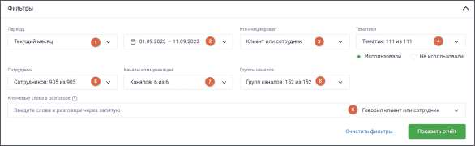
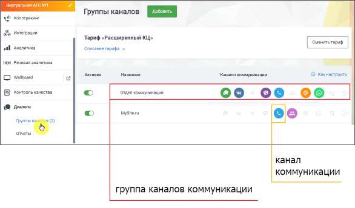
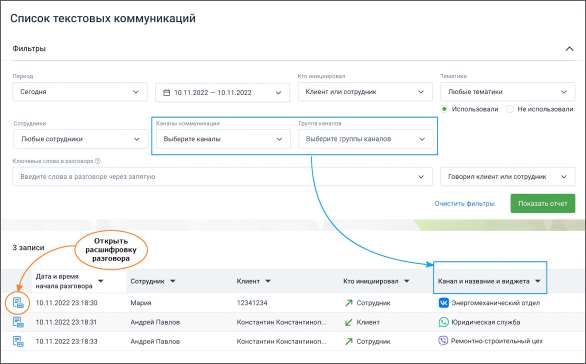
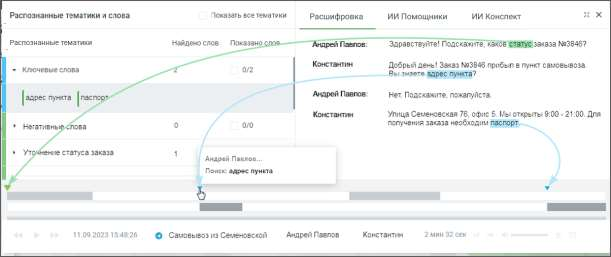
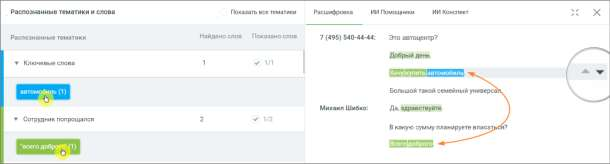

# 16.6. Текстовые коммуникации

> Трассировка: PDF §16.6 · сквозные стр. 504-508 · источники: ч.1 `kb/sources/mango-cc-manual/CC_manual_1.26.28.1.pdf` с.504-508.

Раздел Текстовые коммуникации предоставляет инструменты для анализа текстового взаимодействия сотрудников с клиентами через различные каналы связи. В этом разделе пользователи могут задать период диалогов, выбрать инициаторов, указать ключевые слова для поиска и применить тематики для фильтрации. Результаты поиска отображаются в виде списка разговоров, где для каждого диалога можно просмотреть текстовую расшифровку и осциллограмму с метками ключевых слов и тематик. Далее рассмотрим функции каждого подраздела, которые обеспечивают гибкость в настройке и просмотре текстовых коммуникаций. Список текстовых коммуникаций Метки на осциллограмме диалога 16.6.1. Список текстовых коммуникаций При переходе на страницу «Текстовые коммуникации» отображается панель «Список текстовых коммуникаций». На панели присутствуют:

• Период – в какой период состоялись диалоги, которые должны войти в отчет. Выпадающее меню, с вариантами периода: произвольный, текущий день, текущая неделя, текущий месяц, с прошлого месяца, с позапрошлого месяца, текущий год, весь период; • Календарь – для указания временного промежутка, когда были осуществлены диалоги, которые должны войти в отчет. После выбора дат, нужно подтвердить выбор кнопкой Выбрать; • Выпадающий список "Кто инициировал диалог" – канал поиска. Варианты: клиент, сотрудник, клиент или сотрудник. • Тематики – поиск проводится как по всем распознанным текстовым сообщениям, так и по сообщениям определенной тематики. Для поиска по тематикам в выпадающем списке выберите необходимый вариант. При вводе поискового запроса производится проверка на наличие каждого слова в словаре распознавания (с учетом словоформ). Возможен выбор как включенных, так и исключенных из поиска тематик. Если выбрано Использовали, то в списке выводятся диалоги, на которые проставилась хотя бы одна из выбранных тематик. Если выбрано Не использовали, в списке будут только те диалоги, на которые не проставилась ни одна из выбранных тематик. • Строка для ввода ключевых слов – терм. Подробнее о том, как формулировать поисковые запросы, узнайте здесь. В выпадающем списке доступен выбор канала, по которому будет вестись поиск. Варианты: Клиент, Сотрудник, Клиент или сотрудник. • Сотрудники – выпадающий список всех сотрудников, сгруппированный по группам. Имеется строка поиска по ФИО сотрудника и кнопка Выбрать все/Сбросить все. • Каналы коммуникации – выбор из выпадающего списка доступных в разделе «Текстовые коммуникации» ЛК ВАТС каналов коммуникации. Варианты: Чат на сайте, ВКонтакте, Telegram, Max, WhatsApp, Авито. • Группы каналов – выбор из выпадающего списка созданных в разделе «Текстовые коммуникации» ЛК ВАТС групп каналов коммуникации.

После настройки необходимых фильтров и добавления ключевых слов нажмите кнопку Показать отчет. Отобразится список разговоров, удовлетворяющих заданным условиям поиска.

После нажатия на кнопку Открыть расшифровку разговора, отображается текст разговора с осциллограммой.

| Если пользователь имеет ограниченные права доступа на просмотр текстовых разговоров, то |
| --- |
| в результатах поиска, по ключевым словам, будут только доступные ему разговоры. |

16.6.2. Метки на осциллограмме диалога Для отображения результатов поиска в текстовых сообщениях используется осциллограмма диалога, с выделенными фрагментами диалога.

При наведении курсора в область осциллограммы на тех участках диалога, где были вхождения терм, отображаются:

• метка для терм, найденных из строки ввода ключевых слов;

• метка для терм из тематик.

При наведении курсора на метки и осциллограммы отображается всплывающее окно с указанием канала, в рамках которого была распознана терма, а также сама терма. Поиск по текстовым сообщениям может осуществляться: • по ключевым словам, в строке поиска; • с учетом выбранных в фильтре тематик. Соответственно будут различаться метки на осциллограмме диалога.

 Если во всплывающем окне осциллограммы в списке тематик выбрать какую-либо тематику, то на осциллограмме будут отображены метки, принадлежащие только этой тематике, и не будут отображены метки, принадлежащие другим тематикам из списка.  Если во всплывающем окне осциллограммы в списке ключевых слов выбрать какое- либо ключевое слово, то на осциллограмме будут отображены метки, принадлежащие только этому ключевому слову, и не будут отображены метки, принадлежащие другим ключевым словам из списка. Выбор термы или ключевого слова в блоке «Распознанные словари и слова» выделяет

фрагмент диалога, с этой термой/ключевым словом. Пиктограммы позволяют быстро переключаться между фрагментами, содержащими выбранные термы/ключевые слова.

<!-- изображение на стр. 508: байты не извлечены (PyMuPDF недоступен) -->

Клик по пиктограмме сворачивает окно диалога в компактный формат. Для отображения

<!-- изображение на стр. 508: байты не извлечены (PyMuPDF недоступен) -->

окна в полной форме следует нажать на пиктограмму ..
