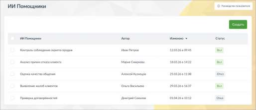

# 16.7. ИИ Помощники

> Трассировка: PDF §16.7 · сквозные стр. 508 · источники: ч.1 `kb/sources/mango-cc-manual/CC_manual_1.26.28.1.pdf` с.508.

ИИ Помощники – это инструмент, который позволяет автоматически анализировать разговоры по заданным вами правилам и получать не только краткое содержание, но и полезные выводы и рекомендации.

В отличие от стандартных ИИ Конспектов, ИИ Помощники можно настраивать под конкретные задачи бизнеса. Вы сами определяете, что именно нужно искать и как интерпретировать разговор. С помощью ИИ Помощников вы можете: • контролировать соблюдение скриптов • выявлять проблемы в диалогах с клиентами • получать рекомендации по улучшению работы сотрудников • анализировать разговоры с разных точек зрения одновременно Один и тот же разговор может быть обработан несколькими помощниками, и каждый из них даст свой результат.
