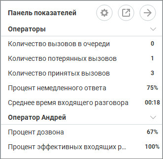
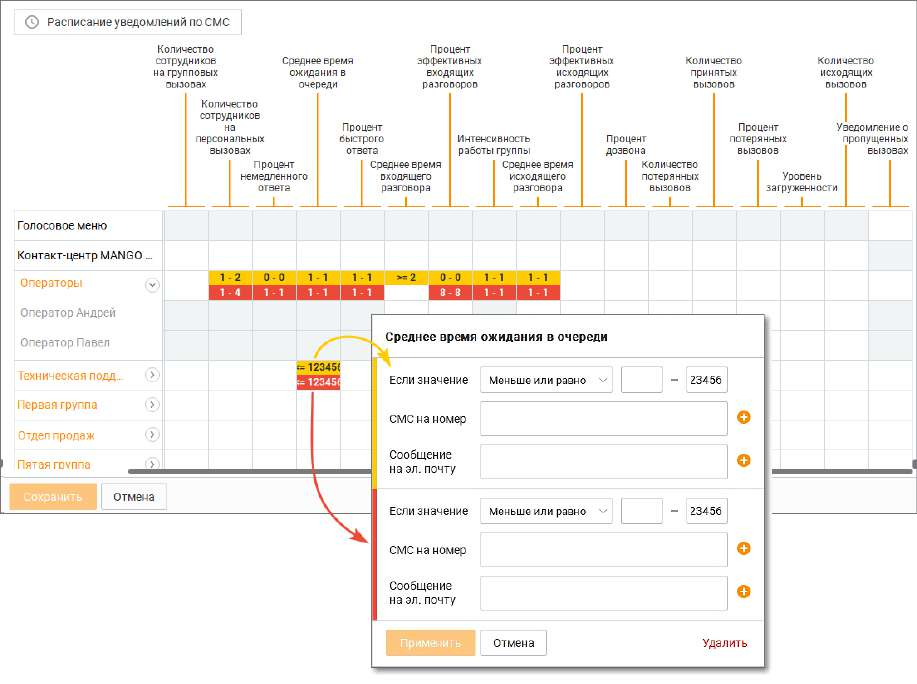

# 2.4. Панель показателей

> Трассировка: PDF §2.4 · сквозные стр. 32-36 · источники: ч.1 `kb/sources/mango-cc-manual/CC_manual_1.26.23_compressed.pdf` с.32-36.

Контакт-центр MANGO OFFICE позволяет отслеживать в реальном времени эффективность работы сотрудников. Для этого используется набор так называемых показателей производительности, представляющих собой параметры, характеризующие эффективность работы Контакт-центра MANGO OFFICE как системы массового обслуживания. Все показатели производительности рассчитываются за определенный промежуток времени с заданной частотой опроса. Более подробная информация о показателях производительности приведена в разделе Общее описание показателей производительности. Информация о настройке пороговых значений показателей производительности находится в одноименном разделе. Для визуализации отслеживаемых в реальном времени значений показателей производительности для различных логических объектов (Контакт-центр MANGO OFFICE в целом, группа сотрудников или сотрудник) используется панель показателей. Для вызова

панели нажмите в верхней панели.

Кнопки для открепления и закрепления блока панели показателей. Окно с открепленным блоком может быть расположено в любом месте рабочего стола, и отображается поверх всех окон.

Клик по кнопке приводит к скрытию блока.

| Доступность панели показателей зависит от роли текущего пользователя Контакт-центра |  |  |
| --- | --- | --- |
|  | MANGO OFFICE и наличия подключенной услуги для соответствующего продукта Контакт- |  |
| центра MANGO OFFICE. |  |  |

Для настройки панели показателей нажмите на панели.

Изначально окно настройки содержит список групп в свернутом состоянии. После развертывания группы панель показателей принимает вид, как указано на рисунке выше. Чтобы выбрать контролируемый объект (Контакт-центр MANGO OFFICE в целом, группу сотрудников или сотрудника), для которого будет осуществляться мониторинг показателя производительности, кликните ячейку на пересечении столбца с нужным показателем производительности и строки с нужным объектом. Если вы хотите развернуть или свернуть нужный вам объект, щелкните по значку со стрелкой справа от его названия.

| Пользователи, не входящие ни в одну из групп, объединены в псевдогруппу "Без группы". |  |  |  |  |
| --- | --- | --- | --- | --- |
|  | Для таких пользователей показатели производительности настраиваются в индивидуальном |  |  |  |
|  | порядке — выбор показателей для объекта "Без группы" осуществить нельзя. |  |  |  |
|  | Пользовательские настройки панели показателей хранятся отдельно для каждого |  |  |  |
|  | пользователя | Контакт-центра MANGO OFFICE | и сохраняются при входе в систему под |  |
| логином этого пользователя с любого компьютера. |  |  |  |  |

После выхода из окна настроек в панели показателей отображаются значения выбранных показателей производительности для указанных логических объектов. Все отображаемые показатели группируются по объектам с алфавитной сортировкой по краткому наименованию. Используйте значок со стрелкой, чтобы свернуть или развернуть список показателей по выбранному объекту. Объекты в панели показателей отображаются иерархически. Верхние уровни иерархии — Голосовое меню и Контакт-центр MANGO OFFICE в целом. Эти объекты всегда являются верхним. Затем идут группы сотрудников с внутренней сортировкой по алфавиту, затем отдельные сотрудники (пользователи) с сортировкой по алфавиту.

Чтобы изменить порядок отображения групп и сотрудников, выберите нужный объект и, удерживая левую клавишу мыши, перетащите его вверх или вниз. При перетаскивании объектов также переносятся все связанные с ними показатели. Аналогичным образом изменяется и порядок отображения показателей внутри отдельного объекта.

| Пользовательские настройки порядка отображения хранятся локально на конкретном |
| --- |
| компьютере. При входе в систему с другого компьютера они не сохраняются. |

При отображении показателей производительности в рабочей области панели имеют место следующие особенности. Если сотрудник является оператором в нескольких группах, то при выборе показателей производительности в одной из групп они автоматически выбираются и во всех остальных группах. При этом выбранные показатели рассчитываются в целом по Контакт-центру MANGO OFFICE — то есть, для всех групп, в которые входит пользователь, а не в рамках отдельной группы. Если значение показателя превышает указанные пороговые значения (красные или желтые), строка показателя подкрашивается соответствующим цветом.

Если отдельный показатель у объекта превышает указанные пороговые значения, то вся строка объекта подкрашивается желтым или красным цветом. При этом: • если по объекту хоть один показатель превышает красное пороговое значение, объект подкрашивается красным; • если по объекту хоть один показатель превышает желтое пороговое значение, и нет показателей, превышающих красное значение, объект подкрашивается желтым.

