# 2.5. Панель управления телефонией

> Трассировка: PDF §2.5 · сквозные стр. 46-65 · источники: ч.1 `kb/sources/mango-cc-manual/CC_manual_1.26.28.1.pdf` с.46-65.

Помимо базовых возможностей телефонии (прием входящих вызовов, совершение исходящих вызовов, постановка вызовов на удержание), Контакт-центр MANGO OFFICE предоставляет дополнительные возможности управления вызовами.

| На данный раздел распространяется возможность скрытия номера клиента. Узнать больше |
| --- |
| здесь. |

Более подробно эти функциональные возможности рассмотрены в последующих подразделах. • Совершение исходящих вызовов; • Прием и классификация входящих вызовов; • Перевод вызовов;

• Постановка вызовов на удержание; • Организация конференций; • Отправка СМС; • Настройка гарнитуры во время разговора; • Оперативное создание и редактирование контактов; • Запись разговоров; • Использование DTMF-команд;

Для того, чтобы развернуть панель телефонии, нажмите на верхней панели. На рисунке ниже приведен пример развернутой панели управления телефонией в состоянии разговора.

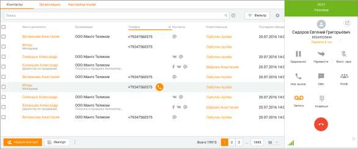

На панели отображается информация о номере, с которого поступил вызов. В случае, когда номер принадлежит клиенту адресной книги, то вместо номера отображается имя клиента. При щелчке по имени выполняется переход к карточке клиента.

| На нижней границе панели софтфона располагается блок с информацией о звонке: номер |
| --- |
| сотрудника, название компании Исходящего обзвона, DID номер и т. д. При этом |

разделе ЛК ВАТС/Номера, подключенные к АТС поле "Комментарий" к номеру телефона или SIP-Trunk, на который пришел вызов, заполнено, то в карточке входящего вызова комментарий отображается вместо номера. Все данные собеседника, отображаемые на панели софтфона, можно скопировать: номер телефона, имя контакта, организация, должность.

| В рамках компаний исходящего обзвона предусмотрена возможность скрытия номеров |  |  |
| --- | --- | --- |
|  | клиентов от сотрудников. Данная возможность является опциональной и подключается |  |
| только через персонального менеджера. |  |  |

Для отображения клавиатурного блока на панели в ходе разговора нажмите кнопку Клавиши , чтобы ввести в тоновом режиме необходимую команду: донабор номера, перевод вызова, организация конференций. Чтобы скрыть клавиатурный блок, нажмите кнопку еще раз.

Кнопки для открепления и закрепления клавиатурного блока. Окно с открепленным блоком может быть расположено в любом месте рабочего стола, и отображается поверх всех окон.

Клик по кнопке приводит к скрытию блока.

Описание действия кнопок и приведено в подразделе Настройка гарнитуры во время разговора.

| Более подробная информация о командах для ввода с клавиатуры приведена в подразделе |  |  |
| --- | --- | --- |
|  | Использование DTMF-команд. |  |

Во время разговора в нижней части панели отображается пиктограмма анализатора,

указывающая на уровень качества связи. При наведении курсора на пиктограмму отображается подсказка.

2.5.1. Меню программы Меню программы (открывается кликом на аватар пользователя) содержит следующие пункты: • Мой профиль – контактные данные текущего пользователя; • Доступные скрипты – предварительный просмотр шаблонов скриптов; • Все настройки – настройки программы; • Квесты – обучение работе с Контакт-центром в форме квеста; • Настройки звука – переход к настройкам софтфона; • Выйти – выход из Контакт-центра.

Меню справочной системы открывается кликом по пиктограмме и содержит • Справка по продукту – вызов справки; • Часто задаваемые вопросы – страница браузера с ответами на наиболее распространенные вопросы пользователей; • Что нового – страница браузера с информацией о новых возможностях программы; • Проверка обновлений – после клика по строке меню система проверит наличие обновлений, и, если обновление имеется, предложит его установить. Операция проверки может занять несколько секунд; • О программе – информация о текущей версии Контакт-центра; • Написать в техподдержку – открывает всплывающее окно создания обращения. • Удаленный доступ – в браузере открывается ссылка на скачивание программы удаленного доступа Teamviewer. • Мониторинг доступности – в браузере открывается ссылка на информационную страницу «Статусы доступности сервисов MANGO OFFICE». • Очистка локальных данных – клик по строке меню открывает окно для подтверждения очистки данных. После нажатия "ДА" запускается функция очистки. Функционал очищает только локальные данные, с сохранением файла пользовательских данных для авторизации в Контакт-центре без повторного ввода логина и пароля. 2.5.1.1. Профиль Для перехода к просмотру профиля текущего сотрудника следует нажать на аватар сотрудника, расположенный в правом верхнем углу приложения, и выбрать пункт меню Профиль. В результате на экране отобразится карточка сотрудника.

Карточка сотрудника содержит следующую информацию: • Фотографию сотрудника (аватар); • Должность и отдел; • Внутренний номер (при его наличии); • Достижения сотрудника; • Список средств связи; • Исходящий номер;

| Автосекретарь; |
| --- |
| Регион сотрудника. |

При изменении исходящего номера в Личном кабинете ВАТС или профиле сотрудника, исходящий номер также изменяется в карточке сотрудника и в верхней панели основного окна Контакт-центра. Для выбора аватара следует нажать на него и выбрать нужное изображение. Для удаления

аватара следует навести курсор на аватар и щелкнуть по пиктограмме .

По клику на пиктограмме откроется окно, содержащее информацию о группах, в которых состоит сотрудник, статусе сотрудника в данной группе и других сотрудниках группы с аналогичным статусом.

По клику на пиктограмме открываются окна редактирования соответствующих данных. Больше о карточке сотрудника узнайте здесь.

2.5.1.2. Доступные скрипты Во время редактирования скрипта доступна функция предварительного просмотра созданного шаблона, чтобы увидеть его так, как он будет представлен назначенному сотруднику во время вызова. Для этого щелкните на фото в профиле и выберите пункт Доступные скрипты.

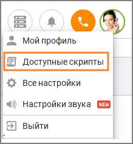

В результате на экране будет отображен скрипт в том составе, в котором он был на момент щелчка по ссылке, а не в сохраненном состоянии. Данная форма предназначена для того, чтобы сотрудник мог заранее ознакомиться со своими репликами и возможными ответами клиента. После того, как был просмотрен хотя бы один ответ клиента, данная версия скрипта перестает быть новой для текущего сотрудника. 2.5.1.3. Настройки Окно Настройки позволяет создавать новые учетные записи и осуществлять настройку Контакт-центра MANGO OFFICE в соответствии с ролью пользователя и кругом его обязанностей.

| Настройки, хранящиеся локально на компьютере пользователя, хранятся отдельно для |  |  |
| --- | --- | --- |
|  | каждой учетной записи. Если под учетной записью вход с компьютера осуществляется |  |
|  | впервые, то значения настроек устанавливаются по умолчанию, а при их изменении – |  |
| сохраняются на компьютере пользователя для соответствующей учетной записи. |  |  |

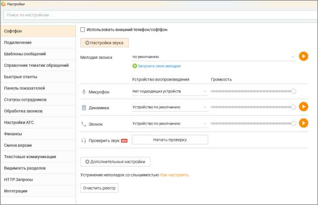

Окно содержит вкладки, позволяющие выбрать нужную группу настроек: • ВАТС — информация о настройках, управление Виртуальной АТС, с которой используется Контакт-центр MANGO OFFICE; • Телефония e-mail — выбор линии АТС для исходящих звонков; • Исходящие обращения – настройка аккаунтов, через которые оператор обращается к клиенту при инициации исходящего текстового обращения; • Автосекретарь – настройка правил Автосекретаря; • Пользовательские — пользовательские настройки программы; • Справочник тематик обращений — редактирование списка тематик обращений, применяемых при обработке вызова; • Быстрые ответы — редактирование списка быстрых ответов, применяемых при обработке обращений; • Панель показателей — настройка показателей производительности; • Софтфон — выбор устройств, использующихся в качестве микрофона и динамиков (гарнитуры) для осуществления разговоров, прослушивания записей разговоров и т. д; • Шаблоны сообщений — настройка сообщений, отправляемых пользователям по каналам СМС и WhatsApp; • Статусы сотрудников — добавление пользовательских статусов; • Подключение — настройки подключения программы; • Обработка звонков — настройки телефонных номеров; • Настройки АТС — настройки АТС; • Финансы — настройки и инструменты для работы с текущим Лицевым счетом; • Смена версии — смена версии и тарифа текущего продукта;

• Текстовые коммуникации — многоканальные виджеты; • Видимость разделов – отображение разделов Контакт-центра MANGO OFFICE. • HTTP-запросы — работа с внешними базами данных; • Интеграции — настройка интеграций с внешними сервисами. Строка полнотекстового поиска обеспечивает поиск по наименованию вкладок и их содержимому.

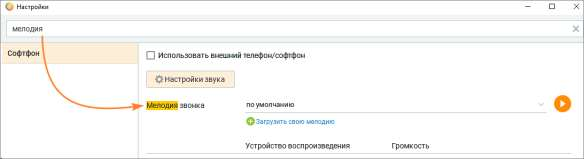

Также настройки Контакт-центра MANGO OFFICE можно открыть, щелкнув правой кнопкой мыши по иконке приложения в области системных значков уведомлений (трее).

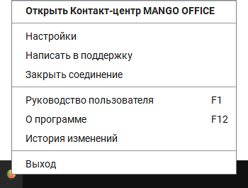

Изменения, выполненные на одной вкладке, сохраняются при переходе на другую. Для сохранения изменений нажмите Сохранить в нижней части окна настроек. В случае закрытия окна при наличии несохраненных настроек на экране отобразится предупреждающее сообщение вида:

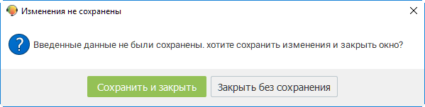

2.5.1.3.1. ВАТС

Данная вкладка предназначена для получения информации о настройках Виртуальной АТС, с которой используется Контакт-центр MANGO OFFICE.

Вкладка доступна пользователям с ролью Администратор.

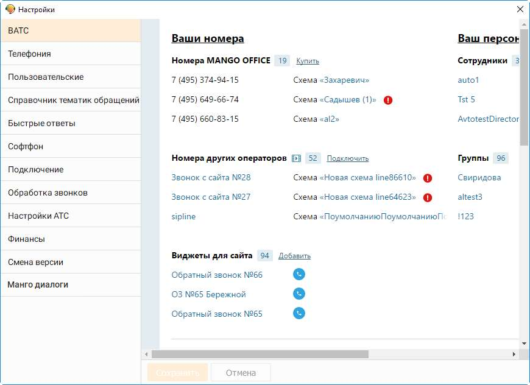

| Подробное описание работы с настройками и инструментами ВАТС приведено в |  |  |
| --- | --- | --- |
|  | документе "Справочник ВАТС", который можно скачать с официального сайта компании |  |
| Манго-Телеком. В документе см. раздел "Продукт "Виртуальная АТС" и его подразделы. |  |  |

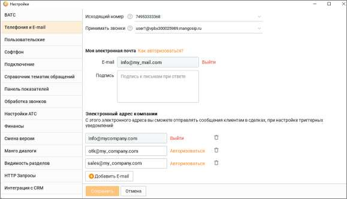

2.5.1.3.2. Телефония и E-mail Данная вкладка предназначена для выбора исходящей линии АТС и адреса электронной почты сотрудника.

Исходящий номер телефона Выбранный номер будет отображаться на определителе номера у человека, которому звонит сотрудник. Также номер служит для определения региона звонка для расчета стоимости связи. Напротив каждого номера отображается комментарий (при его наличии), указанный в Личном кабинете на странице настроек "Номера, подключенные к АТС". Принимать звонки Номера сотрудника (номера телефонов и SIP), на которые он может принимать входящие вызовы. Задаются в карточке сотрудника в Личном кабинете пользователя ВАТС. (См. Справочник ВАТС, Вкладка «Телефония»). В списке отображаются только номера, отмеченные как "активные". Настройка доступна пользователям с правом: Изменять порядок, активность и расписание средств приема звонков, а также изменять алгоритм приема звонков по внутреннему номеру. Моя электронная почта Адрес электронной почты может находиться в одном из трех состояний: 1) отсутствует – адрес электронной почты сотрудника не указан ни в настройке "Телефония и E-mail" в Контакт-центре, ни в Карточке сотрудника в ВАТС (раздел Ваш персонал/Сотрудники); 2) добавлен, но не авторизован – действительный адрес электронной почты сотрудника внесен в поле "Моя электронная почта" и сохранен нажатием кнопки "Сохранить". В этом случае E-

mail добавляется в Карточке сотрудника в Контакт-центре с пометкой и в Карточку сотрудника в Личном кабинете ВАТС (если в Карточке сотрудника в Личном кабинете ВАТС уже был добавлен E-mail, то он заменится на новый);

| При изменении или добавлении нового E-mail в Карточке сотрудника в Личном кабинете |  |  |
| --- | --- | --- |
|  | ВАТС, новый E-mail так же отобразится в Карточке сотрудника и в настройке "Телефония и |  |
| E-mail" в Контакт-центре. |  |  |

3) авторизован – если пройдена процедура авторизации адреса электронной почты в Контакт- центре.

| Если после авторизации почты сотрудника в Контакт-центре E-mail будет изменен в |  |  |
| --- | --- | --- |
|  | Карточке-сотрудника в Личном кабинет ВАТС, то в Контакт-центре E-mail так же изменится, |  |
| и процедуру авторизации будет необходимо пройти заново. |  |  |

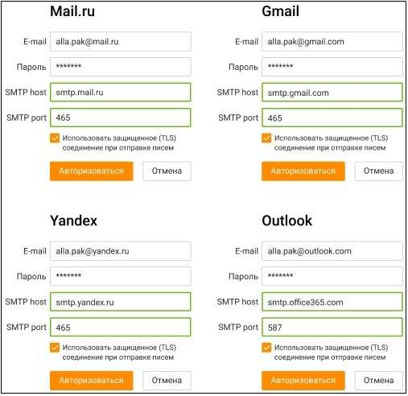

| Если сотрудник назначен на обработку обращений по каналу e-mail, он получает системное |
| --- |
| уведомление о необходимости авторизации. |

Для авторизации e-mail заполните поле Моя электронная почта и щелкните по ссылке Авторизоваться. В окне авторизации заполните поля: • E-mail – адрес электронной почты; • Пароль – пароль к электронной почте; • SMTP host - сервер исходящей почты для вашего домена; • SMTP port – протокол шифрования для вашего домена; Параметры SMTP host и SMTP port можно узнать в разделе "Настройки" на сайте вашего почтового клиента. Если вы используете один из следующих почтовых сервисов, то для обработки исходящих писем заполните поля SMTP-host и SMTP-port следующими данными:

| При авторизации не рекомендуется удалять галочку из чекбокса "Использовать |
| --- |
| защищенное соединение (TLS) при отправке писем" |

E-mail сотрудника может использоваться в качестве адреса отправителя в письмах, отправляемых сотрудником из Контакт-центра (в ответах на входящие обращения или в новых исходящих обращениях к клиенту). Для этого должны быть выполнены условия: • E-mail сотрудника должен быть авторизован в Контакт-центре; • В настройках виджета в канале коммуникации E-mail указано:

| Если e-mail сотрудника не авторизован в Контакт-центре, или в настройках виджета в |  |  |
| --- | --- | --- |
|  | Личном кабинете установлено "Отвечать с электронной почты компании", то письма из |  |
| Контакт-центра будут отправляться с e-mail компании, указанного в настройках виджета. |  |  |

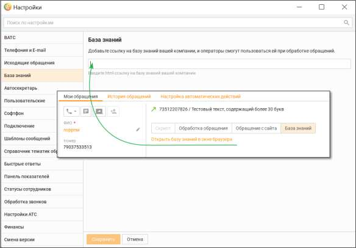

Подпись при ответе с этой электронной почты в Контакт-центре Данная настройка появляется после авторизации e-mail сотрудника. Если Вы хотите добавлять при каждом ответе во встроенном редакторе писем подпись к письму, то заполните поле необходимой информацией и нажмите кнопку "Сохранить".

| В этом поле указывается подпись к письму при ответе в Контакт-центре с почты |  |  |
| --- | --- | --- |
|  | сотрудника. Подпись к письму, подставляемая при ответе с почты компании, указывается в |  |
| настройках канала коммуникации E-mail в виджете в Личном кабинете. |  |  |

Узнайте больше о переписке с клиентом по е-mail здесь. Электронный адрес компании Поле Адрес компании и остальные элементы настройки нескольких электронных адресов компании используются для отправки триггерных уведомлений. Клик по кнопке Добавить E-mail открывает новое поле добавления электронной почты. Клик

по пиктограмме удаляет добавленный ранее адрес электронной почты. Порядок авторизации аналогичен описанному выше в блоке "Моя электронная почта". 2.5.1.3.3. База знаний В этом поле можно добавить ссылку на базу знаний вашей компании. При наличии ссылки в окне обращения оператора отобразится сообщение "Открыть базу знаний". Клик на сообщение откроет базу знаний.

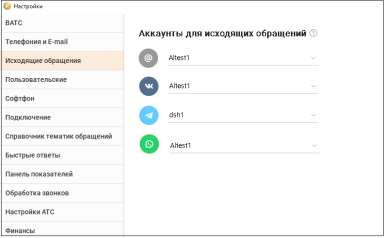

2.5.1.3.4. Исходящие обращения Вкладка Исходящие обращения предназначена для настройки аккаунтов, через которые оператор обращается к клиенту при инициации исходящего текстового обращения.

Вкладка отображается в случае, если в ЛК ВАТС подключен хотя бы один канал из следующих возможных: E-mail, VK, Telegram, WhatsApp, Max. В списке отображаются все аккаунты, подключенные по соответствующему каналу. Если для канала не настроен аккаунт, то канал не отображается На вкладке можно выбрать любой из активных каналов, подключенных и настроенных в Личном кабинете ВАТС. Сотрудник не может осуществить отправку исходящего текстового обращения клиенту по каналу, который не подключен, или если по каналу не настроено ни одного аккаунта.

| Настройки на вкладке требуют сохранения для применения (перезапуск приложения не |  |  |
| --- | --- | --- |
|  | требуется). Настройка аккаунтов хранится на сервере для каждой учетной записи |  |
| пользователя (для обеспечения доступа к настройке с других устройств). |  |  |

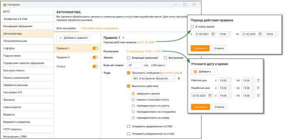

2.5.1.3.5. Автосекретарь Вкладка предназначена для настройки правил Автосекретаря.

Вкладка доступна, если в Личном кабинете подключена услуга "Автосекретарь". Редактировать настройки могут пользователи с правом "Настраивать индивидуальные правила обработки звонков (Автосекретарь)". Пользователь может просмотреть настроенные правила даже в том случае, если у него нет прав на редактирование автосекретаря.

На вкладке пользователю доступны следующие настройки: Переключатель «Правила переадресации» – в положении «включен» определяет Правило, как действующее. Кнопка «Добавить правило» – максимальное количество правил для одного сотрудника – 5. Если для сотрудника создано несколько правил, у которых пересекаются условия, то срабатывает первое правило из списка. Для каждого правила можно задать следующие параметры:

| Период действия правила – настройка периода поступления звонка; |
| --- |
| Расписание – настройка времени поступления звонка с разделением на рабочие и |
| нерабочие дни; |

3. Направление звонка (входящий внешний и/или внутренний) – настройка условия направления звонка для обработки; 4. Если нет ответа __ сек – время в секундах, в течение которого ожидается ответ сотрудника. Максимальное время ожидания – 100 секунд. По истечении установленного времени срабатывают настройки: 5. Проиграть голосовое сообщение – выберите из выпадающего списка голосовое сообщение, которое будет проигрываться, если в течение установленного в п.3 времени ответа от сотрудника не поступило. Выбранное голосовое сообщение можно прослушать при

помощи встроенного плеера, кликнув по пиктограмме . Там же можно загрузить новое голосовое сообщение, если пользователь обладает правом "Добавлять, просматривать и удалять аудиофайлы". 6. Выполнить действие – после воспроизведения голосового сообщения Автосекретарь выполнит одно из указанных в настройках действий: • завершить звонок. • принять голосовую почту – абонент сможет записать и отправить голосовое сообщение на e-mail сотрудника, после чего звонок завершается. • переадресовать на группу – звонок будет переадресован на указанную группу. Далее звонок обрабатывается по правилам, настроенным в Личном кабинете для обработки звонков группой. Если в рамках алгоритма распределения для группы вызов должен быть переадресован на данного сотрудника, то автосекретарь не обрабатывает звонок повторно.

• Переадресовать на сотрудника – звонок будет переадресован на указанного сотрудника. При переадресации на сотрудника используются параметры дозвона, указанные в карточке данного сотрудника в Личном кабинете. Если в процессе прохождения звонка, звонок поступил на сотрудника, для которого уже сработали индивидуальные правила переадресации, то автосекретарь не обрабатывает звонок повторно. • Переадресовать на номер телефона – звонок будет переадресован на указанный номер. При переадресации используется время ожидания ответа, указанное в поле рядом. Таким образом, в рамках одного вызова для одного сотрудника правило автосекретаря может сработать только один раз.

| Автосекретарь не работает для групповых вызовов с последующим распределением на |
| --- |
| сотрудника. |

7. Отправить сообщение о пропущенном звонке • Отправить уведомление по СМС – чекбокс открывает поле для ввода мобильного телефона в формате "+79", "79" или "89". • Отправить уведомление по e-mail – чекбокс открывает поле для ввода адреса электронной почты. По умолчанию заполняется e-mail из карточки сотрудника.

| Пример 1: |
| --- |
| Если включен чек-бокс «Отправить уведомление по СМС», то на указанный номер приходит СМС со |
| следующим текстом: "<текущая дата> в <текущее время> сотрудником <ФИО сотрудника, для |
| которого сработало правило> пропущен звонок с номера <номер, с которого поступил звонок>". |
| Пример 2: |
| Если включен чек-бокс «Отправить уведомление по e-mail», то на указанный адрес электронной |
| почты приходит сообщение со следующим текстом: "<текущая дата> в <текущее время> |
| сотрудником <ФИО сотрудника, для которого сработало правило> пропущен звонок с номера |
| <номер, с которого поступил звонок>". Тема письма "Пропущенный звонок от <текущая дата> в |
| <текущее время>". |

При включенных чекбоксах поля являются обязательными для заполнения. Сохраните настройки кнопкой Сохранить. Клик по кнопке Отмена отменяет изменения и возвращает настройки обработки звонков к последнему сохраненному значению.

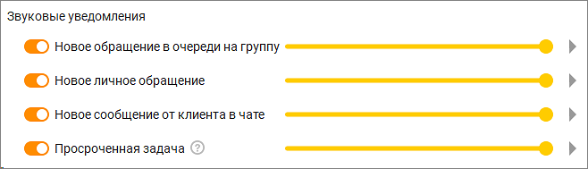

Клик по пиктограмме "корзина" приводит к удалению правила Автосекретаря. 2.5.1.3.6. Пользовательские Данная вкладка предназначена для редактирования настроек непосредственно программы.

Вкладка доступна всем пользователям. Основные Предупреждать при попытке выхода из приложения При включенной настройке при попытке выхода из Контакт-центра MANGO OFFICE с помощью: • кнопки закрытия • комбинации клавиш Alt+F4

• пункта Выход контекстного меню, отображаемого при щелчке правой кнопкой мыши по значку в трее (если установлен флажок Не оставлять Контакт-центр MANGO OFFICE в Панели задач Windows (сворачивать в трей) на экране отображается окно подтверждения запроса на закрытие программы:

При выключенной настройке Контакт-центр MANGO OFFICE закроется без дополнительного подтверждения. Предупреждать при попытке звонка из браузера При включенной настройке при попытке совершения исходящего вызова из браузера на экране отображается окно с предупреждающим сообщением. Не оставлять Контакт центр MANGO OFFICE в Панели задач Windows (сворачивать в трей) При включенной настройке после нажатия кнопки Свернуть окно Контакт-центр MANGO OFFICE сворачивается в трей (область системных значков и уведомлений). При выключенной настройке Контакт-центр MANGO OFFICE сворачивается на панель задач. Разворачивать окно приложения, панель софтфона и звонковое обращение при принятии входящего вызова При включенной настройке в случае, когда окно программы свернуто, при принятии нового входящего вызова в момент поднятия трубки окно программы разворачивается и осуществляется переход к обработке звонкового обращения. Запускать Контакт центр MANGO OFFICE при входе в систему Автоматический запуск Контакт центр MANGO OFFICE при старте операционной системы. Переход в статус "Перерыв" в периоде бездействия При включенной настройке и бездействии пользователя статусы На линии и Обзвон автоматически меняются на Перерыв при следующих условиях: • компьютер заблокирован пользователем (Win+L); • компьютер перешёл в спящий режим (без гибернации); • при запуске экранной заставки, спустя 5 секунд (допускается небольшая задержка); • компьютер перешёл в режим энергосбережения (функция отключения дисплея). Возобновление работы после периода бездействия происходит во всех случаях, когда ни одно из условий блокировки не выполняется. Не показывать уведомления "Назначена новая задача" При включенной настройке пользователь не будет получать системные уведомления, если на него назначена новая задача.

<!-- изображение на стр. 64: байты не извлечены (PyMuPDF недоступен) -->

Звуковые уведомления

<!-- изображение на стр. 64: байты не извлечены (PyMuPDF недоступен) -->

Для настройки звукового уведомления следует установить соответствующий переключатель в положение "включено". Обработка текстовых обращений Чекбокс Автоматически переключать на новое обращение регулирует автоматическое переключение оператора на новое поступившее текстовое обращение. При активации данной опции оператор автоматически переходит к новому обращению сразу после его поступления, что позволяет оперативно реагировать на новые запросы. • Если опция включена, система автоматически переключает фокус оператора с текущего обращения на новое. Это позволяет быстро обработать поступившее обращение без необходимости ручного выбора. • Если опция отключена, оператор продолжает работать с текущим обращением без автоматического переключения на новое. Это позволяет завершить начатое обращение, не отвлекаясь на вновь поступившие. Данная настройка сохраняется локально для каждого оператора, что позволяет персонализировать поведение системы в зависимости от предпочтений пользователя. Запланированный звонок

<!-- изображение на стр. 64: байты не извлечены (PyMuPDF недоступен) -->

В поле задается максимальное количество попыток дозвона (по умолчанию – 3 попытки), а также время паузы между попытками (по умолчанию 5 мин.). • Номер занят – количество попыток дозвона и интервал времени между повторной попыткой в случае, если номер сотрудника занят; • Не берут трубку – количество попыток дозвона и интервал времени между повторной попыткой в случае, если сотрудник не берет трубку; • Номер недоступен – количество попыток дозвона и интервал времени между повторной попыткой в случае, если сотрудник недоступен. История вызовов Количество выводимых вызовов

<!-- изображение на стр. 65: байты не извлечены (PyMuPDF недоступен) -->

Это поле с регулятором позволяет указать общее количество выводимых в истории вызовов. Значение по умолчанию — 1000 записей; максимальное значение — 10 000 записей.

| При установке чрезмерно большого значения данного параметра возможно существенное |  |  |  |  |
| --- | --- | --- | --- | --- |
|  | замедление работы программы! |  |  |  |
|  |  | При использовании устройства с небольшой диагональю экрана рекомендуем уменьшить |  |  |
|  | установленное по умолчанию значение (200 записей), чтобы повысить удобство работы с |  |  |  |
| историей вызовов. |  |  |  |  |

<!-- изображение на стр. 65: байты не извлечены (PyMuPDF недоступен) -->

<!-- изображение на стр. 65: байты не извлечены (PyMuPDF недоступен) -->

Обработка звонков Автоматически поднимать трубку при звонке Если указанная настройка выбрана, при поступлении звонка пользователю происходит автоматическое поднятие трубки (авто соединение с абонентом). Эта настройка устанавливается в Личном кабинете ВАТС по следующему пути: «Общие настройки» → «Безопасность и ограничения» → «Настройка доступа». Настройка роли, раздел "Инструменты" → блок "Управление звонками". Установить или удалить настройку может только пользователь с соответствующими правами доступа. Отклонять входящий вызов, если вы уже разговариваете по телефону

| При включенной настройке если пользователю во время разговора поступает второй звонок |
| --- |
| (например, распределенный на пользователя входящий звонок, обзвон по пропущенным в |
| рамках кампании Исходящего обзвона, задача на автоматический перезвон т. д.), второй и |
| последующие вызовы автоматически отклоняются (как если бы пользователь нажал кнопку |
| "Отклонить" на карточке соответствующего входящего вызова). |

При выключенной настройке (по умолчанию) вызовы не будут отклоняться, и карточки входящего вызова будут отображаться вне зависимости от того, сколько вызовов уже распределено на пользователя через Контакт-центр MANGO OFFICE. Скрывать окно вызова при работе в других программах При включенной настройке плавающие виджеты всех вызовов (кроме виджетов входящего и исходящего вызовов) не отображаются в случае, когда окно приложения не является активным Внутреннее общение Показывать в списке всех сотрудников, заведенных на ВАТС При включенной настройке в панели Сотрудники также отображаются сотрудники, не имеющие логина и пароля для входа в Личный кабинет и Контакт-центр MANGO OFFICE. 2.5.1.3.7. Софтфон Данная вкладка предназначена для выбора устройств, которые вы будете использовать в качестве микрофона и динамиков (наушников гарнитуры) для осуществления разговоров, прослушивания записей разговоров и т. д. с использованием Контакт-центра MANGO OFFICE.

| Контакт-центр использует выбранные устройства в монопольном режиме. Это означает, |  |  |
| --- | --- | --- |
|  | что во время работы Контакт-центра MANGO OFFICE вы не сможете использовать эти же |  |
| устройства для голосовой связи в других программах. |  |  |

<!-- изображение на стр. 65: байты не извлечены (PyMuPDF недоступен) -->
