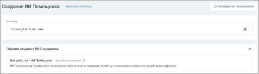

# Как создать ИИ Помощника

> Трассировка: PDF §16.7 · сквозные стр. 508-509 · источники: ч.1 `kb/sources/mango-cc-manual/CC_manual_1.26.28.1.pdf` с.508-509.

1. Перейдите в раздел ИИ Помощники 2. Нажмите кнопку Создать

3. Откроется форма создания нового ИИ Помощника

