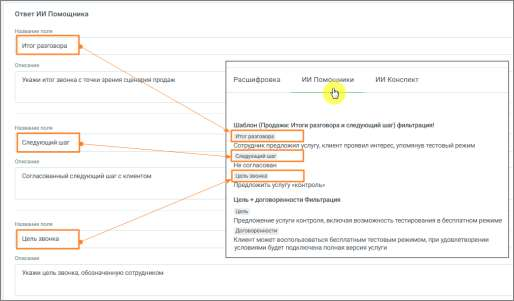

# Настройка ИИ Помощника

> Трассировка: PDF §16.7 · сквозные стр. 509-511 · источники: ч.1 `kb/sources/mango-cc-manual/CC_manual_1.26.28.1.pdf` с.509-511.

1. Название – введите название помощника. Рекомендуется указывать название по задаче, например: • контроль скрипта • анализ жалоб • проверка качества общения 2. Промпт – определяет, какой именно результат будет получать пользователь. По сути, это описание задачи для анализа разговора. Чтобы результат был полезным: • формулируйте задачу конкретно • указывайте, что именно нужно определить или сформулировать • задавайте формат ответа (например, кратко, с примерами, с оценкой и т.д.) Один и тот же разговор может анализироваться по-разному в зависимости от промпта, поэтому рекомендуется создавать отдельные ИИ Помощники под разные задачи. • введите текст задания для анализа разговора • при необходимости нажмите Улучшить, чтобы система помогла уточнить формулировку • можно использовать Библиотеку шаблонов и выбрать нужный промт

Примеры промта: • «Проанализируй диалог сотрудника с клиентом. Определи цель звонка, итог разговора, был ли согласован следующий шаг (какой именно) и на какую дату/время, а также наличие отказа и его причины словами клиента.» • «Ты оцениваешь диалог сотрудника контактного центра и клиента. В данном диалоге сотрудник пытался продать товар или услугу. Проанализируй диалог и дай свои рекомендации – что сотрудник мог бы улучшить в работе для повышения вероятности продажи. Отвечай емко и по существу. К каждой рекомендации делай отсылку к элементу диалога где обнаружена зона роста с указанием времени. Сделай максимум 5 ключевых рекомендаций не больше чем на 300 слов.» 3. Ответ ИИ Помощника – результат работы ИИ Помощника можно настроить под нужный уровень детализации. Возможны два подхода: • единый общий вывод по разговору • структурированный ответ, разбитый на несколько частей Разделение на части удобно, если требуется анализ по нескольким аспектам - например, в плеере отдельно выделить содержание разговора, принятые решения и последующие действия. На примере ниже показан вариант настроек структурированного ответа в блоке настроек, а также итоговое отображение ответа в плеере звонка.

4. Звонки и чаты для анализа – здесь задаётся, какие разговоры будет анализировать помощник. Можно указать: • сотрудников или группы • номера • тип коммуникации (звонки, чаты) • направление звонков • длительность разговора Это позволяет применять помощника только к нужным диалогам.
