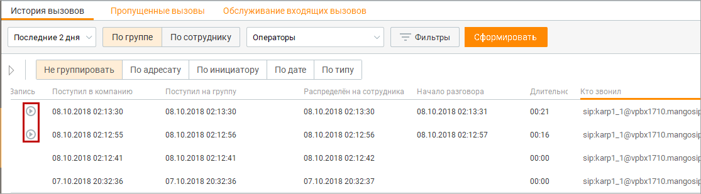
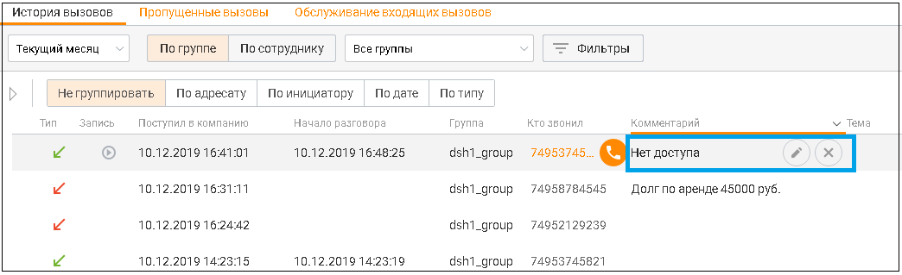

# 9.1.2. Прослушивание разговоров и повторные вызовы

> Трассировка: PDF §9.1.2 · сквозные стр. 285-286 · источники: ч.1 `kb/sources/mango-cc-manual/CC_manual_1.26.23_compressed.pdf` с.285-286.

Вы можете прослушивать записи разговоров и осуществлять повторные вызовы непосредственно в рабочей области Истории вызовов.

| Возможность прослушивания вызовов зависит от роли пользователя. Аналогичные |  |  |  |  |
| --- | --- | --- | --- | --- |
|  | правила действуют для раздела "Скрипты" и подраздела "Задачи обращения" раздела |  |  |  |
|  | "Клиенты": |  |  |  |
|  | — Оператор может прослушивать записи разговоров только для вызовов, в которых он |  |  |  |
|  | участвовал. |  |  |  |
|  | — Супервизор может прослушивать записи разговоров только для вызовов, в которых он |  |  |  |
|  | участвовал, а также для вызовов с участием операторов в группах, в которых он является |  |  |  |
|  | супервизором. |  |  |  |
|  | — Администратор может прослушивать записи разговоров для любых вызовов, |  |  |  |
| осуществляемых с использованием Контакт-центра MANGO OFFICE. |  |  |  |  |

Чтобы прослушать разговор, выберите вызов с имеющейся записью разговора (на что

указывает наличие кнопки ).

Затем нажмите кнопку . После этого выполняется воспроизведение записанного разговора. Для управления прослушиванием используйте встроенный плеер.

Кнопка для скачивания записи отображается на плеере, но недоступна для нажатия, если у пользователя нет права "Выгружать и отправлять записи по почте".
