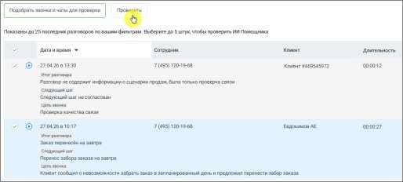

# Проверка работы ИИ Помощника

> Трассировка: PDF §16.7 · сквозные стр. 511-512 · источники: ч.1 `kb/sources/mango-cc-manual/CC_manual_1.26.28.1.pdf` с.511-512.

Перед использованием рекомендуется проверить работу: 1. Выберите период и фильтры 2. Нажмите Подобрать звонки и чаты для проверки 3. Выберите до 5 разговоров 4. Нажмите Проверить Вы увидите, как помощник анализирует реальные диалоги.

Тестирование позволяет заранее проверить, как ИИ Помощник будет анализировать реальные разговоры, до его сохранения и включения в работу. Это даёт пользователю следующие преимущества: • позволяет убедиться, что помощник правильно понимает задачу • помогает выявить неточности или ошибки в формулировке промпта • даёт возможность сравнить результат на нескольких разговорах • снижает риск получения некорректных или бесполезных выводов после запуска • экономит время, исключая необходимость последующей переработки настроек В результате пользователь получает более точный и предсказуемый анализ разговоров сразу после включения помощника. Для сохранения данных нажмите кнопку Создать. После этого помощник начнёт автоматически анализировать подходящие разговоры.
