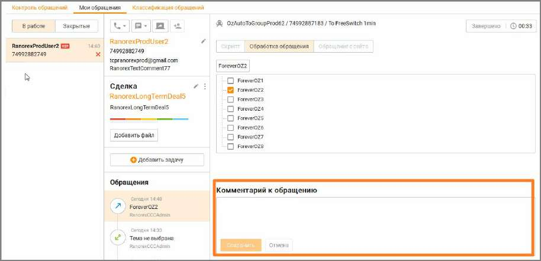

# 9.1.3. Тематики и комментарии к вызову

Более подробное описание приведено далее в данном подразделе. Как добавить комментарий Чтобы работать с комментарием к вызову, наведите курсор на строку нужного вызова в столбце Комментарий. При этом в столбце отображаются кнопки правки и удаления.

Чтобы создать или изменить комментарий, нажмите кнопку правки и внесите необходимые изменения.

Чтобы удалить комментарий, нажмите кнопку . Если в карточке обращения имеется комментарий, то он также отображается в этом поле.

Как добавить тематику Чтобы работать с тематикой комментария к вызову, наведите курсор на строку нужного вызова в столбце Тема. При этом в столбце отображается кнопка редактирования темы и кнопка удаления — так же, как и для комментария к вызову. Чтобы добавить, создать или изменить тематику, нажмите кнопку редактирования и внесите необходимые изменения.

| Комментарии и тематики обращения будут доступны для просмотра и редактирования в |
| --- |
| карточке контакта и статистическом отчете "Обслуживание входящих вызовов". |

Напомним, что набор тематик, доступных при обработке вызова, определяется ролью пользователя в Личном кабинете: • Сотрудник – доступны тематики, входящие в псевдогруппу Без группы. • Оператор – тематики своей группы; • Супервизор – тематики своей группы; • Администратор (не оператор и/или супервизор) – тематики псевдогруппы Без группы; • Администратор (оператор и/или супервизор) – тематики своей группы. Полный список ролей пользователей, которым доступна работа с тематиками, см. в Приложении 2 "Роли и права доступа Контакт-центра", вкладка "Обращения". Кроме того, в Контакт-центре MANGO OFFICE предусмотрена возможность создания отдельных списков тематик внутри группы, в которую включен пользователь. Отдельные списки применяются в зависимости от типа вызова. Таким образом, при поступлении вызова определенного типа сотруднику, с учетом его роли в Личном кабинете, будут доступны тематики только одного соответствующего списка, созданного для обработки: • внешних входящих вызовов, распределенных из группы. • персональных входящих вызовов; • внешних исходящих вызовов; • внутренних вызовов. Подробнее о создании тематик см. в подразделе Справочник тематик обращений.

| Список доступных тематик различается в зависимости от выбранного фильтра: По группе |  |  |
| --- | --- | --- |
|  | или По сотруднику. Если был принят входящий вызов, распределенный из группы, то при |  |
|  | фильтрации по группе для его редактирования будет доступен набор тематик, определенный |  |
|  | для внешних вызовов, распределенных с группы для данной группы. При фильтрации по |  |
|  | сотруднику будет доступен набор тематик, определенный для персональных вызовов для |  |
| всех групп, где состоит данный сотрудник. |  |  |

<!-- изображение на стр. 288: байты не извлечены (PyMuPDF недоступен) -->
