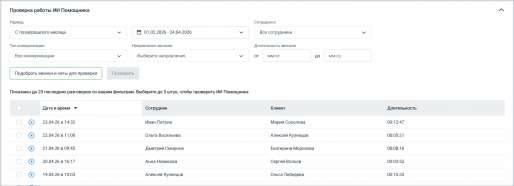
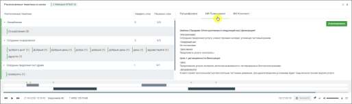

# Где смотреть результаты

> Трассировка: PDF §16.7 · сквозные стр. 512-514 · источники: ч.1 `kb/sources/mango-cc-manual/CC_manual_1.26.28.1.pdf` с.512-514.

Чтобы посмотреть результат анализа: 1. Настройте фильтры

2. Откройте запись разговора 3. Нажмите кнопку прослушивания 4. В плеере перейдите во вкладку ИИ Помощники

Здесь отображаются: • ответы всех активных помощников • результаты анализа по каждому из них Один разговор может содержать несколько ответов - по числу активных помощников. Особенности работы • каждый помощник работает независимо • один разговор может содержать несколько ответов - по числу активных ИИ Помощников

• по умолчанию обрабатываются разговоры от 20 секунд, если иная длительность не задана в фильтре • результаты отображаются вместе с расшифровкой, ИИ Конспектом и тематиками из любых отчетов • помощники анализируют разговоры автоматически после их расшифровки Рекомендации • создавайте отдельных помощников под разные задачи • формулируйте промпт максимально конкретно • проверяйте результат на тестовых звонках перед использованием • при необходимости используйте кнопку Улучшить для доработки запроса

